## 2. Numerical Methods with MATLAB

### Example 2.1 Solution of a Linear System 
Use Gauss elimination, Gauss-Seidel, and conjugate gradient methods to solve Ax =b
```math
A=\begin{bmatrix}
2 & -1 & 0 & 0 & 0 & 0 \\
-1 & 2 & -1 & 0 & 0 & 0 \\
0 & -1 & 2 & -1 & 0 & 0 \\
0 & 0 & -1 & 2 & -1 & 0 \\
0 & 0 & 0 & -1 & 2 & -1 \\
0 & 0 & 0 & 0 & -1 & 2 \\
\end{bmatrix} ,
B=\begin{bmatrix}
0 \\
0 \\
0 \\
0 \\
0 \\
4 \\
\end{bmatrix}
```

Use ρ=0.8 and $x_0 =[0 0 0 0 0 0]^T$

### Example 2.2 Pseudo-Inverse of a Matrix 
Compute the pseudo-inverse of
```math
A=\begin{bmatrix}
-2 & -1 & 3 \\
4 & -5 & 7 \\
6 & 2 & -5 \\
-3 & 2 & 1 \\
\end{bmatrix}
```

### Example 2.3 Solution of a Linear System  
Solve the following equation system: 

$4x_1+2x_2-x_3=8 $
$-3x_1+x_2+2x_3=-6 $
$2x_1-4x_2+x_3=12 $


### Example 2.4 Heat Conduction by Conjugate Gradients Method 
Find the temperature at each node x1, x2, x3, and x4 using the conjugate gradients method. Each dot represents a node, and the temperature at each node is assumed to be given by the average temperatures of adjacent nodes. 

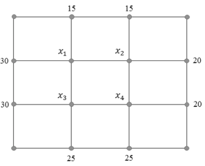

### Example 2.5 Two-Dimensional Heat Transfer
Consider the cross section of a rectangular flue with steady heat conduction along the x- and y-axes as shown in Figure 2.2. Since both ends of the section are symmetrical, we can consider only 1/8 of the section. From this section, we can construct a node network consisting of small squares. 
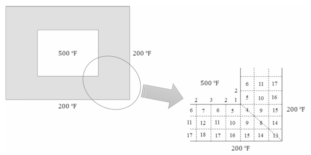
A heat balance on node 4 gives 
$$
q_4=\frac{kA}{\Delta x}(T_5-T_4)+\frac{kA}{\Delta x}(T_9-T_4)+\frac{kA}{\Delta y}(T_5-T_4)+\frac{kA}{\Delta y}(T_9-T_4)
$$
Since each node is square, ∆x = ∆y , and by rearranging we have 
$$
\frac{q_4\Delta x}{kA}=2T_5-4T_4+2T_9
$$
At steady state, $q_4/ kA$ is assumed to be zero. Find temperatures T4, T5 ..., T12 at nodes 4 through 12. 

### Example 2.6 Solution of a Polynomial Equation 
Find the roots of the following equation: 
$$
f(x)=x^5-3x^4+3x^3-2x^2-4x+1=0
$$

### Example 2.7 Specific Volume of CO2 
The van der Waals equation of state is given by 
$$(P+\frac{a}{v^2})(v-b)=RT$$
In this equation, v  =( V/n )(n: number of moles), R  =0.082054 liter·atm /( mol·K ), a=3.592 and b=0.04267 for CO2. Find the specific volume (liter/mol) of CO2 when P  =12 atm and T  =315.6 K. 

### Example 2.8 Reduction of an Iron Ore 
In a reduction experiment of iron ore by hydrogen, the time t (sec) spent in the reduction zone is given by the function of unreacted particle core r (cm) as 
$t =9.496×10 3(1 -12r^2 +16r^3 ) $ 
Find r when t  =30 min using the bisection, secant, and Newton-Raphson methods. As the initial search interval, use [0,0.5], and as an initial guess, let x0 =0.3  .  

### Example 2.9 Nonlinear Equation System  

Determine a solution of the following system of equations using the Newton-Raphson method. Let the initial guess be $x_0 = [1 1 1]^T$
$cos(x)+y^2+ln z=8$
$4x+3^y-z^3=-2$
$x+y+z=6$

### Example 2.10 Catalytic Dehydrogenation Reactions of Ethane C2H6 
Ethylene (C2H4) and acetylene (C2H2) are obtained from the following catalytic dehydrogenation reactions of ethane (C2H6): 
Reaction 1: C2H6 C2H4 +H2(extent of reaction: η1) 
Reaction 2: C2H6 C2H2+2H2(extent of reaction: η2) 
The equilibrium constants K1 and K2 for each reaction may be expressed in terms of the extents of reaction η1 and η2 as follows: 
$$
 K1=\frac{\eta η_1(\eta η_1+\eta η_2)}{(1-\eta η_1-\eta η_2)(1+\eta η_1+2\eta η_2)}, K2=\frac{\eta η_2(\eta η_1+2\eta η_2)^2}{(1-\eta η_1-\eta η_2)(1+\eta η_1+2\eta η_2)^2}
$$

At the reaction condition of 980°C and 1 atm, the equilibrium constants were measured to be K1 =3.78 and K2 = 0.137. Determine the extents of reaction η1 and η2.

### Example 2.11 Zeros of a Nonlinear Equation 
Find the zeros of
$$
f(x)=x^3-xsinx+1
$$

### Example 2.12 Friction Factor Using the Colebrook Equation 
The Colebrook equation is given by 
$$
\frac{1}{\sqrt{f}}=-0.86 ln(\frac{\varepsilon /D}{3.7}+\frac{2.51}{N_{Re}\sqrt{f}})
$$
Find the friction factor f for $N_Re = 6.5 × 10^4$ and ε/D = 0.00013. As the first guess for f , use f0 = 0.1. 

### Example 2.13 SRK Equation of State 
The Soave-Redlich-Kwong (SRK) equation of state is given by
$$
P=\frac{RT}{(V-b)}-\frac{a}{V(V+b)\sqrt{T}}
$$

where $a = 0.42748 R^2 T_c^{5/2} /P_c$, $b = 0.08664 RT_c /P_c$

Tc and Pc denote the critical temperature (K) and critical pressure (atm), respectively, and V is the specific volume (liter /mol ). Find the specific volume of 1-butene at  415 K and  21 MPa. The gas constant is R =0.082054 liter·atm/(mol·K) and the critical properties of 1-butene are Tc = 419.6K  and Pc = 40.2 MPa. 

### Example 2.14 Bubble Point of a Mixture 
The vapor pressure $P_sat (mmHg)$ of benzene and toluene can be represented by the Antoine equation: 
$$
ln P_{sat}=A-\frac{B}{t(°C)+C}
$$
Determine the bubble point temperature t (°C) of a mixture containing benzene and toluene at a pressure P = 1 atm. Pis given by 
$$
P(mmHg)=x_{B} P_{sat.B}(t)+x_{T}P_{sat.T}(t)-P
$$
where xB and xT are mole fractions of benzene and toluene, respectively. 
Data: xB  =0.4;xT =0.6; benzene: A=15.90085, B=2788.507, C=220.790; toluene: 
A=16.01066, B=3094.543, C=219.377. 

### Example 2.15 A System of Nonlinear Equations 
Find the zeros of the following three equations: 
$sin(x)+y^2+ln z=7 $
$3x+2y-z^3=-1 $
$x+y+z=5 $

### Example 2.16 Composition of the Equilibrium Mixture
Ethane reacts with steam to form hydrogen over a cracking catalyst at a temperature of T = 1000 K and pressure of P = 1 atm. The feed contains 4 moles of steam per mole of ethane. The components present in the equilibrium mixture are shown in Table 2.2. The Gibbs energies of formation (kcal /gmol )of the various components at the reaction temperature (1000 K)are also given in Table 2.2, as is the initial guess for each component. The equilibrium composition of the effluent mixture is to be calculated using the data given in Table 2.2. 
This problem can be regarded as an optimization problem, which minimizes the total Gibbs energy. The objective function to be minimized is given by
$$
min_{n_i}\frac{G}{RT}=\sum_{i=1}^{c}n_i(\frac{G_i^0}{RT}+ln\frac{n_i}{\sum n_i})
$$
where 
ni is the number of moles of component i
c is the total number of components 
R is the gas constant 
Gi0 is the Gibbs energy of pure component i at temperature T
Oxygen, hydrogen, and carbon balances should be set to find ni. 
Oxygen: f1 = 2n4+n5+2n6+n8-4
Hydrogen: f2 =4n1+4n2+2n3+2n7+2n8+6n9-14
Carbon: f3 =n1+2n2+2n3+n4+n5+2n9-2
These balance equations are constraints that can be introduced into the objective function using Lagrange multipliers λ1, λ2, and λ3. The extended objective function is given by
$$
min_{n_i,\lambda _i}F=\sum_{i=1}^{c}n_i(\frac{G_i^0}{RT}+ln\frac{n_i}{\sum n_i})+\sum_{j=1}^{3}\lambda _jf_j
$$
All the partial derivatives of the function Fwith respect to ni and jvanish at the minimum point. 
For example, the partial derivative of Fwith respect to ni is given by
$$
\frac{\partial F}{\partial n_i}=\frac{G_i^0}{RT}+ln\frac{n_i}{\sum n_k}+1-\frac{n_i}{\sum n_k}+\sum_{j=1}^{3}\lambda _j(\frac{f_j}{\partial n_i})
$$

### Example 2.17 Elementary Statistics 
The list Tc shows the measurements of thermal expansion coefficients of a certain metal. Find the 
mean, median, mode, variance, and standard deviation of these data.
tc = [
    5.394, 5.564, 5.654, 5.465, 5.495, 5.404, 5.524, 5.414,
    5.514, 5.335, 5.614, 5.455, 5.534, 5.524, 5.475, 5.295,
    5.384, 5.614, 5.554, 5.675, 5.455, 5.554, 5.504, 5.584
]

### Example 2.18 Normal Probability
We can define the normal probability density f(x) with μ  =  0 and σ  =  1 using the built − in 
function. Let z = (x- μ)/σ . 
(1) Determine the probability of z assuming any value between -0.8 and +0.8. 
(2) What is the probability of z lying between -0.8 and +0.8? 
(3) Determine the probability of observing z > 2.  

### Example 2.19 t Test 
In a sequence of light absorbance experiments to determine the concentration of a hemoglobin solution, the individual absorbance values measured are [0.72, 0.54, 0.62, 0.80, 0.76, 0.64, 0.75, 0.94, 0.44]. The absorbance data are approximately normally distributed. Determine if the mean absorbance value is 0.86 (i.e., the null hypothesis is H0: μ=0.86).

### Example 2.20 Generation of Random Numbers 
(1) Generate a 2×3 matrix x of random numbers distributed uniformly between 0 and 1. 
(2) Generate a 2×3 matrix y of normally distributed random numbers. 
(3) Generate a 3×3 matrix z of random numbers distributed uniformly between 3 and 5.  

### Example 2.21 Least-Squares Polynomial Fitting 
The data shown in below Table were taken in an isothermal batch reactor where reactant A is 
decomposed to product B. Fit 2nd-, 3rd-, and 4th-order polynomials to the data. 
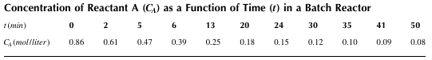

### Example 2.22 Reaction Temperature Profile 
Below Table shows measurements of reaction temperature versus time. Determine the 1st-, 2nd-, 
and 4th-order polynomials to represent this data.  
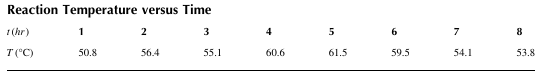

### Example 2.23 Virial Coefficients
Below Table shows the density (ρ) of N2 as a function of pressure(P ) at T= 200 K. Using these data, estimate the virial coefficients of the virial equation of state given by
$$
Z=\frac{P}{ρRT}=1+bρ+Cρ^2+Dρ^3
$$
where R is the gas constant (=0.08206 liter atm /(mol K )).  
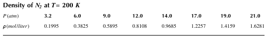

### Example 2.24 Michaelis-Menten Enzyme Kinetics 
An enzyme behaves as a catalyst in a living cell. To represent enzyme-catalyzed reactions, the 
Michaelis-Menten equation is widely used:
$$
r=\frac{a[S]}{b+[S]}
$$
where 
r is the reaction rate 
[S ] denotes the concentration of the substrate S
a is the maximum initial reaction rate 
b is a constant given by combination of rate constants 

Table below shows experimental data of reaction rates versus substrate concentrations. Assuming 
that reaction rates can be represented by the Michaelis-Menten equation, determine parameters a
and b of the equation.
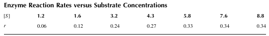

### Example 2.25 Vapor Pressure by Antoine Equation
The Antoine equation is widely used to represent the relationship between vapor pressure and temperature: 
$$
log P_v=A+\frac{B}{T+C}
$$
where 
Pv is vapor pressure (mmHg) 
T is temperature(°C) 
A, B and C are parameters 

Use the vapor pressure data given in Table below to find parameters A, B, and C. 
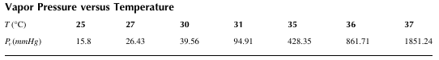

### Example 2.26 Nonlinear Regression by Least Squares  
Assume that the experimental data shown in Table below can be represented by a nonlinear model
$$
v=\frac{Ae^{-t}}{1+Bt}
$$
Use the least-squares method and the built-in function nlinfit to estimate A and B. Compare the nonlinear model and the results of nonlinear regressions by plotting the fitting curves and data on the same graph. 
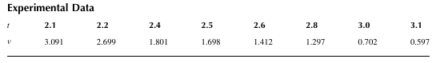

### Example 2.27 Nonlinear Regression 
A wooden slab with thickness z  =0.03 m is dried from both sides by hot air. Table below 
shows the data on the free moisture in the wood, x  ( kgH2O/ kg dry wood ), obtained from the drying experiment. The following model can be used to approximate the moisture content of 
the wood: 
$$
x(t)=\frac{8x_0}{\pi ^2}(e^{-Dt(\frac{\pi }{2x})^2}+\frac{1}{9}e^{-9Dt(\frac{\pi }{2x})^2})
$$
where x0 is the initial free moisture of the wood and D ( m2/hr ) is the diffusivity of water in the wood. Estimate x0 and D .
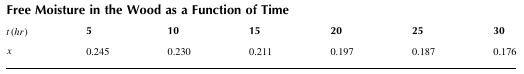

### Example 2.28 Determination of Interpolating 2nd-Order Polynomial 
Table below shows entropy data of saturated steam at three different temperatures. Identify the 2nd-order polynomial that best fits the data, and estimate the entropy at T =373.15 K using this polynomial.
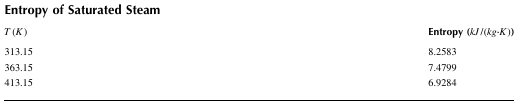

### Example 2.29 Isothermal Batch Reactor
The data shown below were taken in an isothermal batch reactor where reactant A is 
decomposed to product B. Determine CA at t(min )=8, 15, 25 and 32 using Lagrange, Newton, and cubic spline interpolation methods. 
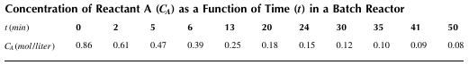

### Example 2.30 Polynomial Regression 
Table below presents the enthalpy of saturated steam versus temperature. Determine a 2nd-order polynomial that fits these enthalpy data, and estimate the enthalpy at T = 350.15 K using the polynomial. 
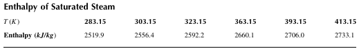

### Example 2.31 Cubic Spline Interpolation 
Table below shows experimental data on a pressure drop (kPa)according to flow rates (liter/ sec) in a filter. Perform cubic spline interpolation .
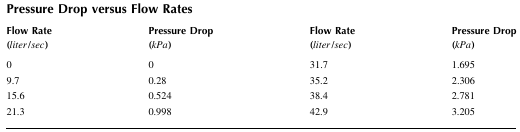

### Example 2.32 One-Dimensional Interpolation 
Determine y at x = 0.45 using the benzene-toluene equilibrium data shown in Table below. Try 
various interpolation methods. 
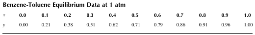

### Example 2.33 One-Dimensional Fitting 
Table below shows the time series of measurements of reaction temperature. Fit these data with the pchip (piecewise cubic Hermite) option.
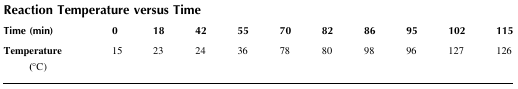

### Example 2.34 One-Dimensional Fitting of Heat Capacity Data
Table below shows the heat capacity of nitrogen (Cp  ) at 1 atm. Determine Cp at T=580 K . Try various one-dimensional interpolation methods. 
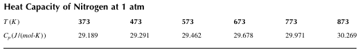

### Example 2.35 Two-Dimensional Interpolation 
Temperatures are measured at various points on a heated metal plate (Table below). Estimate the temperature at xi =6.4 and yi =5.2 using two-dimensional piecewise cubic spline interpolation. 
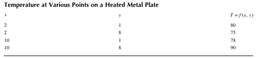

### Example 2.36 Interpolation of Humidity and Dew Point 
Table below presents the absolute humidity (H) and the dew point (DP) of the air as a function of relative humidity (RH). Estimate H and DP when RH = 58.4 and T(dry bulb temperature) = 46.8℃ 
using two-dimensional piecewise cubic spline interpolation.  
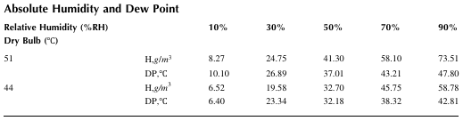

### Example 2.37 Two-Dimensional Interpolation of Steam Table Data
Table below shows the enthalpy H(kJ/kg) of superheated steam excerpted from the steam table. 
Estimate H at T = 380°C and P = 260 kPa. 
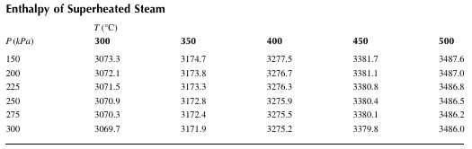

### Example 2.38 Differentiation by diff  
Differentiate the function
$$
f(x)=0.3+20x-180x^2+650x^3-880x^4+360x^5
$$
from x = 0 to 1 using the diff function. Compare your results with the exact solution


### Example 2.39 : Differentiation of CO2Concentration by diff
In a transient mass transfer of CO2 through a membrane the concentration profile of CO2 at a 
certain time  across the membrane wall is represented by the equation
$$
C(x)=-1.3 \times 10^6x^4+7.1\times 10^3x^3-14x^2-0.364x+0.001
$$
where C (kgmol /m3 ) is the concentration of CO2 and x(m ) is the distance from the center of the membrane. The mass transfer flux N_CO2 kgmol  /( sec m2) at x(m )from the center of the membrane is given by 
$$
N_{CO2}=-D\frac{dC(x)}{dx}
$$
where D =3.26×10-8 m2/sec is the diffusivity of CO2 through the membrane. At time t, CO2
accumulates within the membrane if the net flux (difference between input flux and output flux) is positive (N_CO2,x=-0.001 - N_CO2,x=0.001 > 0) and is depleted from the membrane if the net flux is negative (N_CO2,x=-0.001 - N_CO2,x=0.001 < 0 ) . Is CO2 accumulating or depleting in the membrane? 

### Example 2.40 Differentiation of Slurry Data by diff
The equation for constant pressure filtration in a plate-and-frame press is given by
$$
\frac{dt}{dV}=\frac{\mu c_s}{A^2(-\Delta P)}\alpha V+\frac{\mu }{A(-\Delta P)}R_m
$$
where 
A is the filter area 
cs is the slurry concentration 
μ is the viscosity of water 
α is the specific cake resistance 
Rm is the resistance of the filter medium to filtrate flow 

Table below shows data for filtration of CaCO3 slurry in water at 298 K at a constant pressure 
(-∆P) of 3×105kg/(m∙sec2). Determine α(m/kg) and Rm (m-1) by using below Table and the data after it. 
Data: A =0.04 m2, cs=20 kg/m3 , μ=8.937×10-4 kg/(m sec ), -∆P=3×10 5 kg/(m sec2 )
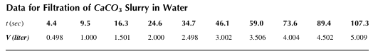

### Example 2.41 Differentiation by gradient 
Differentiate the function
$$
f(x)=0.3+20x-180x^2+650x^3-880x^4+360x^5
$$
from x=0 to 1 using the gradient function. Compare your results with the exact solution

### Example 2.42 Numerical Integration 
Evaluate 
$$
\int_{0}^{1.5}\frac{1}{1+x^2}dx
$$
using the trapezoidal rule and the Simpson 1/3 rule.

### Example 2.43 Use of trapz and cumtrapz
Table below shows a series of time spot measurements of the velocity of a falling sphere. Determine the distance traveled when t  =2.5 sec. Find the cumulative distance traveled at each time spot. 
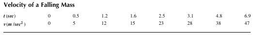

### Example 2.44 Use of integral, quad, and quadl 
MATLAB provides a demonstrative function humps, defined as 
$$
f(x)=\frac{1}{(x-q)^2+0.01}+\frac{1}{(x-r)^2+0.04}+s
$$
Estimate $ \int_{a}^{b}f(x)dx $ when a=0, b=1, q=0.2, r=0.7and s= 4. Use the built-in functions integral, quad, and quadl and compare the results. 

### Example 2.45 Interpolation and Numerical Integration
Table below shows the heat capacity Cp (J/(mol∙℃)) of a gas as a function of temperature t(℃). 
Compute the enthalpy change $ ∆H( J)= n\int_{t_1}^{t_2}C_p(t)dt $ for n = 6.5 mol of this gas heated from t1 = 55℃ to t2 = 185℃. 
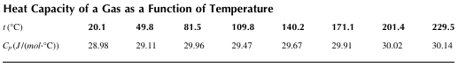

### Example 2.46 Double integral 
Evaluate the double integral 
$$
I=\int_{0}^{5}\int_{0}^{7}f(x,y)dxdy
$$
for the function 
$$
f(x,y)=3xy+x-1.2x^2-3y^2+25
$$

### Example 2.47 Numerical Solution of ODE 
Find the solution of the differential equation
$$
 \frac{dy}{dt}=5e^{0.6t}-2y, y(0)=1.5
$$
using the explicit Euler method and the 4th-order Runge-Kutta method. The number of sub intervals is n=5. 

### Example 2.48 Solution of an ODE 
Solve
$$
 \frac{dy}{dt}=e^{-t}, y(0)=-1
$$
from t = 0 to 1. 

### Example 2.49 van der Pol Equation 
The van der Pol equation can be expressed as
$$
 \frac{d^2y_1}{dt^2}-μ(1-y_1^2)\frac{dy_1}{dt}+y_1=0
$$
This equation can be transformed into a set of 1st-order differential equations as follows: 
$$
 \frac{dy_1}{dt}=y_2, \frac{dy_2}{dt}=-y_1+μ(1-y_1^2)y_2
$$
Plot the changes of y1 and y2 with respect to time t from t = 0 to 25. μ = 1 and the initial conditions 
are y1(0) = y2(0) = 1. 

### Example 2.50 Well-Mixed Tanks
Figure 2.24 shows a series of three well-mixed tanks. From mass balance equations, we have 
$$
\frac{dV_1}{dt}=q_0+m-q_1, V_1\frac{dx_1}{dt}=q_0(x_0-x_1), V_2\frac{dx_2}{dt}=q_1(x_1-x_2), V_3\frac{dx_3}{dt}=q_2(x_2-x_3) 
$$
where x i( =1,2,3) is the concentration (mol  /liter ) of the solution contained in the tank i. Under normal steady-state operation, m is maintained at 0 and q i( =1,2,3) is kept constant. At a certain time (t=0), m is suddenly increased to 12 liter /min . Plot the concentrations in the three tanks from t=0 to 2. The initial conditions are x mol liter =0.15 / 0 and q litermin =15 / 0 , and the initial volume of each tank is 20 liter. 

### Example 2.51 Plug-Flow Reactor
A plug-flow reactor is used to carry out the reaction A -> B. The reaction rate is known to be represented by a Langmuir-Hinshelwood model given by
$$
 \frac{dC_A}{dz}=(\frac{A_c}{q})\frac{dF_A}{dV}=-(\frac{A_c}{q})\frac{kC_A}{\sqrt{1+k_rC_A^2}}
$$
where z is the length of the reactor, V is the reactor volume, q is the inlet flow rate, Ac is the cross-sectional area of the reactor, and k and kr are kinetic parameters. The initial concentration of A is C_A0 =1 mol/m3, the inlet flow rate is q =0.12 m3/sec , A_c =0.26 m2, and the kinetic parameters are k =2.1 sec-1 and k_r = 0.98 mol2/m6. F_A is given by F_A = F_A0(1-x_A ) where F_A0 = qC_A0. 
(1) Generate the profiles of conversion and concentration of A for 0 < z < 0.5m . 
(2) Find the reactor volume required for 80% conversion of A. 

### Example 2.52 Penicillin Production Reaction
Penicillin is produced in a batch reactor by fermentation. The reaction model is given by 
$$
\frac{dx_1}{dt}=a_1x_1-\frac{a_1}{a_2}x_1^2, \frac{dx_2}{dt}=a_3x_1
$$
where x1 is the dimensionless cell concentration and x2 is the dimensionless penicillin concentration. From experiments, it was found that a_1 =13.2, a_2 =0.95 and a_3 =1.76 . At t=0, x_1(0)=0.028 and x_2(0)=0.0 . Generate profiles of x1 and x2 as a function of dimensionless time t ( 0 < t < 1). 

### Example 2.53 Growth of a Biomass from Substrate
A biological process involving the growth of a biomass from substrate can be represented as
$$
\frac{dB}{dt}=\frac{kBS}{K+S}, \frac{dS}{dt}=-\frac{0.75kBS}{K+S}
$$
where B and S are the biomass and substrate concentrations, respectively. Solve these differential equations from t = 0 to 20. At t = 0, S and B are 5 and 0.05, respectively. The reaction kinetics are k = 0.3 and K = 0.000001. 

### Example 2.54 Fluidized Packed Bed Catalytic Reactor
The irreversible gas-phase catalytic reaction A Bis to be carried out in a fluidized packed 
bed reactor. Material and energy balances for this reactor yield
$$
\frac{dP}{d\tau }=P_e-P+H_g(P_P-P), \frac{dT}{d\tau }=T_e-T+H_T(T_P-T)+H_W(T_W-T)
$$
$$
\frac{dP_P}{d\tau }=\frac{H_g}{A}(P-P_P(1+K)), \frac{dT_P}{d\tau }=\frac{H_T}{C}((T-T_P)+FKP_P), K=6\times 10^{-4}exp(20.7-\frac{1000}{T_P})
$$
where 
T(◦R) is the temperature of the reactant 
P(atm) is the partial pressure of the reactant 
Tp(◦R) is the temperature of the reactant at the surface of catalyst 
Pp(atm) is the partial pressure of the reactant at the surface of catalyst 
K is the rate constant (dimensionless) 
τ is time (dimensionless) 
and the subscript e is the inlet condition. The parameters and constants used in the model equations are H_g =320, T_e=600, H_T=266.67, H_W=1.6, T_W=720, F=8000, A=0.17142, 
C =205.74, P_e=0.1 
Solve the differential equations from τ = 0 to 1500 and plot the changes of dependent variables. 
Initial conditions are P(0) = 0.1, T(0) = 600, Pp = 0, and Tp = 761. 

### Example 2.55 Boundary-Value Problem
Solve the equation 
$$
x^2\frac{d^2y}{dx^2}-6y=0
$$
The range of x is 1 < x < 2, and the boundary conditions are y(1) = 1, y(2) = 1.

### Example 2.56 Temperature Distribution in a Rod
A metal rod of length 1 m is placed between two tanks, one containing boiling water and the other containing ice. The rod is exposed to the air, and the temperature distribution in the rod can be expressed as  
$$
\frac{d^2T}{dx^2}=\frac{4h}{kD}(T-T_a), T(0)=100, T(1)=0
$$
where x is the length of the rod, h is the heat transfer coefficient between the rod and air, k is the thermal conductivity of the rod, D is the diameter of the rod, and Ta is the ambient temperature. 
Data are given as h= 50 W/(m2 K), D = 0.04 m, k = 390 W/(m K), and T_a = 25°C. Produce the temperature profile as a function of x. 

### Example 2.57 Heterogeneous Reactor
A 1st-order reaction A -> B is carried out in a heterogeneous reactor. The reactor model can be represented as
$$
u\frac{dC_A}{dz}=-k_ga(C_A-C_As), k_g(C_A-C_As)-kC_As=0
$$
where 
u is the inlet velocity 
a is the surface area to volume ratio 
C_As is the surface concentration 
k_g is the mass transfer coefficient 

Produce the axial profiles of concentration C_A and C_As in the reactor when a = 200, k = 0.02, k_g = 0.01, u = 1, C_A0 = 1, and L(reactor length)  = 1. 

### Example 2.58 Temperature Distribution in a Rod
The temperature distribution in a rod of unit length can be given by 
$$
\frac{\partial u}{\partial t}=\alpha \frac{\partial ^2u}{\partial x^2}, (0<t<t_f, 0<x<1)
$$
The initial and boundary conditions are given by 
$ u(x,0)=x^3-2x^2+1.5x (0<x<1) $
$ u(0,t)=0, u(1,t)=2, (0<t<t_f)$
Plot the temperature profile in the rod using t_f =0.1, α=0.8, m=50, and n=10 . 

### Example 2.59 Motion of a Vibrating String
The motion of a vibrating string with both ends held fixed can be described by 
$$
\frac{\partial^2 u}{\partial t^2}=\alpha \frac{\partial ^2u}{\partial x^2}, (0<t<t_f, 0<x<1)
$$
The initial and boundary conditions are given by 
$ u(x,0)=x(1-x), \frac{\partial u(x,0)}{\partial t=0} (0<x<1) $
$ u(0,t)=0, u(1,t)=0, (0<t<t_f) $
Plot the position profile of the string using t_f =1, α=1, m=40 and n=20 . 

### Example 2.60 Steady-State Temperature Distribution over a Square Plate
The steady-state temperature distribution over a square plate can be described by the Laplace equation 
$$
\nabla^2 u=\frac{\partial ^2 u}{\partial x^2}+\frac{\partial ^2 u}{\partial y^2}, (0<x<4, 0<y<4)
$$
Let the boundary conditions be given by 
$$
u(0,y)=e^y-cos y,u(4,y)=e^ycos 4-e^4 cos y,u(x,0)=cos x-e^x,u(x,4)=e^4 cos x-e^x cos 4
$$
Plot the temperature profile over the plate. 

### Example 2.61 Material Balance on a Plug-Flow Reactor 
The material balance on a plug-flow reactor can be expressed as a 1st-order hyperbolic PDE 
$$
\frac{\partial C}{\partial t}+v\frac{\partial C}{\partial x}=-kC, C(0,x)=C_0, C(t,0)=C_{in}
$$
where v is the inlet velocity. 
(1) Use the method of lines to produce the steady-state concentration profile as a function of 
x for 0 < x < L (m ) where L is the length of the reactor. Compare the result with the steady-state solution. 
(2) Plot the exit concentration as a function of time ( 0 < t < 10 min).Use L =0.5 m,
v =0.4 m/min and k=0.2 min-1

### Example 2.62 One-Dimensional Parabolic PDE 
The temperature u(x ,t ) in a wall of unit length can be described by the one-dimensional heat equation 
$$
\frac{\partial u}{\partial t}=\alpha \frac{\partial ^2u}{\partial x^2}
$$
The thickness of the wall is 1 m and the initial profile of the temperature in the wall at t = 0 sec is uniform at T = 90℃. At time t = 0, the ambient temperature is suddenly changed to 15℃ and held there. If we assume that there is no convection resistance, the temperature of both sides of the wall is also held constant at 15℃. Determine the temperature distribution graphically within the wall from t = 0 to t = 21,600 sec. The wall property can be assumed as  α=4.8×10-7 m/sec2. 
