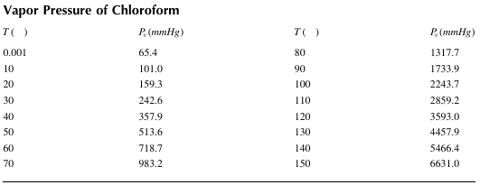
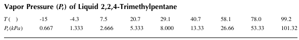
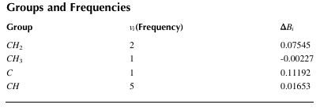

## 3. Physical Properties

### Example 3.1 Calculation of H2O Properties 
Calculate the specific volume, internal energy, enthalpy, and entropy of H2O at the specified temperatures and pressures. Compare the results with those recorded in steam tables that can be found in standard thermodynamic texts.  
1.750 kPa, 167.76 °C
2.2100 kPa, 214.85 °C

### Example 3.2 Physical Properties of the Saturated Liquid 
Calculate the properties of the saturated liquid at P = 10540 kPa  and those of saturated water vapor at =198 ℃.  

### Example 3.3 Physical Properties of Saturated Steam
Calculate the specific volume and the enthalpy and entropy of saturated steam and liquid at 150°C. 
Compare the results with those recorded in steam tables that be found in standard thermodynamic texts.  

### Example 3.4 Humidity of Saturated Water Vapor 
Calculate the actual vapor pressure (Pa) and absolute humidity (g/m3) when the dry bulb temperature is 40 ℃ and relative humidity is 50%. 

### Example 3.5 Density of Water 
Calculate the density of saturated water at 150 °C. 

### Example 3.6 Density of n-Hexane
Estimate the liquid density of n-hexane at T =293.15 K using the COSTALD method.
For n hexane, $T_c$=507.8K, $v_c$=386.8 cm3/ mol , ω =0.3002, and $M_w$ =86.178 g/ mol.  

### Example 3.7 Density of Benzene
Plot the density of benzene as a function of temperature T at 1 atm (0 ≤ T ≤ 70)
For benzene, $T_c$ = 288.93°C, $P_c$ = 49.24 bar, ω = 0.212 and $M_w$ = 78, and the gas constant R = 0.08314 (l atm /mol K)
 
### Example 3.8 Viscosity of Phenol 
Estimate the viscosity of liquid phenol at 150 ℃. 

### Example 3.9 Viscosity of Methane
Estimate the viscosity of methane gas at 100°C.

### Example 3.10 Heat Capacity of Phenol
Estimate the heat capacity of liquid phenol at 150°C.

### Example 3.11 Heat Capacity of MEK 
Use the Rowlinson-Bondi method to estimate the specific heat capacity of methyl ethyl ketone (MEK) at T = 100°C. Use $C_p^{id}$ = 1.671 J/(g K) = 120.496/(mol K), $T_c$ = 535.55 K, w = 0.323, $M_w$ = 72.11 g/mol , and R = 8.3143 J/(mol K)

### Example 3.12 Heat Capacity of Carbon Dioxide 
Estimate the heat capacity of carbon dioxide at 300 ℃.

### Example 3.13 Thermal Conductivity of Water 
Calculate the thermal conductivity of water at the range of 0°C ≤ T ≤ 350°C, and plot the results as a function of temperature. 

### Example 3.14 Thermal Conductivity of Propane
Estimate the thermal conductivity of propane gas at the range of 25°C ≤ T ≤ 900°C, and plot the results as a function of temperature. 

### Example 3.15 Surface Tension of Benzene 
Estimate the ratio of the surface tension of benzene at T = 60°C. 

### Example 3.16 Surface Tension of Ethanethiol 
Use the corresponding-states correlation to estimate the surface tension of ethanethiol (ethyl mercaptan) at 30℃. For ethanethiol, $P_c$ = 54.9 bar, $T_c$ = 499 K, and $T_b$ =308.15 K

### Example 3.17 Vapor Pressure of Chloroform
Table below shows the vapor pressure $P_v$ (mmHg) of chloroform as a function of temperature T(°C). 
The following Antoine equation is known to be adequate to represent the vapor pressure of chloroform:
$ln P_v=A-\frac{B}{T+C}$
Determine Antoine parameters A, B,and C. Plot values of $P_v$ calculated by Antoine equation and $P_v$ data on the same graph for 0 ≤ T ≤ 150(°C) .  

### Example 3.18 Vapor Pressure of Water
Estimate the vapor pressure of water at T = 85°C. 

### Example 3.19 Vapor Pressure of 2,2,4-Trimethylpentane
Table below shows the vapor pressure of liquid 2,2,4-trimethylpentane at various temperatures. 
Use the data given in Table below to determine the parameters for the Antoine equation, the Riedel equation, and the Harlacher-Braun equation. 

### Example 3.20 Vapor Pressure of Acetone
Estimate the vapor pressure (MPa)of acetone at 273.15K. For acetone, $T_c$ = 508.1 K, $P_c$ = 4.6924 MPa, A and values of parameters of the Wagner equation are A = -7.670734, B = 1.965917, C = -2.445437, and D= -2.899873.  

### Example 3.21 Vapor Pressure of n-Propylbenzene
Estimate the vapor pressure of n-propylbenzene $\ce{(C (CH)5 (CH2)2 CH3)} $ at 100 ℃ and 200 ℃ using the Rarey-Moller equation. The normal boiling point of n-propyl benzene is $T_b$ = 159.22°C. 
Each group and corresponding frequency of n-propylbenzene molecules are shown in Table 3.5.  

### Example 3.22 Vapor Pressure of Cyclohexanethiol 
Estimate the vapor pressure of cyclohexanethiol at T = 100°C. Compare the result with the experimental value of $P_v$ = 132.9 mmHg.

### Example 3.23 Vapor Pressure of 2-Methyl-1-Butanethiol 
Estimate the vapor pressure of 2-methyl-1-butanethiol at T = 112.6°C. Compare the result with the experimental value of $P_v$ = 634 mmHg.

### Example 3.24 Heat of Vaporization of Water 
Estimate the heat of vaporization of water (cal/g) at the range of 0 ≤ T ≤ 350(°C) and plot the result as a function of temperature.  

### Example 3.25 Enthalpy of Vaporization of Acetone 
Estimate the enthalpy of vaporization of acetone at T = 273.15 K(0 ℃). For acetone, $v^L$ = 7.145 × 10−5 m3/mol, $v^V$ = 0.2453 m3/mol, T3 = 508.1 K, Pc = 4.6924 MPa, Mw = 58.08 g/mol, and the parameters of the Wagner equation are A = −7.670734, B = 1.965917, C = −2.445437, and D = −2.899873.  

### Example 3.26 Standard Heat of Formation of Methane 
Estimate the heat of formation of methane (kcal/gmol) at 500°C.

### Example 3.27 Gibbs Free Energy of Formation of Benzene
Estimate the Gibbs free energy of formation of benzene at 60 ℃. 

### Example 3.28 Compressibility Factor of Natural Gases
Estimate compressibility factors of natural gases at 60 ℉ and at the pressure range of 100 ≤ P ≤ 5000(psia) when the specific gravity is 0.5, 0.6, 0.7, and 0.8. Plot the results as a function of pressure and specific gravity.  

