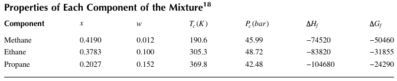
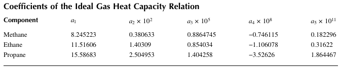
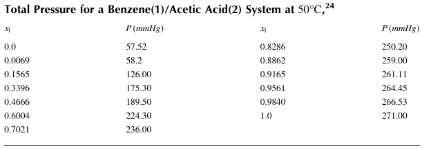
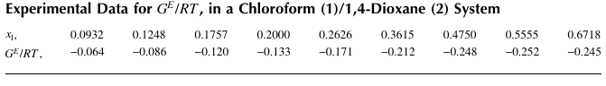
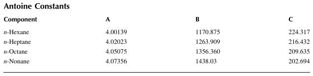
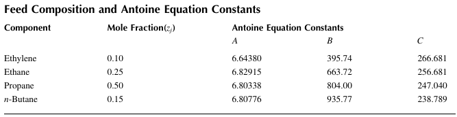

## 4. Thermodynamics

### Example 4.1 Compressibility Factor and Molar Volume of Ethane

Use the virial equation of state to determine the compressibility factor and the molar volume of ethane at 50°C, and 15 bar. For ethane, $T_c =305.3 K$ , $P_c =48.08 atm$, and w=0.1.

### Example 4.2  Density of N2 by Virial Equation

The virial equation of state can be expressed as 

$\frac{P}{\rho RT} = 1 + B \rho + C \rho^2 + D \rho^3 $

where is the molar density, R, is the gas constant (=0.08206 liter atm/(mol K)), and B, C, and D are virial coefficients. For N2, at 200 K, $B  = -0.0361 liter/mol$ , $C = 2.7047×10^{-3} ( liter/mol )^2$, and $D = 4.4944×10^{-4} ( liter/mol )^3$. Plot the density of N2, at 200 K, as a function of pressure ( 1 < P < 30 atm ). 

### Example 4.3  Compressibility Factor of 1-Butene

Determine the compressibility factor of 1-butene at 400 K, and 20 MPa. For 1-butene, the critical temperature is 419.6 K, the critical pressure is 40.2 MPa, and the acentric factor is 0.191. 

### Example 4.4  Molar Volume of n-Butane

Determine the molar volumes of saturated vapor and saturated liquid n-butane using the cubic equations of state (van der Waals, Redlich-Kwong, Soave-Redlich-Kwong equation, and Peng-Robinson). For n-butane, the vapor pressure at 350 K, is 9.4573 bar, Tc = 425.1 K , Pc = 37.96 bar and w = 0.2.  

### Example 4.5  Vapor Pressure by Peng-Robinson Equation

The Peng-Robinson equation of state (EOS) is given by 

$P = \frac{RT}{V-b} - \frac{a}{V^2 +2bV -b^2} $
$a=\frac{0.45724R^2T_c^2}{P_c} (1+(0.37464+1.54226\omega -0.26992\omega^2)(1-\sqrt{T_r}))^2, b=0.0778\frac{RT_c}{P_c} $

Figure 4.2 shows the pressure-volume (PV), plot for CO2, calculated by the Peng-Robinson equation of state when T = 288.15 K (15°C). Graphically, the vapor pressure is a pressure at which the area of the region I shown in the PV, plot is exactly equal to the area of region II. This fact implies that the vapor pressure, $P_v^{sat}$, should satisfy the following relation: 
$P_v^{sat}(V_G-V_L)=\int_{V_L}^{V_G}pdV$

$V_G$, and $V_L$, are the roots of the nonlinear equation 
$f(V)=\frac{RT}{V-b}-\frac{a}{V^2+2bV-b^2}-P$

Determine $P_v^{sat}$, for CO2, by applying appropriate numerical methods, and compare the result with that obtained from the `extended Antoine equation` 
$log P_v=A+\frac{B}{T}+c log T +DT(P_v: mmHg, T :K)$

For CO2, $T_c$ =304.2 K, $P_c$ =73.83 bar, ω=0.224, A =47.544, B = -1792.2, C = -16.559, and D =0.013833.  

### Example 4.6  Enthalpy Change of Methane
Determine the mean heat capacity, $[C_p]_H/R$ , and the heat required to raise the temperature of 1 mol of methane from 260°C, to 600°C, in a steady flow process at a sufficiently low pressure that methane may be considered an ideal gas. For methane, the heat capacity is given by $C_p =1.702+9.081×10^{-3}T-2.164×10^{-6}T^2.$

### Example 4.7  Enthalpy and Entropy Departure of n-Butane Gas

Determine the enthalpy departure $H^R = H - H^{ig} $, and the entropy departure $S^R = S - S^{ig}$, for n-butane gas at 50 bar, and 500 K. For n-butane gas, $T_c$ = 425.1 K, $P_c$ = 37.96 bar, and w = 0.2.  

### Example 4.8  Enthalpy and Entropy Departures of Propane Gas
Propane gas undergoes a change of state from an initial condition of 5 bar, and 105°C, (state 1) to 25 bar, and 190°C, (state 2). 
(1) Determine the enthalpy departure $H - H^{ig} $, and the entropy departure $S - S^{ig} $, at each state from the Peng-Robinson equation.
(2) Calculate changes in enthalpy and entropy for a change from state 1 to state 2. For propane gas, $T_c$ =369.8 K, $P_c$ =4.249 MPa, (  =42.49 bar), and w=0.152. The heat capacity coefficients are 
given by $A = -4.224, B =0.3063, C= -1.586×10^{-4}, and D=3.215×10^{-8}$.

### Example 4.9  Enthalpy of Mixture 
Estimate the liquid-phase enthalpy of the mixture of methane(1)/ethane(2)/propane(3) at -158 K, and 6.8947 bar. 
The liquid-phase mole fractions of components are x1 = 0.419, x2 = 0.3783, x3 = 0.2027, and the properties of each component are shown in Table below ( ∆Hf, ∆Gf : J mol).
Another Table shows coefficients of the ideal gas heat capacity relation for each component. 

### Example 4.10  Fugacity of Acetylene Gas
Find the fugacity of acetylene at 250 K, and 10 bar.
For acetylene, $T_c$ = 308.3 K, $P_c$ = 6.139 MPa ( = 61.39 ), and w = 0.187

### Example 4.11  Fugacity Coefficients in a Mixture
Determine the fugacity coefficients of all components in a nitrogen(1)/methane(2) mixture by the Peng-Robinson equation at 100 K, and 0.4119 MPa (4.119 bar ). In this mixture, the mole fraction of nitrogen is y1 =0.958 . For nitrogen, $T_{c1}$ =126.1 K , $P_{c1}$ =3.394 MPa (33.94 bar ) , and w1 = 0.04 ; and for methane, $T_{c2}$ =190.6 K , $P_{c2}$ =4.604 MPa (46.04 bar ) , and w2 =0.011 . 

### Example 4.12  Vapor-Phase Composition of Benzene/Acetic Acid System
Data of liquid-phase composition versus total pressure for a benzene(1)/acetic acid(2) system at 50°C, are presented in Table 4.11. Use the Gibbs-Duhem equation to estimate the composition of the vapor phase and the activity coefficients.

### Example 4.13  Estimation of Parameters of the Wilson Equation 
The temperature of the azeotrope for an ethanol(1)/n-octane(2) mixture at P = 760 mmHg, is 77 °C, and the composition at the azeotrope is 78% ethanol and 22% n-octane (% by weight). At the temperature of the azeotrope T, the vapor pressures of ethanol and n-octane may be obtained by the Antoine equation 
$log P_i= A_i-B_i/(T +C_i )$
, where T, is the azeotrope temperature ( °C), and Pi, is the vapor pressure (mmHg). For ethanol, A1 = 8.04494, B1 = 1554.3, and C1 = 222.65; and for n-octane, A2 = 6.92374, B2 = 1355.126, and C2 = 209.517. The molecular weights of ethanol and n-octane are 46.07 and 114, respectively. Determine the Wilson equation coefficients for this system. 

### Example 4.14  Estimation of Activity Coefficients by Margules Equation
In a binary liquid mixture of chloroform (1) and 1,4-dioxane (2) at 50 °C, the activity coefficients of chloroform ( γ1), and 1,4-dioxane ( γ2), can be estimated from Margules equations given by
$\gamma_1 =exp[x_2^2(A_12+2(A_21 -A_12)x_1)], \gamma_2 =exp[x_1^2(A_21+2(A_12 -A_21)x_2)]$

where x1, is the mole fraction of chloroform, x2, is the mole fraction of 1,4-dioxane, and A12, and A21, are the Margules parameters for the binary system. The following relation can be applied to estimate A12, and A21: 
$G^E/RT_{x_1,x_2}=A_{21}x_1+A_{12}x_2$

where $G^E/RT$ , is the dimensionless excess Gibbs free energy. Table below shows data for $G^E/RT$ , obtained from the vapor-liquid equilibrium experiment. Estimate A12, and A21, and determine the value of x1, such that γ1 = γ2.  

### Example 4.15  Activity Coefficients by the UNIFAC Method
Determine γ1, and γ2, for the binary system of diethylamine(1)/n-heptane(2) at T =308.15 K , when x1 =0.4 , and x2 =0.6 . The subgroups involved are indicated by the chemical formulas as Diethylamine(1): CH3 CH3CH CH3 CH3 , n-Heptane(2): CH3 (CH2)5 CH3 ,  

### Example 4.16  Activity Coefficients for a Four-Component Mixture by the UNIFAC Method 
Estimate activity coefficients of all components for a system n-hexane(1)/ethanol(2)/ methylcyclopentane(3)/benzene(4). The given pressure P, is 1 atm, the temperature T, is 334.82 K, and the liquid-phase mole fractions of the components are x1= 0.162, x2= 0.068, x3= 0.656, and x4 = 0.114. Each component consists of the following functional groups: 
n-Hexane(1): 2CH3 4CH2 , 
Ethanol(2): CH3 CH2 OH , 
Methylcyclopentane(3): 3CH3 CH2 CH C , 
Benzene(4): 6ACH 6 ,  

### Example 4.17  Estimation of Pressure by Raoult’s Law 
A liquid mixture containing mol 60 %, of n-pentane(1) and mol 40 %, n-heptane(2) enters a flash drum at a low pressure. The vapor and liquid streams from the drum are in equilibrium. Both streams are assumed to be ideal, and Raoult’s law can be applied. The vapor pressure of each component, $P_{sat i}$,(kPa), at temperature T,(°C), can be obtained using the Antoine equation given by 
$ln P_{sat i} =A_i -\frac{B_i}{T+C_i} (i=1,2)$
where A1 =13.8183, A2=13.8587, B1=2477.07, B2=2991.32, C1=233.21, C2=216.64 . 
(1) Determine the operating pressure P,(kPa), when the temperature of the flash drum is T=60°C, and 65% of the feed is vaporized. What is the composition of each product stream at this operating pressure? 
(2) Plot the operating pressure as a function of the fraction vaporized at 60°C. 

### Example 4.18  Bubble Point Estimation  
Determine the bubble point temperature for a mixture of 32 mol% n-hexane, 31 mol%, n-heptane, 25 mol%, n-octane, and 12 mol %, n-nonane at 1.5 bar , total pressure. The vapor pressure of the pure species j, is given by the Antoine equation
$log P_J^{sat} =A -\frac{B}{C+T-273.15}$ (T: K, $P_J^{sat} $: bar)
where the Antoine constants for each component are shown in Table below.

### Example 4.19  P and T Plots by Raoult’s Law
A binary system of acetonitrile(1)/nitromethane(2) conforms closely to Raoult’s law. Vapor pressures for the pure species are given by the following Antoine equations: 
$ln P_1=A_1-\frac{B_1}{T+C_1}=14.2724-\frac{2945.47}{T+224.0}, ln P_2=A_2-\frac{B_2}{T+C_2}=14.2043-\frac{2972.64}{T+209.0}$
where T, is the temperature ( °C). 
(1) Generate a graph showing the total pressure P, versus x1, and y1,for a temperature of 75 °C. 
(2) Generate a graph showing T, versus x1, and y1, for a pressure of P = 70 kPa.  

### Example 4.20  Equilibrium Calculations Using the Modified Raoult’s Law
For a methanol(1)/methyl acetate(2) binary system, reasonable correlations for the activity coefficients are given by 
$ln \gamma_1=Ax_2^2, ln \gamma_2=Ax_1^2, A=2.771 - 0.00523 T$
The Antoine equation provides expressions for vapor pressures (kPa): 
$ln P_1^{sat}=16.59158-\frac{3643.31}{T-33.324}, ln P_2^{sat}=14.25326-\frac{2665.54}{T-53.424}$
where T, is the temperature (K).  
(1) Estimate P, and yi, for T =318.15 K, and x1 =0.25  .  
(2) Estimate P, and xi, for T =318.15 K, and y1 =0.60  .  
(3) Estimate T, and yi, for P =101.33 kPa , and x1 =0.85  .  
(4) Estimate T, and xi, for P =101.33 kPa , and y1 =0.40  . 

### Example 4.21  Flash Evaporator
A feed stream of an ideal four-component mixture is fed into a flash evaporator. The composition of the feed stream is given in Table below with the Antoine equation constants. The flash drum operates under high pressure, between 15 and 25 atm, with a feed stream at 50 °C. Estimate the percentage of the total feed at 50 °C, that is evaporated, α,( =V /F), and the corresponding mole fractions in the liquid and vapor streams fbubble point temperature,or P = 16, 18, 20, and 24 atm. 
Calculate the dew point and bubble point temperatures of the feed stream. 

### Example 4.22  Bubble Point P for a Two-Component System 
A liquid mixture contains chloroform (1) and ethanol (2) at 60°C. At equilibrium, 
$y_1\hat{\phi_1}P=x_1\gamma_1P_1^{sat}, (1-y_1)\hat{\phi_2}P=(1-x_1)\gamma_2P_2^{sat}$

where x1, and y1, are the mole fractions of chloroform in the liquid and vapor phases, respectively; 
$P_i^{sat}$, is the vapor pressure of component i; γi, is the activity coefficient of component i; and $\hat{\phi_i}$, is the fugacity coefficient of component i. Generate profiles of the bubble point pressure (P), as a function of x1, and y1, using the data given below. The activity coefficient γi, is given by 
$ln \gamma_1=(1-x_1)^2(A_12+2(A_21-A_12)x_1), ln \gamma_2=x_1^2(A_21+2(A_12-A_21)(1-x_1))$

and $\hat{\phi_i}$, can be obtained from
$ln \hat{\phi_1}=\frac{1}{RT}(B_11(P-P_1^{sat})+P(1-y_1)^2\delta_12), ln \hat{\phi_2}=\frac{1}{RT}(B_22(P-P_2^{sat})+Py_1^2\delta_12)$

where δ12 =2 B12 - B11 - B22, R, is the gas constant, and T(K ), is the temperature. 
Data: $P_1^{sat} =83.25 kPa $ , $P_2^{sat} =37.97 kPa $ , A12 =0.59  , A21 =1.42  , B11 = -963 cm3/ mol , B22 = -1523 cm3/mol  , B12 =52 cm3/mol . 

### Example 4.23  Bubble T Calculations for a Four-Component System
Determine the bubble point temperature and vapor-phase mole fractions for an n-hexane(1)/ ethanol(2)/methylcyclopentane(3)/benzene(4) system. The given pressure is 1 atm , and the given liquid-phase mole fractions are x1 =0.162, x2=0.068, x3=0.656 , and x4 =0.114  . Vapor pressure can be estimated using the Antoine equation ln P = A+ B/(T +Ci ) 
, (T:K, P:atm). The parameters for the Antoine equation are 
A1 =9.2033, A2=12.2786, A3=9.1690, A4=9.2675 
B1 =2697.55, B2=3803.98, B3=2731.00, B4=2788.51 
C1 = 48.78, C2= 41.68, C3= 47.11, C4= 52.36 
The virial coefficients (cm3 /mol ), for each component are 
B11 = -1360.1, B12= -657.0, B13= -1274.2, B14= -1218.8 
B22 = -1174.7, B23= -621.8, B24= -589.7, B33 = -1191.9 
B34 = -1137.9, B44 = -1086.9

### Example 4.24  Flash Calculations for a Four-Component System
Perform flash calculations for a four-component system consisting of n-hexane(1)/ethanol(2)/ methylcyclopentane(3)/benzene(4). The given pressure and temperature are 1 atm , and 334.15 K , and the given mole fractions of the feed stream are z1 =0.25, z2 =0.40, z3 =0.20 , and z4 =0.15. Vapor pressure can be estimated using the Antoine equation $ln P_i^{sat} = A_i+ B_i/(T +C_i )$ , (T: K, P: atm). The parameters for the Antoine equation are 
A1 =9.2033, A2 =12.2786, A3 =9.1690, A4 =9.2675 
B1 = 2697.55, B2 = 3803.98, B3 = 2731.00, B4 = 2788.51
C1 = -48.78, C2 = -41.68, C3 = -47.11, C4 = -52.36
The virial coefficients (cm3/ mol) for the components are 
B11 = -1360.1, B12 = -657.0, B13 = -1274.2, B14 = -1218.8
B22 = -1174.7, B23 = -621.8, B24 = -589.7, B33 = -1191.9
B34 = -1137.9, B44 = -1086.9

### Example 4.25  Water-Isobutanol Equilibrium Calculations
A mixture of isobutanol(1) (20 mol%), and water(2) (80 mol%), is heated to the bubble point at a constant pressure of 1 atm . We assume that Raoult’s law, $K_ij = γ_ij P_i/P$ , can be applied. The vapor pressure of species i, Pi, for each component is given by the Antoine equation: 
$log(P_1)=7.62231-\frac{1417.9}{191.15+T}, log(P_2)=8.10765-\frac{1750.29}{235+T} (T: °C)$

Activity coefficients of isobutanol(1) and water(2) are given by 
$log γ_{1,j}=\frac{1.7 x_{2,j}^2}{(2.43 x_{1,j}+x_{2,j})^2}, log γ_{2,j}=\frac{0.7 x_{1,j}^2}{(x_{1,j}+0.412x_{2,j})^2} (J: phase)$
Determine the bubble point and dew point temperatures at 1 atm . Plot the fraction evaporated (α ), as a function of the boiling temperature between these two temperatures.  