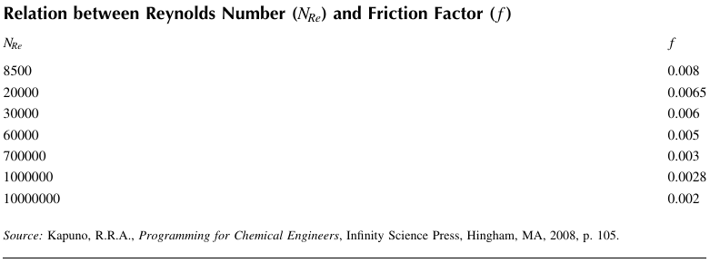
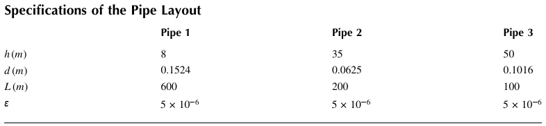
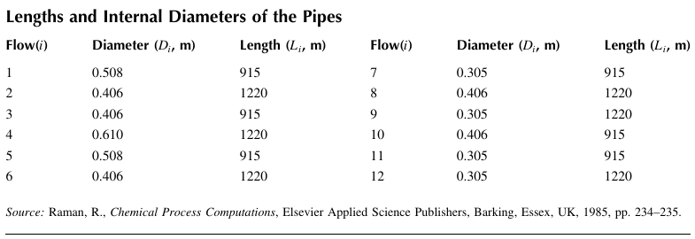
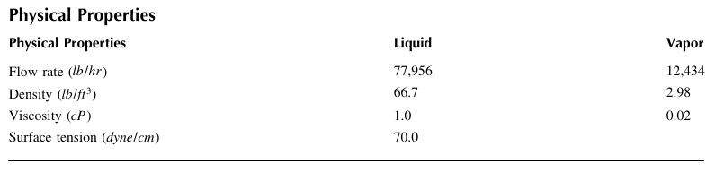

## 5. Fluid Mechanics

### Example 5.1 Newtonian Fluid Flow inside a Horizontal Pipe 

Water flows inside a horizontal circular pipe at 25°C. Determine the average velocity and plot the velocity distribution inside the pipe. The length and the inside radius of the pipe are 15 and 0.009 m, respectively, the viscosity of water is $8.937 × 10^{-4} kg/(m·sec)$, and the pressure drop is ∆P = 520 Pa

### Example 5.2 Laminar Flow of Water in a Horizontal Annulus 

Water flows inside a horizontal annulus at 25°C. Determine the average velocity and plot the velocity and shear stress distributions inside the annulus. The length and the inside radii of the inner and outer pipes are 12, 0.025, and 0.036 m, respectively. The viscosity of water is $8.937 × 10^{-4} kg/(m·sec)$ , and the pressure drop is ∆P = 110 Pa. 

### Example 5.3 Velocity Distribution of a Falling Film 

Plot the velocity distribution $v_z (x)$ and calculate the average velocity for a falling film of a Newtonian fluid with ρ = 780 kg/m3 and μ = 0.172 kg/(m·sec). The film thickness is δ = 0.0021 m.

### Example 5.4 Terminal Velocity of a Falling Particle
Estimate the terminal velocity of a spherical particle falling in water at 25°C. For the particle, $ρ_p$ =1780 kg/m3 and $D_p$ =0.2 mm . The viscosity and density of water are μ = $8.391×10^{-4}$ kg /(m·sec) 
and  994.6 kg/ m3, respectively. 

### Example 5.5 Friction Factor
Determine the friction factors using various correlation equations (i.e., SC, CB, CBW, HA, CH, NK, and BS) at $N_Re = 2 × 10^4$ and $N_{Re} = 3.2 × 10^7$ for smooth pipes, where ε/D = 0

### Example 5.6 Friction Factor Correlation 
Determine an empirical correlation to represent the relationship between the Reynolds number and the Fanning friction factor for a smooth pipe using the data given in Table below.

### Example 5.7 Determination of Pipe Diameter
Water flows inside a smooth pipeline at 21°C with a flow rate of 0.0085 m3 / sec . The length of the pipeline is 250 m, and the elevation of the upstream point is high enough to overcome the friction loss $F_f$  =27.5 J /kg . The Fanning friction factor is given by $f =0.0468 N_{Re}^{-0.2}$
, and the density and viscosity of water at 21°C are ρ =997.91 kg/ m3 and u  =0.000982 kg /(m·sec ), respectively. Determine the diameter of the pipeline. 

### Example 5.8 Flow in a Pipe
Figure 5.8 shows a pipeline that delivers water at a constant temperature from point 1 to point 2. 
At point 1, the pressure and elevation are p1  =150 psig and z1  =0 ft , respectively, and at point 2, the pressure p2 is atmospheric and the elevation is z2  =300 ft . The density (lbm / ft3) and viscosity (lbm  /(ft·sec )) of the water can be estimated from the following equations: 
$ρ = 62.122 + 0.0122 T - 1.54 \times 10^{-4}T^2 + 2.65 \times 10^{-7}T^3 - 2.24 \times 10^{-10}T^4 $
$ln \mu = -11.0318 + \frac{1057.51}{T+214.624} $
where T is in °F. 
(1) Determine the volumetric flow rate (gal /min ) at T=60°F for a pipeline with an effective length of L  =1000 ft and made of nominal 8 in. schedule 40 commercial steel pipe ( ε =0.00015 ft). 
(2) Estimate the flow velocities v in ft  /sec and flow rates q in gal /min for pipelines at T=60°F with effective lengths of L=500, 1000, 1500, , 10,000 ft and made of nominal 4, 5, 6, and 8 in. schedule 
40 commercial steel pipe. Prepare plots of velocity v versus D and L, and flow rate q versus D and L. 
(3) Repeat part (1) at T=40, 60, and 100°F and display the results in a table showing temperature, density, viscosity, and flow rates. 

### Example 5.9 Liquid Flow in a Pipeline  
Water is drained from a reservoir through a pipeline from point 1, where the pressure is P1  =205 kPa , to point 2, where the pressure is P2  =125 kPa (see Figure 5.10). Calculate the mass flow rate in kg /sec for water that is required to generate  1.2 MW from the turbine installed between point 1 and point 2. The distance from the reservoir (point 1) to the turbine is 120 m, and the distance from the turbine to point 2 is 5 m . Assume that the temperature and fluid velocity are constant and the friction loss is negligible. 

### Example 5.10 Steam Flow in a Pipeline 
Superheated steam flows through a pipe with inner diameter (di) of 0.75 cm and length (z) of 12 m. 
The inlet temperature and pressure (P1) of the steam are 145°C and 510 kPa, respectively, and the viscosity of the steam is $13.8×10^{-6} N·sec/m2$. The outlet pressure (P2) can be determined by solving 
the following equation: 
$P_1^2 = P_2^2 + \frac{G^2RT}{M}(\frac{fz}{d_i} +2 ln(\frac{P_1}{P_2}))$
where M is the molecular weight of water (= 18 kg/kmol ), G is the mass flow rate of the steam, and the friction factor f is given by f = {0.79 ln(Re ) -1.64}^{-2} (Re: Reynolds number). Plot the pressure drop versus G when G varies from 20 to 50 kg /(sec·m2). 

### Example 5.11 Flow Rate and Pressure Drop  
Water is flowing through a horizontal 6 in. Schedule 40 mild steel pipe at 1 atm and 25°C. The inside diameter and the length of the pipe are 0.154 m and 1500 m, respectively, and the roughness factor is 0.0000457 m. The inlet and outlet conditions are P1= 20 atm, z1= 0m, P2= 2 atm, and 
z2= 100m. The density of water is 1000 kg/ m3 and the viscosity is  
0.001 kg/(m sec). Calculate the 
inlet volumetric flow rate and the pressure drop $ΔP_f =2fρLv^2 /D$. The friction factor f is given by the Colebrook equation as follows: 

$\frac{1}{\sqrt{f}}=-1.7372 ln(\frac{\varepsilon }{3.7D}+\frac{1.255}{N_{Re}\sqrt{f}})$

### Example 5.12 Unsteady-State Flow in a Pipe
The momentum balance for the fluid flow through a long pipe with constant density (ρ ) and viscosity (μ ) is given by
$\rho \frac{\partial v_z}{\partial t}=\frac{P_0-P_L}{L} + \mu \frac{1}{r}\frac{\partial }{\partial r}(r\frac{\partial v_z}{\partial r})$
The initial and boundary conditions are given by 
$t =0: v_z=0, r=0: v_z$=finite, r= R: $v_z=0 $
The momentum equation can be expressed in dimensionless form as 
$\frac{\partial \phi }{\partial \tau }=4+\frac{1}{\xi }\frac{\partial }{\partial \xi }(\xi \frac{\partial \phi }{\partial \xi }), \phi (0,\xi )=0, \phi (\tau ,1)=0, \frac{\partial \phi (\tau ,0)}{\partial \xi }=0$
where 
$\phi =\frac{v_z}{(P_0-P_L)R^2/(4\mu L)}=\frac{v_z}{v_max}, \xi =\frac{r}{R}, \tau =\frac{vt}{R^2}$
The differential equation can be solved by using the built-in PDE solver pdepe. The standard form provided by the MATLAB to be used in pdepe is given by 
$g(x,t,u,\frac{\partial u}{\partial x})\frac{\partial u}{\partial t}=x^{-m}\frac{\partial }{\partial x}(x^mf(x,t,u,\frac{\partial u}{\partial x}))+r(x,t,u,\frac{\partial u}{\partial x})$
By direct comparison between the dimensionless momentum equation and the MATLAB standard form, we have
$m=1, g(x,t,u,\frac{\partial u}{\partial x})=1,r(x,t,u,\frac{\partial u}{\partial x})=4, f(x,t,u,\frac{\partial u}{\partial x})=\frac{\partial \phi }{\partial \xi }$
The standard forms of the initial and boundary conditions provided by MATLAB are given by 
$t=t_0, u(x,t_0)=u_0(x)$

$x=a, x=b: p(x,t,u)+q(x,t)f(x,t,u,\frac{\partial u}{\partial x}) $
By comparison between the dimensionless initial and boundary conditions and MATLAB standard forms, we have 
$\phi (0,\xi )=0 -> u_0(x)=0, $

$\phi (\tau ,1)=0 -> p=ur, q=0, $

$\frac{\partial \phi (\tau ,0)}{\partial \xi }=0 -> p=0, q=1$
In order to use the built-in function pdepe, the differential equation and the initial and boundary conditions should be defined as functions. The plot of ф as functions of τ and ξ and the profiles of τ as a function of ξ can be produced as follows:  
1. Define the differential equation to be solved: the function fleqn defines the PDE.  
2. Define the initial and boundary conditions: the function itcon defines the initial condition and the function bncon sets up the boundary conditions.  
3. Define the ranges of x and t and execute the built-in function pdepe: the script unsflow defines the range of xand t and calls pdepe to solve the PDE. 

### Example 5.13 Pump Power
Figure 5.13 shows the layout of a three-tank system. We need to feed tank 2 and tank 3 from storage tank 1. The flow rate from tank 1 is  0.042 m3 /sec , and the density and viscosity of the liquid are  1000 kg/ m3 and 0.001 kg  /(m·sec ), respectively. The tanks are open to atmosphere, and the characteristics of the pipes are given in Table below. Determine the power of the pump to be bought for this transport operation and the flow rates to each tank. 

### Example 5.14 Power Requirement from a Pump
Water is to be delivered to the upper tank shown in Figure 5.14. Determine the required power output from the pump at steady state. All of the piping is 4 in. internal-diameter smooth circular pipe. The Shacham equation can be used to estimate the friction factor in the turbulent region. 
Data: ρ =62.4 lbm / ft3, μ =1 cp =0.0006905 lbm /(ft·sec )  , Q   =12 ft /min =0.2 ft3 /sec  , K(sudden contraction)=0.45, K(sudden expansion)=1, K(90° elbow)=0.5, ε =0.0005, $g_c$=32.174 lbm·ft /(lbf·sec2 )

### Example 5.15 Internal Diameter of a Pipe 
A process vapor is to be condensed with cooling water flowing inside the tubes of a shell-and- tube heat exchanger. The mass flow rate of cooling water is 0.36 kg /sec , and the allowable pressure drop is 10 kPa. Determine the diameter of the tube to be used in the condenser. The friction factor in the turbulent region may be given by the Shacham equation. 
Data: ρ = 85.9 kg/m3 , μ =$4.4×10^{-4}$ N sec/m2(kg/m /sec ), L = 4 m, ε= $5 × 10^{-6}$ m, K = 0.3. 

### Example 5.16 Pipeline Flow
A pipeline isometric (Figure 5.15) shows a 6 in. schedule 40 steel pipeline with six 90° LR (long-radius) elbows and two flow-through tees. The actual length of the pipe is 78 ft. The mass flow rate of the fluid is 75,000 lb /hr, the viscosity and density of the fluid are 1.25 cP and 64.30 lb /ft3, respectively, and the pipe roughness is ε= 0.000015 ft. Calculate the equivalent length of pipe fittings and the total length of the pipe. 

### Example 5.17 Flow in a Pipeline Network
Water at 25°C is flowing in the pipeline network shown in Figure 5.17. The pressure at the exit of the pump is P0  =15 bar (gauge pressure), and the water is discharged at atmospheric pressure (P5) at the end of the pipeline. All the pipes are 6 in. schedule 40 steel with an inside diameter of 0.154 m. The equivalent lengths of the pipes connecting different nodes are L01 =100 m, L12= L23= L45=300 m , and L13 = L24= L34 =1200 m . Determine all the flow rates qij and pressures at nodes 1, 2, 3, and 4 for the pipeline network. The pipe roughness is ε =$4.6×10^{-5}$ m, and the friction factor f may be given by the Shacham equation. At 25°C, the viscosity of water is $8.931×10^{-4}$ kg/(msec ) . 

### Example 5.18 Four-Loop Network
A pipeline network with four flow loops is illustrated in Figure 5.18. The lengths and internal diameters of the pipes are shown in Table 5.7. Calculate the mass flow rate in each pipe that satisfies the pressure drop equation. A pipe roughness of ε =$5×10^{-6}$ m is assumed uniformly for all pipes. The density and viscosity of the fluid are 881 kg/ m3 and  $5×10^{-4}$ Ns/ m2, respectively, and the inlet flow rate is m0 =334 kg/ sec . 

### Example 5.19 Flow through an Enclosed Tank
For a flow involving an enclosed tank, plot the dimensionless level (z ), flow rates (F1, F2), and pressure (P2) versus the dimensionless time (t ) within the range of 0 ≤t ≤0.4. Assume that the molecular weight of the gas is 29 (air) and $P_{G0} =0.735 P_{10}$ . 
Data: ρ =1000 kg/m3 , A =0.465 m2, z0=3.05 m, g =9.8 m/ sec2
$C_{v1} =C_{v2} =0.012 m2/(N^{1/2}·sec)$ ,
P10 = P1 =$1.38×10^5$ N/m2 , P30= P3=$1.08×10^5$ N/m3
P0 =$1.014×10^5$ N/m2, V0 =2.83 m3, $V_{G0}$=1.415 m3, $T_{G0}$=338.6 K
$c_V$ =0.2 cal/(g·K ), R =1.987 cal/(gmol·K)

### Example 5.20 Liquid Flow through an Orifice
A gas flows through a 35 mmrestriction orifice in a 100 NB (nominal bore) schedule 40 pipe. 
Estimate the pressure drop due to the orifice using the given data. 
Data: mass flow rate G  =3960 kg/hr , pipe inside diameter d =0.10226 m, gas density ρ =10.25 kg/ m3, gas viscosity μ =0.013 cP, operating pressure p1  =1200 kPa (abs), temperature T1 =20°C , γ=1.3, compressibility Z=1, Fa =1 . 

### Example 5.21 Flow of a Non-Newtonian Fluid in a Horizontal Pipe 
A non-Newtonian fluid is flowing in a horizontal pipe where L = 15 m, r = 0.009 m, n = 2, k = $1.0 × 10^{-6} N·sec^N /m^2$, and ΔP = 110 Pa. Calculate the average velocity, and plot the velocity profile and shear stress versus radius. 

### Example 5.22 Pipe Diameter for Non-Newtonian Flow
Calculate the pipe diameter required for the horizontal flow of a power law fluid in a pipe. 
Data: density ρ =961 kg/ m3, mass flow rate m  =6.67 kg/sec , pipe length L =10 m, pipe roughness ε =$5×10^{-6}$ m, pressure drop ΔP =15 kPa, K=1.8, n=0.64, k  =1.48 $N·sec^{2-n}$ /m2. 

### Example 5.23 Compressible Fluid Flow
Calculate the maximum flow rate of natural gas through a ruptured exchanger tube. 
Data: Exchanger tube = 3/4 in., Schedule 160, inside diameter d = 0.614 in., tube length = 20 ft, pipe friction factor (complete turbulence) = 0.026, compressibility factor Z=0.9, gas temperature = 100 , molecular weight = 19.5, pressure in tubes (P1) = 1110 psig, relief valve set pressure on the shell side (P2) = 400 psig, ratio of specific heat capacities k=1.27, fluid viscosity = 0.012 cP, resistance coefficient due to fittings and valves K=2.026. 

### Example 5.24 Gas Release from a Cylinder
A gas being stored in a cylinder at 60°C is released to the atmosphere through a 6 m 80 NB (schedule 80) pipe (ID = 0.0779 m). The specific gravity of the gas is 0.42. Assume that the Darcy friction factor is $f_D$ =0.0175 , the ratio of specific heats is 1.3, and the gas in the cylinder is not limiting. Calculate the flow rates of the gas when the pressure in the cylinder is 800 kPa (gauge) and 150 kPa (gauge).

### Example 5.24 Pressure Drop due to the Orifice
A gas flows through a 10 mm restriction orifice in a 100 NB schedule 40 pipe. The flow may be considered a choked (or critical) flow. Estimate the expansion factor Y and pressure drop due to the orifice using the given data. 
Data: mass flow rate G = 582 kg/hr , pipe inside diameter d = 0.10226 m, gas density ρ = 10.25 kg/ m3
gas viscosity μ = 0.013 cP, operating pressure p1= 1200 kPa (abs), temperature T1 = 20°C, γ= 1.3, K = 1, Fa = 1

### Example 5.25 Pressure Drop in a Two-Phase Flow
Determine the pressure drop of a 5 mile (26,400 ft) length in a 6 in. schedule 40 ( in ID=6.065 .) pipe, for a 5,000 bpd(77,956 lb /hr ) rate of salt water ( $γ_w$ =1.07 ), having a vapor flowing at 6 mmscfd (12,434 lb /hr ) with 0.65 specific gravity at a temperature of 110°F. Physical properties of the fluid are shown in Table below. 

### Example 5.26 Pressure Drop for Flow through a Packed Bed
Estimate the pressure drop in a 60 ft length of 1 1/2 in. (schedule 40, inside diameter  =1.61 in.(  =0.134 ft)) pipe packed with catalyst pellets 1/4 in.diameter when 104.4 lb /hr of gas is passing through the bed. The temperature is constant along the length of the pipe at 260°C. The void fraction is 45% and the properties of the gas are similar to those of air at this temperature (density=0.413 lb / ft3, viscosity=0.0278 cP). The entering pressure is 10 atm. 
