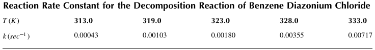
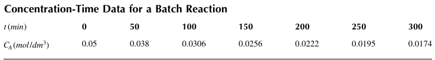
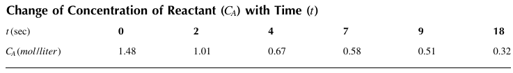
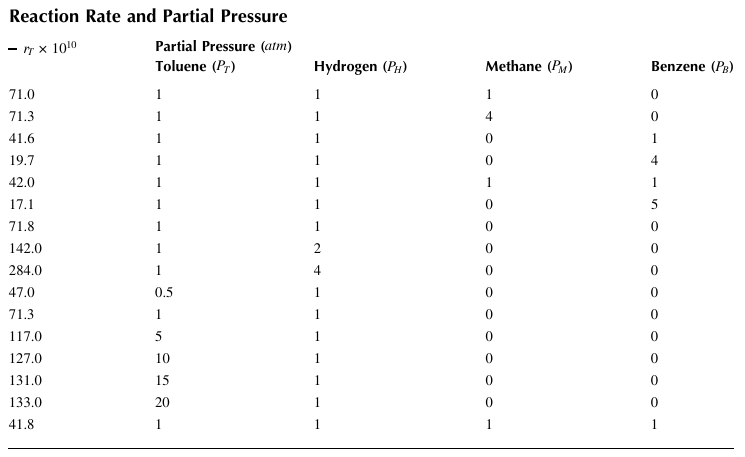
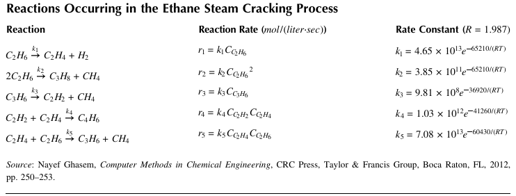

## 6 Chemical Reaction Engineering

### Example 6.1 Estimation of the Activation Energy
Estimate the activation energy for the decomposition of benzene diazonium chloride to produce chlorobenzene and nitrogen using the information given in Table below for this 1st-order reaction.

### Example 6.2 Estimation of Rate Constant and Reaction Order
Concentration ($C_A$)-time data were obtained in batch experiments for the liquid-phase reaction 
A + B -> C
as shown in Table below. For this reaction, the rate can be represented as $-r_A =k'Ca^α$
The concentration of B is assumed to be constant. Estimate the reaction order α and the rate constant k'. 

### Example 6.3 Estimation of Reaction Order
A pure substance A is decomposed into Baccording to the elementary reaction A -> B. The reaction rate must be found by using the experimental data shown in Table below. Determine the most probable order (0, 1, or 2) of the reaction and the corresponding rate constant.

### Example 6.4 Equilibrium of Water-Gas Shift Reaction
Consider the water-gas shift reaction to make hydrogen for fuel cell applications: 
$\ce{CO + H2O <-> CO2 + H2} $

The equilibrium constant has been found to be K = 148.4 at 500 K. The reaction feed consists of 1 mol of CO and 1 mol of H2O . Determine the compositions at equilibrium. 

### Example 6.5 Equilibrium Conversion
The reversible gas-phase decomposition of nitrogen tetroxide (N2O4) to nitrogen dioxide, $\ce{N2O4 <-> 2NO2}$ , is to be carried out at a constant temperature of 340 K. The feed consists of pure 
N2O4 at 202.6 kPa ( 2 atm ). The concentration equilibrium constant, $K_C$, at 340 K is 0.1 mol / dm3, and the rate constant is $k_{N2O4}  =0.5 min^{-1} $. Calculate the equilibrium conversion of N2O4 in a flow reactor. The equilibrium constant is given by
$K_C=\frac{C_{Be}^2}{C_{Ae}} $

### Example 6.6 Series Reactions
An elementary liquid-phase series reaction is carried out in a batch reactor: 
$\ce{A->[k1]B->[k2]C}  $
In this reaction, A is decomposed to the desired product B and the flow rate of the feed containing A is 25 liter/ min. Determine the maximum concentration of B and the time when the concentration of B reaches the maximum value. The initial concentrations of A, B, and C are $C_{A0}$ = 2.5 mol/ liter , $C_B=C_C=0$.
The reaction rate constants are $k_1 = 0.2 min^{-1}$ and $k_2 = 0.1  min^{-1}$

### Example 6.7 CSTRs in Series
The elementary irreversible liquid-phase reaction 
$\ce{A + B -> C}$, $r_A =kC_AC_B$
is carried out in a series of three identical CSTRs. The initial concentrations of A and B are $C_{A0} = C_{B0}$ = 2 gmol/dm3, the inlet flow rates of A and B are $v_{0A} = v_{0B}$= 6 dm3/ min , the reaction rate constant is k=0.5, the volume of each reactor is $V_1 = V_2= V_3$ =200 dm3, and the flow rate of each stream is $v_1 = v_2= v_3$ = 12 dm3/ min . Plot the concentration of A exiting each reactor, $C_{Ai}$ ( i=1,2,3) , during start-up to the final time t=20  (0 ≤t ≤20).

### Example 6.8 pH Neutralization Reaction
Figure 6.6 shows a CSTR where an acidic solution is neutralized with an alkaline solution. The neutralization reaction takes place between a strong acid (HA) and a strong base (BOH) in the presence of a buffer agent (BX).
The following reactions occur in the reactor: 

$\ce{HA <->[K_A]H+ + A- , BOH <->[K_B] B+ + OH- ,BX <->[K_C] B+ + X-}$

$\ce{H2O + X-<->[K_D]HX + OH- , H2O <->[K_E] H+ + OH- }$

The equilibrium constants are given by 

$\ce{K_A = \frac{[H+][A-]}{[HA]}, K_B = \frac{[B+][OH-]}{[BOH]}, K_C = \frac{[B+][X-]}{[BX]}, K_D = \frac{[HX][OH-]}{[X-]}, K_E = [H+][OH-] }$

The base and buffer agents are both highly soluble, and  [HA ] =0,  [BOH ] =0, and  [BX ] =0. Thus we can assume that $K_A -> ∞, K_B -> ∞$, and $K_C -> ∞$. The invariant species are given by 

$\ce{x_1 =[HA] +[A-] ≈ [A-], x_2 =[BOH] +[BX] +[B+] ≈ [B+],  } $

$\ce{x_3 =[BX] +[HX] + [X-] ≈ [HX] +[X-]  } $

From the material and charge balances, we have 

$\frac{dx_1}{dt} =\frac{F_A}{V}(x_{1i}-x_1) -\frac{F_B}{V}x_1, \frac{dx_2}{dt} =\frac{F_B}{V}(x_{2i}-x_2) -\frac{F_A}{V}x_2, \frac{dx_3}{dt} =\frac{F_B}{V}(x_{3i}-x_3) -\frac{F_A}{V}x_3 $

$\ce{[H+] +x_2 +x_3 -x_1 -\frac{K_E}{[H+]} -\frac{x_3}{1+\frac{K_D[H+]}{K_E}}=0, pH =log_10 [H+] } $

Using the given data, generate plots displaying the concentration of each species and pH as a function of time. 
Data: $x_{1i}$ =0.0012 mol/liter (HCl ) , $x_{2i}$ =0.002 mol/liter (NaOH ) , $x_{3i}$ =0.0025 mol/liter  (NaHCO3 ) , $K_D =10^{-7} $ mol/liter , $K_E =10^{-14}  mol^2/liter^2$, $F_A$ =0.01667 liter/sec , $F_B$ =0.002333 liter/ sec , V  =2.5 liter. 

### Example 6.9 Exothermic CSTR
A 1st-order irreversible liquid-phase reaction is to be carried out in a CSTR. The reaction rate is given by 

$\ce{A -> B, -r_A =k_0 exp(-E/T)} $

where T(K )is the temperature of the fluid in the reactor. The reaction is exothermic, and a cooling 
medium with a temperature of $T_c$ (K ) will be used. From the mass and energy balances, we have
$τ \frac{dC_A}{dt}=(C_{A0}-C_A) - (-r_A τ), τ \frac{dT}{dt} = \frac{-ΔH_r}{C_p} \frac{-r_A}{C_{A0}}τ - (1+κ)(T-T_c) $
where 
τ (hr ) is the residence time of the fluid in the reactor 
κ is the heat transfer parameter 
Cp is the heat capacity of the solution in the reactor 
$ΔH_r$ ( J/mol ) is the heat of the reaction 
$C_{A0}$ (mol A/ cm3) is the initial concentration of A in the feed 

Plot $C_A$ and T as a function of the reaction time t  (hr )using the given data. What are the steady- state values of $C_A$ and T? 

Data: k0 = 460 hr −1, E = 1380 K, $C_{A0}$ = 0.4 mol/cm3, τ = 0.18 hr, Tc = 298.15 K, κ = 78, Cp = 32 J/(mol·K), ∆Hr = − 151,080 + 2(T − 298.15) J/mol 

### Example 6.10 Exothermic Irreversible Reaction

The 1st-order exothermic irreversible reaction $A \stackrel{k}{\rightarrow} B$ takes place in the CSTR shown in Figure 6.10.

The reactant A is supplied continuously to the reactor with a flow rate $F_{i}(m^{3}/hr)$, a concentration $C_{Af}(kmol/m^{3})$ and a temperature $T_{f}(^{\circ}C)$. A cooling jacket surrounds the reactor to remove the exothermic heat. A coolant with a flow rate $F_{j}(m^{3}/hr)$ and an inlet temperature $T_{j0}(^{\circ}C)$ takes out the heat to maintain the desired reaction temperature.

It is assumed that the exit flow rate $F(m^{3}/hr)$ is proportional to $\sqrt{h}$ and can be represented as $F=\sqrt{10S_{A}h}$ where $S_{A}(m^{2})$ is the cross-sectional area of the reactor and $h(m)$ is the liquid level in the reactor.

From the material balances for the reactor and for species A, we obtain

$$\frac{dh}{dt}=\frac{F_{i}}{S_{A}}-\sqrt{\frac{10h}{S_{A}}},\frac{dC_{A}}{dt}=\frac{F_{i}}{S_{A}h}(C_{Af}-C_{A})-A_{1}e^{-E/(RT)}C_{A}$$

The energy balance for the reactor gives

$$\frac{dT}{dt}=\frac{F_{i}}{S_{A}h}(T_{f}-T)+\left(\frac{-\Delta H}{\rho C_{p}}\right)A_{1}e^{-E/(RT)}C_{A}-\frac{U_{i}S_{h}}{\rho C_{p}S_{A}h}(T-T_{j})$$

where $S_{h}(m^{2})$ is the heat transfer area given by $S_{h}=(\pi/4)D^{2}+\pi Dh=S_{A}+\pi Dh.$ The coolant temperature $T_{j}$ in the cooling jacket is assumed to be constant $(T_{j}=T_{j0})$.

(1) Using the given data, generate profiles of h, $C_{A}$ and T as a function of reaction time $t(0\le t\le20~hr)$.

(2) Determine steady-state operating points and generate the heat profile as a function of the reactor temperature and the reactor temperature profile as a function of the jacket temperature at steady state.

**Data:** $C_{Af}=10.0~kmol/m^{3}$, $D=2.335~m$, $F_{i}=10~m^{3}/h$, $T_{f}=T_{j}=T_{j0}=25^{\circ}C,$ $(-\Delta H)=5960~kcal/kmol$, $A_{1}=3.49308\times10^{7}hr^{-1}$, E = 11843 kcal/kmol, $\rho C_{p}=500~kcal/(m^{3}\cdot^{\circ}C)$, $U_{i}=70~kcal/(m^{2}\cdot^{\circ}C\cdot hr)$, $R=1.987~kcal/(kmol\cdot K)$.

### Example 6.11 Nonisothermal CSTR

The liquid-phase 1st-order irreversible exothermic reaction $A\rightarrow B$ is carried out in a CSTR. The reaction rate is given by $-r_{A}=kC_{A}$ where $k=\alpha e^{-E/RT}.$

(1) Calculate the steady-state values of $C_{A}$, T, and $T_{j}$.

(2) This exothermic reaction system may exhibit multiple steady states. The energy balance on the reactor yields

$$\rho C_{p}(F_{0}T_{0}-FT)-\lambda kVC_{A}-UA(T-T_{j})=0$$

Substituting $k=\alpha e^{-E/RT}$, $C_{A}=F_{0}C_{A0}/(F+kV)$, and $T_{j}=(\rho_{j}C_{j}F_{j}T_{j0}+UAT)/(\rho_{j}C_{j}F_{j}+UA)$ into this equation gives

$$f(T)=\rho C_{p}(F_{0}T_{0}-FT)-\frac{F_{0}C_{A0}V\lambda\alpha e^{-E/RT}}{F+\alpha e^{-E/RT}V}-UA\rho_{j}C_{j}F_{j}\left(\frac{T-T_{j0}}{\rho_{j}C_{j}F_{j}+UA}\right)=0$$

Solve the nonlinear equation $f(T)=0$ and plot $f(T)$ versus T to verify multiple steady states. Required data are given as follows:

|  |  |
| --- | --- |
| Flow rate of the reactant feed | $F_{0}=40~ft^{3}/hr$ |
| Flow rate of the product stream | $F=40~ft^{3}/hr$ |
| Initial concentration of species A | $C_{A0}=0.55~lbmol/ft^{3}$ |
| Reactor volume | $V=48~ft^{3}$ |
| Flow rate of the cooling water | $F_{j0}=F_{j}=49.9~ft^{3}/hr$ |
| Heat capacity of the reactant | $C_{p}=0.75~btu/(lb_{m}\cdot^{\circ}R)$ |
| Heat capacity of the cooling water | $C_{j}=1~btu/(lb_{m}\cdot^{\circ}R)$ |
| Rate constant | $\alpha=7.08\times10^{10}hr^{-1}$ |
| Activation energy | $E=30,000~btu/lbmol$ |
| Density of the reactant | $\rho=50~lb_{m}/ft^{3}$ |
| Density of the cooling water | $\rho_{j}=62.3~lb_{m}/ft^{3}$ |
| Overall heat transfer coefficient | $U=150~btu/(hr\cdot ft^{2}\cdot^{\circ}R)$ |
| Heat transfer area | $A=250~ft^{2}$ |
| Inlet temperature of the cooling water | $T_{j0}=530^{\circ}R$ |
| Inlet temperature of the reactant | $T_{0}=530^{\circ}R$ |
| Heat of the reaction | $\lambda=-30,000~btu/lbmol$  |
| Volume of the cooling jacket | $V_{j}=12~ft^{3}$ |
| Gas constant | $R=1.9872~btu/(lbmol\cdot^{\circ}R)$ |

### Example 6.12 Multiple Reactions in a Liquid-Phase

The following liquid-phase reactions take place in a $2500~dm^{3}$ CSTR: 

$$A+2B\rightarrow C,\quad 2A+3C\rightarrow D$$

The reaction rate for each species is expressed as 

$$r_{A}=-k_{a}C_{A}C_{B}^{2}-\frac{2}{3}k_{c}C_{A}^{2}C_{C}^{3}$$

$$r_{C}=k_{a}C_{A}C_{B}^{2}-k_{c}C_{A}^{2}C_{C}^{3}$$

$$r_{B}=-2k_{a}C_{A}C_{B}^{2},\quad r_{D}=\frac{1}{3}k_{c}C_{A}^{2}C_{C}^{3}$$

Determine the concentrations of A, B, C, and D exiting the reactor, along with the exiting selectivity, which is defined as $S_{C/D}=C_{C}/C_{D}.$ 

**Data:** $k_{a}=10(dm^{3}/mol)^{2}/min$, $k_{c}=15(dm^{3}/mol)^{4}/min,$ $v_{0}=100~dm^{3}/min$, $C_{A0}=C_{B0}=2~mol/dm^{3}$

### Example 6.13 van de Vusse Reaction

The following van de Vusse reaction is carried out in a CSTR:

$$A\rightarrow B\rightarrow C,\quad 2A\rightarrow D$$

The component material balance yields 

$$\frac{dC_{A}}{dt}=-k_{1}C_{A}-k_{3}{C_{A}}^{2}+\frac{F}{V}(C_{Af}-C_{A})$$

$$\frac{dC_{B}}{dt}=k_{1}C_{A}-k_{2}C_{B}-\frac{F}{V}C_{B}$$

where $V\text{ (liter)}$ is the reactor volume, $F\text{ (liter/hr)}$ is the feed flow rate, $k_{i}\ (i=1,2,3)$ are kinetic constants, $C_{Af}\text{ (mol/liter)}$ is the feed concentration of reactant A, and $C_{A}$ and $C_{B}$ are the concentrations of A and B, respectively.

(1) Determine the steady-state values of $C_{A}$ and $C_{B}$ 

(2) Plot $C_{A}$ and $C_{B}$ as a function of reaction time $t(0\le t\le0.06)$ 

**Data:** $V=1\text{ liter}$, $F=25\text{ liter/hr}$, $C_{Af}=10\text{ mol/liter}$, $k_{1}=50\text{ hr}^{-1}$, $k_{2}=100\text{ hr}^{-1}$, $k_{3}=10\text{ liter}/(\text{mol}\cdot\text{hr})$ 

### Example 6.14 Reaction Parameters in a Batch Reactor 

The liquid-phase bromination of xylene at $17^{\circ}C$ is carried out in a batch reactor. Iodine is used as a catalyst, and small quantities of the reactant bromine are introduced into the reactor containing the reactant xylene in considerable excess. The concentrations of the reactant xylene and the catalyst iodine are approximately constant during the reaction. A mass balance on the batch reactor yields

$$\frac{dC_{Br_{2}}}{dt}=-kC_{Br_{2}}^{n}$$

where

$C_{Br_{2}}$ is the concentration of bromine $(gmol/dm^{3})$ k is a pseudo rate constant that depends on the iodine and xylene concentrations n is the reaction order 

Data on the concentration of bromine $(C_{Br_{2}})$ are shown in below Table . Estimate the rate constant k and the reaction order n.

Concentration of Bromine versus Time

| t (min) | $C_{Br_{2}}(gmol/dm^{3})$ | t(min) | $C_{Br_{2}}$(gmol/dm³) |
| --- | --- | --- | --- |
| 0 | 0.3335 | 19.60 | 0.1429 |
| 2.25 | 0.2965 | 27.00 | 0.1160 |
| 4.50 | 0.2660 | 30.00 | 0.1053 |
| 6.33 | 0.2450 | 38.00 | 0.0830 |
| 8.00 | 0.2255 | 41.00 | 0.0767 |
| 10.25 | 0.2050 | 45.00 | 0.0705 |
| 12.00 | 0.1910 | 47.00 | 0.0678 |
| 13.50 | 0.1794 | 57.00 | 0.0553 |
| 15.60 | 0.1632 | 63.00 | 0.0482 |
| 17.85 | 0.1500 |  |  |

### Example 6.15 Nonisothermal Batch Reactor 

The following exothermic consecutive reactions are carried out in a batch reactor fitted with a cooling coil through which cooling water is passed to remove the exothermic heat: 

$\ce{A ->[k1] B ->[k2] C} $

From the material balances for species A and B, we obtain 

$$\frac{dC_{A}}{dt}=-k_{1}{C_{A}}^{2},\quad \frac{dC_{B}}{dt}=k_{1}{C_{A}}^{2}-k_{2}C_{B}$$

where $k_{1}$ and $k_{2}$ are the reaction rate constants 
$C_{A}$ and $C_{B}$ are the concentrations of species A and B, respectively 
$k_{1}$ and $k_{2}$ are represented as 

$$k_{1}=A_{1}e^{-E_{1}/(RT)},\quad k_{2}=A_{2}e^{-E_{2}/(RT)}$$

The energy balance for the batch reactor gives 

$$\frac{dT}{dt}=\frac{(-\Delta H_{1})}{\rho C_{p}}k_{1}{C_{A}}^{2}+\frac{(-\Delta H_{2})}{\rho C_{p}}k_{2}C_{B}+\frac{U_{j}A_{j}}{\rho C_{p}V}(T_{s}-T)-\frac{U_{c}A_{c}}{\rho C_{p}V}(T-T_{c})$$

where $(-\Delta H_{1})$ is the heat of reaction for $A\rightarrow B$ $(-\Delta H_{2})$ is the heat of reaction for $B\rightarrow C$ $T_{s}$ and $T_{c}$ are the steam and coolant temperatures, respectively $U_{j}$ and $U_{c}$ are the overall heat transfer coefficients of the jacket and coolant, respectively 

Plot $C_{A}$, $C_{B}$, and T as a function of reaction time $t(0\le t\le6000~sec)$. 

**Data:** $C_{A0}=1.5~kmol/m^{3}$, $C_{B0}=0.0~kmol/m^{3}$, $A_{1}=1.2~m^{3}/(kmol\cdot sec)$, $A_{2}=180.0~sec^{-1}$, $E_{1}=2.1\times10^{4}kJ/kmol$, $E_{2}=4.3\times10^{4}kJ/kmol$, $(-\Delta H_{1})=4.09\times10^{4}kJ/kmol$, $(-\Delta H_{2})=8.24\times10^{4}kJ/kmol$, $\rho=1000~kg/m^{3}$, $T_{c}=20^{\circ}C$, $U_{j}=1.2~kJ/(m^{2}\cdot^{\circ}C\cdot sec)$, $U_{c}=3.0~kJ/(m^{2}\cdot^{\circ}C\cdot sec)$, $T_{s}=110^{\circ}C$, $R=8.314~kJ/(kmol\cdot K)$, $A_{c}/V=18.6~m^{2}/m^{3}$, $A_{j}/V=31.5~m^{2}/m^{3}$, $C_{p}=1.0~kJ/(kg\cdot^{\circ}C)$.

### Example 6.16 Semibatch Reactor 

Methyl bromide is produced by the irreversible liquid-phase reaction

$$CNBr(A)+CH_{3}NH_{2}(B)\rightarrow CH_{3}Br(C)+NCNH_{2}(D)$$

The reaction is carried out isothermally in a semibatch reactor. The reaction rate is given by $-r_{A}=kC_{A}C_{B}$ where $k=2.2~dm^{3}/(sec\cdot mol)$. The initial volume of liquid in the reactor is $V_{0}=5~dm^{3}$. An aqueous solution of methyl amine (B) at a concentration of $C_{B0}=0.025~mol/dm^{3}$ is to be fed at a volumetric flow rate of $v_{0}=0.05~dm^{3}/sec$ to an aqueous solution of bromine cyanide (A) contained in the reactor. The initial concentration of bromine cyanide is $C_{A0}=0.05~mol/dm^{3}$. Solve for the concentration of each species (A and B) and the rate of reaction as a function of time. Plot the results versus time $(0\le t\le500~sec)$.

### Example 6.17 Isothermal Plug-Flow Reactor 15

Components A and C are fed to a plug-flow reactor in equimolar amounts, and the reaction $2A\rightarrow B$ takes place in the reactor.

The mass balance on each species yields 

$$v_{0}\frac{dC_{A}}{dV}=-2kC_{A}^{2},\quad v_{0}\frac{dC_{B}}{dV}=kC_{A}^{2},\quad v_{0}\frac{dC_{C}}{dV}=0$$

where $v_{0}=0.5~m/sec$ and $k=0.3~m^{3}/(kmol\cdot sec)$. The initial concentrations of the species are $C_{A0}=2~kmol/m^{3}$, $C_{B0}=0$ and $C_{C0}=2~kmol/m^{3},$ and the volume of the reactor represented as the total reactor length is $V_{f}=2.4m$.

Plot the concentration change of each species as a function of the reactor volume (represented in length) V.

### Example 6.18 HDA Reaction in a Plug-Flow Reactor 16

m-Xylene is produced by the hydrodealkylation (HDA) of mesitylene in a plug-flow reactor[cite: 67, 68]. The HDA reaction is to be carried out isothermally at 1500 R and 35 atm

Two reactions occur in the reactor: 
Reaction 1: $\text{Mesitylene}(M)+H_{2}(H)\rightarrow \text{m-Xylene}(X)+CH_{4}$ 
Reaction 2: $\text{m-Xylene}(X)+H_{2}(H)\rightarrow \text{Toluene}(T)+CH_{4}$ 

Reaction 2 is not desirable because it consumes the desired product m-xylene to produce toluene

Mass balance yields the following set of differential equations: 

$$\frac{dC_{H}}{d\tau} = -k_{1}C_{H}^{1/2}C_{M}-k_{2}C_{X}C_{H}^{1/2},\quad \frac{dC_{M}}{d\tau} = -k_{1}C_{H}^{1/2}C_{M},$$ 

$$\frac{dC_{X}}{d\tau}=k_{1}{C_{H}}^{1/2}C_{M}-k_{2}C_{X}{C_{H}}^{1/2}$$ 

where
$\tau$ is the residence time 
$k_{1}$ is the reaction constant of Reaction 1 
$k_{2}$ is the reaction constant of Reaction 2 
$C_{H}$, $C_{M}$, and $C_{X}$ are the concentration of $H_{2}$, mesitylene, and m-xylene, respectively 

Plot the concentrations of $H_{2}$, mesitylene, and m-xylene as a function of $\tau\ (0\le\tau\le0.5~hr).$ What is the optimum residence time of the reactor to give the maximum product concentration? 

**Data:** $k_{1}=55.2~(ft^{3}/lbmol)^{1/2}/hr$, $k_{2}=30.2~(ft^{3}/lbmol)^{1/2}/hr,$ $C_{H}(0)=0.021$, $C_{M}(0)=0.0105$, $C_{X}(0)=0.0$ 

### Example 6.19 Multiple Reaction in a Plug-Flow Reactor 

The following four gas-phase reactions take place simultaneously on a metal oxide-supported catalyst in a plug-flow reactor (PFR).:

Reaction 1: $4A+5B\rightarrow4C+6D$.
Reaction 2: $2A+1.5B\rightarrow E+3D$.
Reaction 3: $2C+B\rightarrow2F$.
Reaction 4: $4A+6C\rightarrow5E+6D$.

where.

$$r_{1A}=-{k_{1}{C_{T0}}^{3}{F_{A}{F_{B}}^{2}/{F_{T}}^{3}}}$$

$$r_{2A}=-k_{2}{C_{T0}}^{2}F_{A}F_{B}/{F_{T}}^{2}$$

$$r_{3B}=-{k_{3}{C_{T0}}^{3}F_{B}{F_{C}}^{2}/{F_{T}}^{3}}$$

$$r_{4C}=-{k_{4}{C_{T0}}^{5/3}F_{C}{F_{A}}^{2/3}/{F_{T}}^{5/3}}$$

$C_{T0}$ is the total concentration at the entrance to the reactor.
$F_{i}(i=A,B,C,D,E,F)$ is the molar flow rate of component i.
$F_{T}$ is the total molar flow rate, given by $F_{T}=\Sigma~F_{i}$.

In these reactions, $A=NH_{3}$, $B=O_{2}$, $C=NO$, $D=H_{2}O$, $E=N_{2}$, and $F=NO_{2}$. From mole balances we have.

$$\frac{dF_{A}}{dV}=r_{1A}+r_{2A}+r_{4C},\quad \frac{dF_{B}}{dV}=\frac{5}{4}r_{1A}+\frac{3}{4}r_{2A}+\frac{1}{2}r_{3B},$$

$$\frac{dF_{C}}{dV}=-r_{1A}+r_{3B}+\frac{3}{2}r_{4C},\quad \frac{dF_{F}}{dV}=-r_{3B},$$

$$\frac{dF_{D}}{dV}=-\frac{3}{2}r_{1A}-\frac{3}{2}r_{2A}-r_{4C},\quad \frac{dF_{E}}{dV}=-\frac{1}{2}r_{2A}-\frac{5}{6}r_{4C}$$

Plot the molar flow rate profiles as a function of position (V, volume) in a PFR $(0\le V\le10~liter).$

**Data:** $k_{1}=5.0(liter/mol)^{2}/min$, $k_{2}=2.0~liter/(mol\cdot min)$, $k_{3}=10.0(liter/mol)^{2}/min$, $k_{4}=5.0(liter/mol)^{2/3}/min$, $F_{A0}=F_{B0}=10~mol/min$, $F_{C0}=F_{D0}=F_{E0}=F_{F0}=0$, $C_{T0}=2~mol/liter.$

### Example 6.20 Nonisothermal Plug-Flow Reactor 

A liquid-phase reaction is carried out in a nonisothermal plug-flow reactor. The model equations are given by.

$$\frac{\partial C}{\partial t}+v\frac{\partial C}{\partial x}=r(C),\quad C(0,x)=C_{0},\quad C(t,0)=C_{f}$$

$$\frac{\partial T}{\partial t}+\nu\frac{\partial T}{\partial x}=\frac{(-\Delta H_{r})r(C)}{\rho C_{p}}=g(C),$$

$$T(0,x)=T_{0},\quad T(t,0)=T_{f}$$

where v is assumed to be constant. The reaction rate is given by.

$$r(C)=-\frac{kC}{\sqrt{1+K_{r}C^{2}}},\quad k=k_{0}e^{-E/(RT)},\quad K_{r}=K_{r0}e^{-\Delta E_{r}/(RT)}$$

Using the specified rate constants $k=k_{1}$ and $K_{r}=K_{r1}$ at $T=T_{1},$ k and $K_{r}$ can be represented as.

$$k=k_{1}exp\left\{-\frac{E}{R}\left(\frac{1}{T}-\frac{1}{T_{1}}\right)\right\},\quad K_{r}=K_{r1}exp\left\{-\frac{\Delta E_{r}}{R}\left(\frac{1}{T}-\frac{1}{T_{l}}\right)\right\}$$

Application of the method of lines yields $(\phi=C \text{ or } T, h=r \text{ or } g)$

$$\frac{d\phi_{i}}{dt}=-\nu\left(\frac{\phi_{i+1}-\phi_{i-1}}{2h}\right)-h(\phi_{i})\quad (i=2,3,\cdot\cdot\cdot,n-1)$$

$$\frac{d\phi_{i}}{dt}=-\nu\left(\frac{\phi_{i+1}-\phi_{f}}{2h}\right)-h(\phi_{i})\quad (i=1)$$

$$\frac{d\phi_{i}}{dt}=-\nu\left(\frac{\phi_{i}-\phi_{i-1}}{h}\right)-h(\phi_{i})\quad (i=n)$$

Generate concentration and temperature profiles using the given data.

**Data:** $C_{f}=1~mol/m^{3}$, $T_{f}=T_{1}=450~K,$ $k_{1}=2,$ $K_{r1}=1,$ $E=60~kJ/mol$, $\Delta E_{r}=-10~kJ/mol,$ $(-\Delta H_{r})=100~kJ/mol$, $\rho C_{p}=800~J/(mol\cdot K)$, $L=2~m.$, $v=0.4~m/min.$, $n=50$.

### Example 6.21 Adiabatic Liquid-Phase Isomerization of n-Butane 19

n-Butane $(C_{4}H_{10})$ is to be isomerized to isobutane in a plug-flow reactor.:

$$n-C_{4}H_{10}(A)\leftrightarrow i-C_{4}H_{10}(B)$$

The reaction is an elementary reversible reaction to be carried out adiabatically in the liquid phase under high pressure using essentially trace amounts of a liquid catalyst. The feed enters at $T_{0}=330~K.$ At $T_{1}=360~K$ and $T_{2}=333~K$ it is known that $k_{1}(T_{1})=31.1~hr^{-1}$ and $K_{C2}(T_{2})=3.03~hr^{-1}$. A mixture of 90 mol% n-butane and 10 mol% i-pentane, which is considered inert, is to be processed at 70% conversion. The molar flow rate of the mixture is 163 kmol/hr. Plot the conversion X, equilibrium conversion $X_{e}$, temperature T, and reaction rate $-r_{A}$ down the length of the reactor.

**Data:** $\Delta H_{R_{\times}}^{\circ}=-6900~J/mol,$ activation energy $E=65,700~J/mol,$ $C_{A0}=9.3~kmol/m^{3},$ $R=8.314~J/(mol\cdot K),$ $C_{P_{n-B}}=141~J/(mol\cdot K),$ $C_{p_{i-B}}=141~J/(mol\cdot K),$ $C_{p_{i-P}}=161~J/(mol\cdot K).$

### Example 6.22 Estimation of Catalytic Reaction Parameters 

Table below shows reaction rates and partial pressures for the hydrodemethylation reaction in which toluene (T) reacts with hydrogen (H) to produce benzene (B) and methane (M). The reaction rate can be expressed by.

$$-r_{T}=\frac{kP_{H}P_{T}}{1+K_{B}P_{B}+K_{T}P_{T}}$$

Use the regression method along with the data in Table below to find the best estimates of the rate law parameters k, $K_{B}$, and $K_{T}$.

### Example 6.23 Concentration Profile 

Generate the concentration profiles for various $C_{A0}$ when $R=0.2~cm,$ $k=100~sec^{-1},$ $D_{e}=0.25~cm^{6}/mol,$ and $K_{r}=10^{6}~cm^{6}/mol^{2}$. Try four different values of $C_{A0}$: $C_{A0}=5\times10^{-5},$ $10\times10^{-5},$ $15\times10^{-5}$ and $20\times10^{-5}~mol/cm^{3}$.

### Example 6.24 Gas-Phase Reaction in a Packed-Bed Reactor 

The irreversible gas-phase catalytic reaction.

$$A+B \rightarrow C+D$$

is to be carried out in a packed-bed reactor with four different catalysts (Catalyst 1, Catalyst 2, Catalyst 3, Catalyst 4). For each catalyst, the rate expression has a different form.

Catalyst 1: $-r_{A1}=kC_{A}C_{B}/(1+K_{A}C_{A})$.
Catalyst 2: $-r_{A2}=kC_{A}C_{B}/(1+K_{A}C_{A}+K_{C}C_{C})$.
Catalyst 3: $-r_{A3}=kC_{A}C_{B}/(1+K_{A}C_{A}+K_{B}C_{B})^{2}$.
Catalyst 4: $-r_{A4}=kC_{A}C_{B}/(1+K_{A}C_{A}+K_{B}C_{B}+K_{C}C_{C})^{2}$.

The feed is stoichiometric and enters at a total molar flow rate of $F_{T0}=20~mol/min,$ with $C_{A0}=0.1~mol/dm^{3},$ $k=10~dm^{6}/(g\cdot mol\cdot min),$ $K_{A}=20~dm^{3}/gmol,$ $K_{B}=2~dm^{3}/gmol,$ and $K_{C}=20~dm^{3}/gmol$. Calculate and plot the conversion X versus the catalyst weight W for each of the catalytic rate expressions when the reactor operation is at a constant pressure and $\alpha=0.4$.

### Example 6.25 Complex Reactions in a Packed-Bed Reactor 

The complex gas-phase reactions.

$$A+2B\rightarrow C$$

$$2A+3C\rightarrow D$$

take place isothermally in a packed-bed reactor. These reactions follow elementary rate laws, and the reaction rates for the species can be written as.

$$r_{A}=\frac{dF_{A}}{dW}=-k_{a}C_{A}C_{B}^{2}-\frac{2}{3}k_{c}C_{A}^{2}C_{C}^{3}, \quad r_{B}=\frac{dF_{B}}{dW}=-2k_{a}C_{A}C_{B}^{2}$$

$$r_{C}=\frac{dF_{C}}{dW}=k_{a}C_{A}C_{B}^{2}-k_{c}C_{A}^{2}C_{C}^{3}, \quad r_{D}=\frac{dF_{D}}{dW}=\frac{1}{3}k_{c}C_{A}^{2}C_{C}^{3}$$

where.

W is the catalyst weight (kg) 
$F_i$ is the molar flow rate of species i

The concentration of each species can be expressed by 

$$C_{i}=C_{T0}\left(\frac{F_{i}}{F_{T}}\right)y, (i=A,B,C,D)$$

$F_{T}=\Sigma F_{i}$, and the rate of change of ywith respect to Wis given by 

$$\frac{dy}{dW}=-\frac{\alpha}{2y}\left(\frac{F_{T}}{F_{T0}}\right), y(0)=1 $$

The selectivity is defined by $S_{C/D} = F_C/F_D$ . 
Plot the molar flow rates of each species and the selectivity as a function of catalyst weight W $(0 \le W \le 1000~kg)$. 

**Data:** $C_{T0}=0.2~mol/dm^{3}$, $\alpha=0.0019~kg^{-1}$, $k_{a}=100~(dm^{3}/mol)^2 / kg_{cat}\cdot min)$, $k_{c}=1500~dm^{15}/(mol^{4}\cdot kg_{cat}\cdot min)$, $F_{T0}=20~mol/min$, ($F_{A0}=F_{B0}=10~mol/min$).

### Example 6.26 Conversion in a Packed-Bed Reactor 

Ethylene oxide (C) can be produced by the vapor-phase catalytic oxidation of ethylene (A) with air (B): 

$$C_{2}H_{4}(A)+\frac{1}{2}O_{2}(B)\rightarrow CH_{2}OCH_{2}(C)$$

$$-r_{A}=kP_{A}^{1/3}P_{B}^{2/3}=kP_{A0}(\frac{1}{2})^{2/3}(\frac{1-X}{1+\epsilon X})y=k^{\prime}(\frac{1-X}{1+\epsilon X})y$$

The ratio of the volumetric flow rate, f, is given by 

$$f=\frac{v}{v_{0}}=\frac{1+\epsilon X}{y}$$

Calculate the catalyst weight necessary to achieve 60% conversion and plot X, y, f, and the reaction rate as a function of catalyst weight. 

**Data:** $k=0.00392~mol/(atm\cdot kg_{cat}\cdot sec).$, $F_{A0}=0.1362~mol/sec$, $F_{B0}=0.068~mol/sec,$ $P_{0}=10\text{ atm}$, $\alpha=0.0367~kg^{-1}$. 

### Example 6.27 Packed-Bed Reactor with Axial Dispersion 
Produce concentration profiles $\phi(\tau,\xi)$ for a plug-flow reactor with axial dispersion using the method of lines when $Da=2$ and $Pe=5$ ($0\le\tau$ $\xi\le1$).

### Example 6.28 Gas-Phase Reaction of Gas Oil
The rate of the gas-phase cracking reaction of a gas oil (A)$$A\rightarrow B$$can be represented by$$-r_{A}=\frac{akC_{A}}{1+K_{A}C_{A}},$$$$C_{A}=C_{A0}(1-x_{A}), C_{B0}=C_{A0}x_{A}$$The catalyst particles are assumed to move upward with the mean gas velocity, given by $u=8~m/sec.$ The reaction is to be carried out at $750^{\circ}F$ under constant temperature and pressure. The volume change with reaction, pressure drop, and temperature variation may be neglected. Plot the conversion of A $4(X_{A})$ and the catalyst activity versus the reactor length z for the three types of catalyst deactivation (coking, sintering, and poisoning). The height of the reactor is $z_{f}=6m,$ and the initial activity of the catalyst is assumed to be 1.Data:$$k=30~sec^{-1}, K_{A}=5~m^{3}/kgmol, C_{A0}=0.2~kgmol/m^{3}, A^{\prime}=12~sec^{-1/2}, k_{ds}=17.5~sec^{-1}, k_{dp} =140~dm^{3}/(mol\cdot sec)$$

### Example 6.29 Isomerization of n-Butane
The isomerization reaction of n-butane $(C_{4}H_{10})$ to isobutane,

$$n-C_{4}H_{10}(A)\leftrightarrow i-C_{4}H_{10}(B)$$

is to be carried out in a bank of 10 tubular reactors; each reactor is $V=5~m^{3}$. The bank reactors are double-pipe heat exchangers with the reactants flowing in the inner pipe and $Ua=5,000~kJ/(m^{3}\cdot hr\cdot K)$. A mixture of 90 mol% n-butane and 10 mol% i-pentane, which is considered inert, is to be processed at 70% conversion. The molar flow rate of the mixture is 163 kmol/hr. The bank reactors can be considered as a countercurrent heat changer.

The entering temperature of the reactants is $T_{0}=305~K$ and the entering coolant temperature is $T_{a}=310~K$ For a countercurrent heat exchanger, this value is the entering coolant temperature $T_{a0}(=310~K)$ at $V=V_{final}=5~m^{3}.$ In order to find the coolant temperature at the outlet $(V=0),$ we guess $T_{a}$ at $V=0$ and see if it matches $T_{a0}$ at $V=V_{final}=5~m^{3}$. If it doesn't match, we guess again. The mass flow rate of the coolant is $m_{c}=500~kg/hr$, and the heat capacity of the coolant is $C_{pc}=28~kJ/(kg\cdot K)$.

The temperature in any one of the reactors cannot rise above 325 K. At $T_{1}=360~K$ and $T_{2}=333~K$ it is known that $k_{1}(T_{1})=31.1~hr^{-1}$ and $K_{C2}(T_{2})=3.03~hr^{-1}$ Plot the conversion X, equilibrium conversion $X_{e}$ temperature T, and reaction rate $-r_{A}$ down the length of the reactor.

Data: $\Delta H_{Rx}^{\circ}=-6900~J/mol.$ activation energy $E=65,700~J/mol.$ $C_{A0}=9.3~kmol/m^{3}$, $R=8.314~J/(mol\cdot K).$ $C_{pA}=C_{pB}=141~J/(mol\cdot K).$ $C_{p_{i-p}}=161~J/(mol\cdot K)$.

### Example 6.30 Ethane Cracking Reaction

An ethane cracking process uses 4680 kgmol/hr ($F_{C_{2}H_{6}}=1300~mol/sec$) of ethane as a feed to produce ethylene. Reactions taking place in the steam cracking process are shown in Table below. Steam is introduced at a rate of $F_{steam}=0.4~F_{C_{2}H_{6}}.$ and the reactor pressure and temperature are $P=3$ atm and $T=1073.15~K$ Generate concentration profiles of ethane and ethylene as a function of reactor length V ($0\le V\le20000~liter$)

### Example 6.31 Cracking of Acetone in a Plug-Flow Reactor

The irreversible vapor-phase cracking reaction of acetone (A) to ketene (B) and methane 

$$CH_{3}COCH_{3}\rightarrow CH_{2}CO+CH_{4}$$

is carried out adiabatically in a plug-flow reactor. The reaction is 1st-order with respect to acetone, and the reaction rate is given by $-r_{A}=kC_{A}$ $C_{A}$: concentration of acetone, $gmol/m^{3})$. From the mass balance equations for the plug-flow reactor, the rate of change of the molar flow rate of each species $F_{A}$ $F_{B}$, and $F_{C}(gmol/sec)$ with respect to reactor volume V is given by 

$$\frac{dF_{A}}{dV}= r_{A}$$

$$\frac{dF_{B}}{dV}=-r_{A},$$

$$\frac{dF_{C}}{dV}= -r_{A}$$

The rate constant $k(sec^{-1})$ can be expressed as a function of temperature $T(K)$: 

$$ln~k=34.34-\frac{34222}{T}$$

For a gas-phase reactor, the concentration of acetone $C_{A}(gmol/m^{3})$ can be represented as $C_{A}=1000y_{A}P/(8.31T)$. The mole fraction of species i, y, is given by $y_{i}=F_{i}/(F_{A}+F_{B}+F_{C})$ $(i=A,B,C)$, and the conversion of acetone can be calculated from $x_{A}=(F_{A0}-F_{A})/F_{A0}$ An energy balance on a differential volume of the reactor yields 

$$\frac{dT}{dV}=\frac{-r_{A}(-\Delta H)}{F_{A}C_{pA}+F_{B}C_{pB}+F_{C}C_{pC}}$$

where $\Delta H$ (J/gmol) is the heat of reaction at temperature T and $C_{pi}(i=A,B,C)$ are the molar heat capacities $(J/(gmol\cdot K))$ of acetone (A), ketene (B), and methane (C) and are given by$^{34}$ 

$$\Delta H=80770+6.8(T-298)-0.00575(T^{2}-298^{2})-1.27\times10^{-6}(T^{3}-298^{3})$$

$$C_{pA}=26.2+0.183T-45.86\times10^{-6}T^{2}$$

$$C_{pB}=20.04+0.0945T-30.95\times10^{-6}T^{2}$$

$$C_{pC}=13.39+0.077T-18.91\times10^{-6}T^{2}$$

The acetone feed flow rate to the reactor is $8000~kg/hr(=38.3~gmol/sec)$, the inlet temperature is $T=1150~K$ and the reactor operates at a constant pressure of P = 162 kPa (1.6 atm). The volume of the reactor is $4~m^{3}$. 

(1) Calculate the flow rate $(gmol/sec)$ and the mole fraction of each species at the reactor outlet. 

(2) In order to increase the conversion of acetone, it is suggested to feed nitrogen along with the acetone. The total molar feed rate is maintained constant at 38.3 gmol/sec. Calculate the final conversions and temperatures for the cases where 28.3, 18.3, 8.3, 3.3, and 0.0 gmol/sec nitrogen is fed into the reactor, and plot the results as a function of reactor volume. The heat capacity of nitrogen is given by 

$$C_{pN_{2}}=6.25+0.00878T-2.1\times10^{-8}T^{2}.$$

(3) Calculate the final conversions and temperatures in the reactor operating at a pressure range of $1.6~atm\le P\le5~atm$ for acetone feed rates of 10, 20, 30, 35, and $38.3~gmol/sec$. The inlet temperature is $T=1035~K$, and nitrogen is fed to maintain the total feed rate at $38.3~gmol/sec$ in all cases. Prepare plots of final conversion versus P and $F_{A0}$ and final temperature versus P and $F_{A0}.$ 

### Example 6.32 Polymerization of MMA
As an example, suppose that a reactor is fed with 1500 kg of monomer with a fixed temperature of 350 K. We assume that 1% of the monomer is fed into the reactor in 1 min at a constant rate. The conversion and energy generation profiles, monomer and initiator profiles, and average molecular weight profiles are desired.

### Example 6.33 Decomposition Reaction in a Microreactor

The gas-phase decomposition reaction

$$2NOCl(A)\rightarrow2NO(B)+Cl_{2}(C)(A\rightarrow B+\frac{1}{2}C)$$

is carried out in a microreactor. The reaction is 2nd-order, and the reaction rate is given by 

$$-r_{A}=kC_{A}^{2}=kC_{T0}^{2}(\frac{F_{A}}{F_{T}})^{2}$$

where $C_{T0}=P/(RT)$, $C_{i}=C_{T0}F_{i}/F_{T}(i=A,B,C),$ and $F_{T}=F_{A}+F_{B}+F_{C}$ Plot the molar flow rate of each species $F_{A}$, $F_{B}$, $F_{C})$ as a function of reactor volume. The rate constant is given by 

where $E=24000$

$$k=k_{0}exp(\frac{E}{1.987}(\frac{1}{500}-\frac{1}{T}))$$

Data: $F_{A0}=22.6~\mu mol/sec=2.26\times10^{-5}mol/sec,$ (mol K), $P=1641kPa.$ $T=698~K$

### Example 6.34 Membrane Reactor
A reversible reaction $A\leftrightarrow B+C$ takes place on the catalyst side of a membrane reactor with catalyst pellets. The reaction rate and the rate of diffusion of the product B out of the reactor, $R_{B}$ are given by

$$-r_{A}=k(C_{A}-\frac{C_{B}C_{C}}{K_{C}}),$$

$$R_{B}=k_{c}C_{B}$$

(1) Plot the molar flow rates of each species as a function of reactor volume $V(0\le V\le500(dm^{3})).$

(2) Calculate the conversion of A at $V=400~dm^{3}$.

Data: $k=0.7~min^{-1}$, $K_{C}=0.05~mol/dm^{3}$ $k_{c}=0.2~min^{-1}$, $F_{A0}=10~mol/min.$ $F_{B0}=F_{C0}=0$ $P=830.6~kPa$, $T=500~K$ $R=8.314~kPa\cdot dm^{3}/(mol\cdot K)$

### Example 6.35 Multiple Reactions in a Membrane Reactor

Consider the following multiple reactions:

$$A+B\rightarrow D,~~r_{1}=k_{1}C_{A}C_{B}$$

$$A+B\rightarrow U,~~r_{2}=k_{2}C_{A}C_{B}^{2}$$

where D is the desired product and U is the undesired product. The reactions take place on the catalyst side of a membrane reactor. Reactant A is fed at the reactor inlet, and reactant B is fed through the membrane into the reactor shell at a constant rate $R_{B}$ per unit volume of the reactor.

(1) Plot the molar flow rates of each species $(F_{A},F_{B},F_{D},F_{U})$ as a function of reactor volume $V(0\le V\le50~dm^{3})$.
(2) Plot the overall selectivity $S_{D/U}(=F_{D}/F_{U})$ as a function of reactor volume V.

Data: $k_{1}=2~dm^{3}/(mol\cdot sec),$ $k_{2}=3~dm^{6}/(mol^{2}\cdot sec),$ $C_{T0}=0.8~mol/dm^{3},$ total feed rate of B $F_{B0}=4~mol/sec,$ $F_{A0}=4~mol/sec,$ $F_{B0}=F_{D0}=F_{U0}=0.$

### Example 6.36 Bacteria Growth in a Batch Reactor

Glucose-to-ethanol fermentation is to be carried out in a batch reactor using an organism. The cell growth rate $r_{g}$, cell consumption rate $r_{d}$, and substrate consumption rate $r_{sm}$ are given by 

$$r_{g}=\mu_{max}(1-\frac{C_{p}}{C_{p}^{*}})^{0.52}\frac{C_{c}C_{s}}{K_{s}+C_{s}}, \quad r_{d}=k_{d}C_{c} \quad r_{sm}=mC_{c}$$

respectively. Plot the concentrations of cells, substrate, and product, and the rates $r_{g}$, $r_{d},$ and $r_{sm}$ as functions of time. 

**Data:** 

* the initial cell concentration $=1~g/dm^{3}$ 
* the substrate (glucose) concentration $=250~g/dm^{3}$ 
* $C_{p}^{*}=93~g/dm^{3}$ 
* $Y_{c/s}=0.08~g/g$ 
* $Y_{p/s}=0.45~g/g$ 
* $Y_{p/c}=5.6~g/g$ 
* $n=52$ 
* $\mu_{max}=0.33~hr^{-1}$ 
* $K_{s}=1.7~g/dm^{3}$ 
* $k_{d}=0.01~hr^{-1}$ 
* $m=0.03~g/(g\cdot hr)$ 

### Example 6.37 Chemostat

A simple model that describes the essential features of microorganism growth is given by the following equations:

$$\frac{dx}{dt}=-Dx+y_{1}\mu x, \quad \frac{dS}{dt}=-\mu x+D(S_{f}-S), \quad \frac{dP}{dt}=y_{2}\mu x-DP, \quad \mu=\frac{\mu_{m}S}{K_{m}+S}$$

where

* x is the biomass concentration
* S is the substrate concentration
* D is the dilution rate
* $y_{1}$ and $y_{2}$ are yield constants
* $S_{f}$ is the substrate concentration in the feed
* $\mu_{m}$ denotes the biomass' maximum specific growth rate
* P represents the concentration of the microorganism
* $K_{m}$ is the saturation constant

Plot x, $S,$ and P as a function of t using the given data.

**Data:**

* $x(0)=0.03~g/ml$
* $S_{f}=5~g/ml$
* $D=0.1~hr^{-1}$
* $S(0)=5~g/ml$
* $P(0)=0.0~g/ml$
* $\mu_{m}=0.6~hr^{-1}$
* $y_{1}=0.8$
* $y_{2}=0.7$
* $K_{m}=0.28~g/ml$

### Example 6.38 Fermentation Batch Reaction

Ethanol is produced in a baker's yeast fermenter operated in batch mode. The mass balance equations can be summarized as 

$$\frac{dV}{dt}=F,$$

$$\frac{dx}{dt}=(\mu-\frac{F}{V})x,$$

$$\frac{dS}{dt}=-\sigma x+\frac{F}{V}(S_{f}-S)$$

$$\frac{dP}{dt}=\pi x-\frac{F}{V}P$$

where 

$$\mu=\frac{0.408S}{0.22+S}e^{-0.028P},$$

$$\sigma=10\mu, \quad \pi=\frac{S}{0.44+S}e^{-0.015P}$$

* V is the reactor volume (liter) 

* F is the feed rate $(liter/hr)$ 

* 
$\mu$ is the specific growth rate $(hr^{-1})$ 

* 
$\sigma$ is the substrate consumption rate 

* x is the biomass concentration (g/liter) 

* S is the substrate concentration (g/liter) 

* 
$\pi$ is the product formation rate 

* P represents the ethanol concentration (g/liter) 

Plot x, S, P, μ, and $\pi$ as a function of t using the given data. 

**Data:** $x(0)=0.2~g/liter$, $S(0)=100~g/liter$, $P(0)=0.0~g/liter.$ $V(0)=1.0~liter,$ $S_{f}=100~g/liter,$ F = 1 liter/hr. 

### Example 6.39 Biological Reactor

In a biological reactor, a simple microbial culture involves a single biomass (x) growing on a single substrate (S) and yielding a single product (P). The reaction model consists of the following set of equations:

$$\frac{dx}{dt}=(\mu-D)x. [cite: 169]$$

$$\frac{dS}{dt} = D(S_{f}-S) - \frac{\mu x}{Y} [cite: 170, 171, 172]$$

$$\frac{dP}{dt} = -DP + (\alpha_{1}\mu + \alpha_{2})x, [cite: 173, 174]$$

where

$$\mu=\mu_{m}(\frac{S}{K_{m}+S+K_{1}S^{2}})(1-\frac{P}{P_{f}}) [cite: 175]$$

* represents the specific growth rate 

* D is the dilution rate 

* 
$S_{f}$ is the substrate concentration in the feed 

* Y is the yield coefficient 

* 
$\mu_{m}$ denotes the maximum specific growth rate 

* 
$K_{m}$ is the saturation constants 

* 
$K_{1}$ and $P_{f}$ are the inhibition constants 

Generate profiles of x, S, and P as a function of time $(0\le t\le120)$ using the given data. What are the steady-state values of x, S, and P? 

**Data:** $x_{0}=1~g/liter$, $S_{0}=50~g/liter$, $P_{0}=0~g/liter$, $Y=0.4~g/g$, $D=0.202~hr^{-1}$, $\alpha_{1}=2.2~g/g$, $\alpha_{2}=0.2~hr^{-1}$, $P_{f}=50~g/liter$, $\mu_{m}=0.48~hr^{-1}$, $K_{1}=0.04545~g/liter$, $K_{m}=1.2~g/liter.$ $S_{f}=20~g/liter.$ 

### Example 6.40 E. coli Consumption by Amoebas

The predictive Tsuchiya equations of E. coli consumption by amoebas are 

$$\frac{dS}{dt}=\frac{F}{V}(S_{0}-S)-\frac{c_{1}\mu_{m1}N_{1}S}{K_{1}+S},$$

$$\frac{dN_{1}}{dt}=-\frac{F}{V}N_{1}+\frac{\mu_{m1}N_{1}S}{K_{1}+S}-\frac{c_{2}\mu_{m2}N_{1}N_{2}}{K_{2}+N_{1}},$$

$$\frac{dN_{2}}{dt}=-\frac{F}{V}N_{2}+\frac{\mu_{m2}N_{1}N_{2}}{K_{2}+N_{1}}$$

where 

* S is the substrate 

* 
$N_{1}$ is the number of bacteria 

* 
$N_{2}$ is the number of amoebas 

Generate time profiles of bacteria and amoebas using the given data $(0\le t\le1000~hr)$.

**Data:** $F/V=0.0625~hr^{-1}$ $S_{0}=0.5~mg/ml$, $\mu_{m1}=0.25~hr^{-1}$ $\mu_{m2}=0.24~hr^{-1}$, $K_{1}=5\times10^{-4}mg/ml$ $K_{2}=4\times10^{8}ml^{-1}$, $c_{1}=3.3\times10^{-10}mg$, $c_{2}=1.4\times10^{3}$ $N_{1}(0)=1.3\times10^{9}ml^{-1},$ $N_{2}(0)=4\times10^{5}ml^{-1}$.

