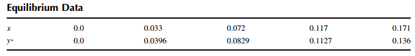
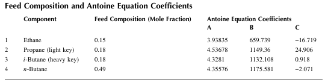
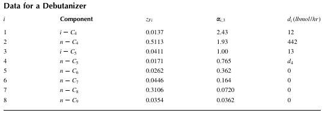
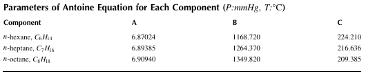
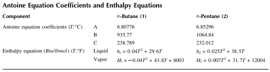
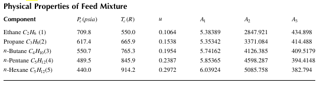
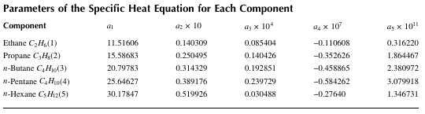
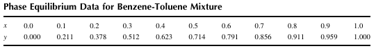
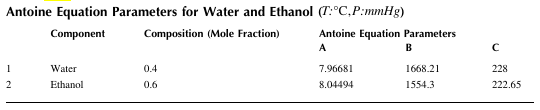
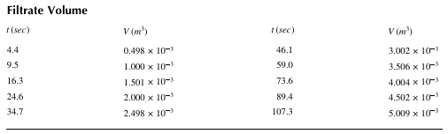

## 7 Mass Transfer

### Example 7.1 Binary Diffusion

Methanol (A) is evaporated into a stream of dry air (B) in a cylindrical tube at 328.5 K. The distance from the tube inlet to the liquid surface is $z_{2}-z_{1}=0.238~m.$ At $T=328.5~K$, the vapor pressure of methanol is $P_{A0}=68.4~kPa$ and the total pressure is $P=99.4~kPa$. The binary molecular diffusion coefficient of methanol in air under these conditions is $D_{AB}=1.991\times10^{-5}m^{2}/sec$.

Calculate the constant molar flux of methanol within the tube at steady state and plot the mole fraction profile of methanol from the liquid surface to the flowing air stream. Compare the calculated molar flux with that obtained from the equation 

$$N_{Az}=D_{AB}C\frac{x_{0}}{(z_{2}-z_{1})(x_{B})_{lm}},\quad (x_{B})_{lm}=\frac{x_{0}}{ln(1/(1-x_{0}))}$$

### Example 7.2 Multi-Component Diffusion of Gases

Gases A and B are diffusing through stagnant gas C at a temperature of $55^{\circ}C$ and a pressure of 0.2 atm from point 1 ($z_1$) to point 2 ($z_2$). The distance between these two points is 0.001 m. The molar flux of B is measured to be $N_{B}=-4.143\times10^{-4}kgmol/(m^{2}\cdot sec)$ (that is, gas B diffuses from $z_2$ to $z_{1}$). The gas mixture is assumed to be an ideal gas. Estimate the molar flux of A ($N_{A}$).

Data: 

* $C_{A1}=2.229\times10^{-4}$, $C_{A2}=0$ 

* $C_{B1}=0$, $C_{B2}=2.701\times10^{-3}$ 

* $C_{C1}=7.208\times10^{-3}$, $C_{C2}=4.730\times10^{-3}$ 

* $C_{AB}=1.47\times10^{-4}$, $C_{AC}=1.075\times10^{-4}$, $D_{BC}=1.245\times10^{-4}$ 

### Example 7.3 Diffusion from a Solid Sphere

Dichlorobenzene (A), suspended in stagnant air (B), is sublimed at $25^{\circ}C$ and atmospheric pressure. The sublimation is taking place at the surface of a sphere of solid dichlorobenzene with a radius of $3\times10^{-3}m.$ The vapor pressure of A at $25^{\circ}C$ is 1 mmHg, and the diffusivity in air is $7.39\times10^{-6}m^{2}/sec$ The density of A is $1458~kg/m^{3}$ and the molecular weight is 147. Calculate the rate of sublimation (flux) and plot it as a function of the radius r.

### Example 7.4 Drug Delivery by Dissolution of Pill Coating

The pills to deliver three particular drugs all have a solid spherical inner core of pure drug D surrounded by a spherical outer coating of A. The outer coating and the drug dissolve at different rates in the stomach due to their difference in solubility. A person takes all three different pills at the same time. Assume that the stomach is well mixed and that the pills remain in the stomach while they are dissolving.

Let the diameter of pill $i$ be $D_{i}$, the diameter of pure drug D in pill $i$ be $D_{di}$, and the mass transfer coefficient for pill $i$ be $k_{Li}$ ($i=1,2,3$). If the concentration of coating in the stomach is $C_{AS}$ ($\text{mg/cm}^3$), the concentration of drug in the stomach is $C_{DS}$ ($\text{mg/cm}^3$), the concentration of drug in the body is $C_{DB}$ ($\text{mg/kg}$), and the solubilities of the outer pill layer and inner drug core at stomach conditions are $S_{A}$ and $S_{D}$ ($\text{mg/cm}^3$), respectively, then the mass balances on volumes of pills yield:

$$\frac{dD_{i}}{dt}=-(2k_{Li}/\rho)(S_{A}-C_{AS}), \quad D_{1}(0)=0.5\text{ cm}, \ D_{2}(0)=0.4\text{ cm}, \ D_{3}(0)=0.35\text{ cm}$$

and we have 

$$\frac{dD_{i}}{dt}=\begin{cases}-\frac{2k_{Li}}{\rho}(S_{D}-C_{DS}) & : 10^{-5}\le D_{i}\le D_{di}=0.3\text{ cm}\\ 0 & : D_{i}\le10^{-5}\text{ cm}\end{cases}$$

$$\frac{dC_{AS}}{dt}=\frac{1}{V}(S_{A}-C_{AS})\pi\sum_{i=1}^{3}S_{Wi}k_{Li}D_{i}^{2}-\frac{C_{AS}}{\tau}$$

$$\frac{dC_{DS}}{dt}=\frac{1}{V}(S_{D}-C_{DS})\pi\sum_{i=1}^{3}(1-S_{Wi})k_{Li}D_{i}^{2}-\frac{C_{DS}}{\tau}$$

$$k_{Li}=\frac{1.2}{D_{i}}\quad(i=1,2,3), \quad S_{Wi}=\begin{cases}1 & : D_{i}>0.3\\ 0 & : D_{i}\le0.3\end{cases}\quad(i=1,2,3)$$

where 

* $V$ (liter) is the volume of fluid in the stomach 

* $\tau$ (hr) is the residence time in the stomach 

Plot the diameters of pills ($D_1$, $D_{2}$, $D_{3}$) and $C_{AS}$ and $C_{DS}$ as a function of time for up to 150 minutes ($0\le t\le150\text{ min}$) after the pills are taken.

### Data:

$V=1200\text{ cm}^3$, $\tau=240\text{ min}$, $S_{A}=1\text{ mg/cm}^3$, $S_{D}=0.4\text{ mg/cm}^3$, $\rho=1414.7\text{ mg/cm}^3$ 

### Example 7.5 Diffusion with Reaction in Catalyst Particles

Calculate the concentration profile for $C_{A}$ and determine the effectiveness factor η for a 1st-order irreversible reaction in a spherical particle, where R = 0.5 cm, $D_{e}=0.1~cm^{2}/sec,$ $C_{As}=0.2~gmol/cm^{3},$ and $k_{1}a=6.4~sec^{-1}$.

### Example 7.6 Reaction and Diffusion in a Porous Catalytic Layer

A catalytic gas-phase reversible reaction between components A and B, $2A\leftrightarrow B,$ is taking place in a porous catalyst layer in a reactor. The reaction rate for reactant A is given by

$$r_{A}=-k\left(C_{A}^{2}-\frac{C_{B}}{K_{c}}\right) \text{gmol/cm}^{3}\cdot \text{sec}$$

where the rate constant $k=8\cdot10^{4}\text{ cm}^{3}/(\text{sec}\cdot \text{gmol})$ and the equilibrium constant $K_{c}=6\times10^{5}\text{ cm}^{3}/\text{gmol}$. The thickness of the catalytic layer is $L=0.2\text{ cm.}$, the effective diffusivity of A in B for this layer is $D_{e}=0.01\text{ cm}^{2}/\text{sec}$, the total concentration of A and B is $C_{t}=4\times10^{-5}\text{ gmol/cm}^{3}$ and the concentrations of A and B at the surface of the catalytic layer are $C_{As}=3\times10^{-5}\text{ gmol/cm}^{3}$ and $C_{Bs}=1\times10^{-5}\text{ gmol/cm}^{3}$, respectively. Calculate the effectiveness factor for the given reaction ($\eta$) and plot $C_{A}$ and $N_{A}$ as a function of the depth of the catalytic layer (z).

### Example 7.7 Unsteady-State Diffusion in a One-Dimensional Slab

A slab of polymer of thickness $L = 0.004\text{ m}$ contains a certain amount of residual monomer (A). This slab is exposed to a well-stirred water bath, where the concentration of monomer is maintained constant at $C_{A0} = 0.01\text{ kgmol/m}^3$. The mass transfer is taking place through the surface at $x = 0$. At $x = L$, the slab is in contact with a solid impermeable surface, where the flux is zero ($\partial C_{A}/\partial x = 0$). The mass transfer coefficient on the fluid side is $k_c = 1\times 10^{-5}\text{ m/sec}$, the distribution coefficient is $K = 2.0$, and the diffusivity of monomer in the polymer slab is $D_{AB} = 1\times 10^{-11}\text{ m}^2\text{/sec}$. The initial concentration at the fluid side is $C_{A1} = 0.001\text{ kgmol/m}^3$, and the concentration at the solid side is $C_{An} = 0.002\text{ kgmol/m}^3$. Calculate and plot the concentrations within the slab after 20,000 sec. The interior of the slab may be divided into several intervals of width 0.0005 m (that is, $\Delta x = 0.0005\text{ m}$).

### Example 7.8 Mass Transfer in a Falling Laminar Film

$\text{CO}_2$ gas is absorbed into a falling liquid film of alkaline solution in which there is no reaction. The film thickness is $\delta=3\times10^{-4}\text{ m}$, the maximum velocity is $v_{z\text{max}}=0.6\text{ m/sec},$ and the diffusivity of dissolved $\text{CO}_2$ in the alkaline solution is $D_{AB}=1.5\times10^{-9}\text{ m}^2\text{/sec}$. Use the numerical method of lines with 10 intervals to calculate the concentration of dissolved $\text{CO}_2$ at $z=1\text{ m}$ (see Figure 7.12).

### Example 7.9 Single-Effect Evaporator

A vertical-tube single-effect evaporator is used to concentrate 29,000 lb/hr of a 25 % solution of organic colloid to 60% solution. The feed temperature is 60 $^{\circ}\text{F}$. The chemical and physical properties of the organic colloid are similar to those of water, and the specific enthalpy of the solution, $h_{p}$, is the same as that of the steam, $h_{v}$. The absolute pressure of the saturated steam being introduced is 25 psia. The absolute pressure in the vapor space is 1.69 psia and the overall heat transfer coefficient is $300\text{ Btu}/(\text{ft}^{2}\cdot\text{hr}\cdot^{\circ}\text{F})$. Calculate the heating surface required $(\text{ft}^{2})$ and the amount of steam consumed $(\text{lb/hr})$

### Example 7.10 Simple Boiler

The simple boiler shown in Figure 7.15 is used to generate steam by receiving heat Q from an external source. The dynamics of the temperature T are assumed to be negligible. Plot the masses of the liquid and vapor phases ($m_{L}$ and $m_{V}$) as a function of time using the given data. For water, the Antoine constants are $A=18.3036$, $B=3816.44$, $C=-46.13$ (T:K, P:mmHg).

### Data:

$Q=6000\text{ kcal/hr}$, $\lambda=475\text{ cal/g}$, $C_{p}=1\text{ cal/g/}^{\circ}\text{C}$, $T_{i}=20^{\circ}\text{C}$, $F_{i}=1000\text{ liter/hr}$, $\rho_{L}=1\text{ kg/liter}$, $V=5500\text{ lite}$, $V_{L}(t=0)=2800\text{ liter},$ $m_{V}(t=0)=9\text{ kg}$, $K_{V}=40\text{ kg/(hr}\cdot\text{bar}),$ $P_{o}=10\text{ bar}$, $M_{W}=18\text{ g/mol}$, $R=0.08206\text{ (liter}\cdot\text{atm)/(mol}\cdot\text{K)}$.

### Example 7.11 Multiple-Effect Evaporator

A triple-effect forward-feed evaporator is being used to evaporate an organic colloid solution containing 15% solids to a concentrated solution of 60%. Saturated steam at 205,603 Pa is being used, and the pressure in the vapor phase of the third effect is 8756 Pa. The feed rate is 20,412 $kg/hr$ at $15.6^{\circ}C$. The heat capacity of the liquid solutions is the same as that of water over the whole concentration range. The coefficients of heat transfer have been estimated as $U_{1}=1.084\times10^{7}$, $U_{2}=7.155\times10^{6}$, and $U_{3}=3.986\times10^{6}J/(m^{2}\cdot hr\cdot K)$. If the heat transfer areas of each of the three effects are to be equal, calculate the heat transfer area $(m^{2})$ and the amount of steam consumed $(kg/hr)$ The boiling point elevation of the solutions is assumed to be negligible.

### Example 7.12 Benzene Absorption Column

A five-stage absorption column is to be used to remove benzene from the process gas using an oil stream. The oil feed flow rate is 1.33 kgmol/min, and the gas feed rate and the mole fraction of benzene in the gas feed are 1.667 kgmol air/min and 0.1, respectively. The liquid molar holdup for each stage is 6.667 kgmol and the equilibrium relation is given by $y_{i}=0.5x_{i}$. The oil feed does not contain any benzene $(x_{f}=0)$.

(1) Calculate the steady-state composition for each stage.

(2) The benzene composition of the gas stream entering the column $(y_{6})$ suddenly changes from 0.1 to 0.15. Plot the compositions of the liquid and vapor streams leaving the column as a function of time. Also plot the profile of the liquid-phase composition for each stage.

### Example 7.13 Absorption in a Tray Column

Figure 7.21 shows a tray column used in an absorption operation. The operating curve of the absorption operation in the column is given by

$$y = \frac{(\frac{L}{V})\frac{x}{1-x}+\{\frac{y_{p}}{1-y_{p}}-(\frac{L}{V})\frac{x_{0}}{1-x_{0}}\}}{1+(\frac{L}{V})\frac{x}{1-x}+\{\frac{y_{p}}{1-y_{p}}-(\frac{L}{V})\frac{x_{0}}{1-x_{0}}\}}$$

where

* x and y are the mole fractions of the solute in the liquid and gas phases, respectively
* L and V are the molar flow rates of the solute-free liquid and gas, respectively $(V=85~kmol/hr)$
* $x_{0}$ and $y_{p}$ are the mole fractions of the solute in the liquid and gas phases at the top of the column, respectively

Equilibrium data are given in Table below.

(1) Find a polynomial that fits the equilibrium data best. Plot the data and the fitting curve for $0\le x\le0.18$.

(2) On the same graph, plot operating curves for $L=170,150$, and $1130~kmol/hr$.

(3) The minimum value of $L(=L_{min})$ must be determined. Find $L_{min}$ using the fact that the operating curve is tangent to the equilibrium curve at $L=L_{min}$ (i.e., these curves have a common tangent line at a point).

(4) Plot the equilibrium curve along with the operating curve when $L=L_{min}$

### Example 7.14 Concentration Profile

Let's produce profiles of $C_{a}$ as functions of L and 8 when $C_{0}=0.1~kgmol/m^{3}$, $\delta=0.01~m$, $\rho g\delta^{2}/D_{A}=0.5$ and $\mu=2.1\times10^{-5}Pa\cdot sec.$ 

### Example 7.15 Gas Absorber

Pure water is used to remove 90% of the $SO_{2}$ from a gas stream in a gas absorber. The flow rate of the gas stream is 103 kg/min, and the stream contains 3 vol.% $SO_{2}$. The minimum liquid flow rate is found to be 2450 kg/min, and the operating liquid flow rate is 1.5 times the minimum value. The operating temperature and pressure are 293 K and 101.32 kPa. The gas velocity should not be greater than 70% $(f=0.7)$ of the flooding velocity, and 2 in. ceramic Intalox saddles are used as the packing material. Find the column diameter. 

Data: $\rho_{G}=1.17~kg/m^{3},$ $\rho_{L}=1000~kg/m^{3}$, $F_{p}=130(m^{2}/m^{3})$, $\psi=1$ $\mu_{L}=0.8~cP,$ $L_{m}=2450~kg/min$, $G=103~kg/min$, $f=0.7$. 

### Example 7.16 Gas Absorption

For the $SO_{2}/H_{2}O$ system shown in Figure 7.24, the overall height of transfer units, $H_{t},$ is found to be 0.6 m. Determine the total height of packing, $H_{pd},$ required to achieve 90% reduction in the inlet concentration. The packing is 2 in Raschig rings ceramic, and the operating conditions are $P=1$ atm and $T=20^{\circ}C$.

Data: H = 26, $G_{m}=206~kmol/hr$, $L_{m}=12,240~kmol/hr$, $x_{2}=0.0$ , $y_1$ = 0.03, $y_2$ = 0.003

### Example 7.17 McCabe-Thiele Operating Lines 

A binary mixture is to be distilled in a distillation column to give a distillate of $x_{D}=0.9$ and a bottoms composition of $x_{B}=0.1$. 

The feed composition is $z_{F}=0.5$ and the reflux ratio is $R=1.5$. 

The feed is partially vaporized and $q=0.8$. The equilibrium equation is given by $y=\alpha x/(1+(1-\alpha)x)$ with $\alpha=2.45$. Determine the location of the feed stage and the number of total stages, and plot the equilibrium curve, q-line, and operating lines as a function of the liquid-phase mole fraction. 

### Example 7.18 Simple Binary Distillation

A saturated liquid mixture containing 1-propanol and ethanol is fed into the column shown in Figure 7.27(a). Using the given data, plot the composition profiles as a function of time $(0\le t\le12\text{ min})$.

Data: feed flow rate $F=100\text{ gmol/min}$, feed composition $z=0.5$, reflux rate $R=128.01\text{ gmol/min}$, vapor rate $V=178.01\text{ gmol/min}$, tray holdup $m_{R}=m_{f}=m_{S}=10\text{ gmol}$, reflux drum holdup $m_{D}=100\text{ gmol}$, bottom holdup $m_{B}=100\text{gmol}$, relative volatility $\alpha=2.0$

### Example 7.19 Dynamics of a Binary Distillation Column 

A 30-stage column with the overhead condenser as stage 1, the feed stage as stage 15, and the reboiler as stage 30 is used to distill a binary mixture. The relative volatility, a, is 1.5. The feed rate is $F=1\text{ mol/min}$, the feed composition is $z_{F}=0.5,$ and the feed condition is $q=1$ (bubble point liquid). The reflux flow rate is $R=2.7\text{ mol/min}$ and the vapor rate leaving the reboiler is $3.2\text{ mol/min}$. The holdups in the condenser and the reboiler are both 5 mol, and the holdup in each stage is maintained constant at 0.5 mol. At t = 10 min, there is a 1% step change in the reflux flow rate. Plot the liquid compositions of the distillate and the bottoms for $0\le t\le400$ Also plot the liquid composition profile along the stages at $t=400$ min.

### Example 7.20 Simple Distillation Calculation

A distillation column is to be used to separate i-butane from a mixture of lighter compounds consisting of ethane, propane, i-butane, and n-butane. The feed stream enters the column as liquid at its bubble point, and the column pressure is 7 bar. It is required that 95% of the i-butane in the feed be recovered in the bottoms, and the bottoms stream must contain no more than 0.1% propane.

(1) Calculate the minimum number of stages required to achieve the desired separation at total reflux using the Fenske equation.

(2) Determine the minimum reflux ratio required to achieve the desired separation with an infinite number of stages using the Underwood equation.

(3) Estimate the number of theoretical stages required if the actual reflux ratio is given by $R=1.5\text{ }R_{m}$ using the Gilliland correlation. Assume that the relation between X and Y is represented by the Eduljee correlation. Determine the location of the optimal feed stage using the Kirkbride equation. Table below shows the feed compositions and the coefficients of the Antoine equation.

### Example 7.21 Minimum Reflux Ratio

The debutanizer shown in Figure 7.30 is to be used to treat a mixture consisting of eight components listed in Table below. The minimum reflux ratio $R_{min}(=L_{min}/D)$ can be determined by solving the following Underwood equations:

$$\sum_{i}\frac{\alpha_{i,3}z_{Fi}}{\alpha_{i,3}-\theta_{1}}=1-q,\sum_{i}\frac{\alpha_{i,3}z_{Fi}}{\alpha_{i,3}-\theta_{2}}=1-q,\sum_{i}\frac{\alpha_{i,3}d_{i}}{\alpha_{i,3}-\theta_{1}}=D(1+R_{min})$$

$$\sum_{i}\frac{\alpha_{i,3}d_{i}}{\alpha_{i,3}-\theta_{2}}=D(1+R_{min}),$$

where

* $z_{Fi}$ is the mole fraction of each species in the feed
* $\sum_{i}d_{i}=D$
* $\alpha_{i,3}$ is the relative volatility between components i and 3
* q is the feed quality
* $d_{i}$ is the molar flow rate of each component in the distillate
* D is the molar flow rate of the distillate withdrawn from the debutanizer
* $L_{min}$ is the molar flow rate of the liquid returned to the debutanizer at the minimum reflux

The quantities $\theta_{1}$ and $\theta_{2}$ have to satisfy $\alpha_{4,3}<\theta_{2}<\alpha_{3,3}<\theta_{1}<\alpha_{2,3}.$ Calculate the minimum reflux ratio using the data shown in Table below. Let $q=0.87$

### Example 7.22 Shortcut Distillation Calculation

A mixture of 33% n-hexane, 37% n-heptane and 30% n-octane is to be separated in a distillation column. The feed stream is 60% vapor at $105^{\circ}\text{C}$ The distillate should contain 0.01 mole fraction n-heptane and the bottom product should contain 0.01 mole fraction n-hexane. The feed molar flow rate is $100\text{ mol/hr}$ and the operating pressure is 1.2 atm. Table below shows the parameters of the Antoine equation given by

$$\text{log}P = A - \frac{B}{T+C}$$

(P: mmHg, $T:^{\circ}\text{C}$)

(1) Determine the minimum number of trays at infinite reflux.

(2) Find the number of ideal trays required for separation if the reflux ratio is $1.5R_{min}$

(3) Determine the optimum feed tray.

### Example 7.23 Three-Stage Distillation Column

A simple distillation column with three theoretical stages—shown in Figure 7.32—is to be used to separate a mixture n-butane(1) and n-pentane(2).51 A feed stream consisting of 0.23 lbmol/hr n-butane and 0.77 lbmol/hr n-pentane enters the column as liquid at its bubble point on stage 2 $(j=2)$. The operating pressure of the column is 120 psia, and a total condenser is used. The amount of heat added to the reboiler is 10,000 Btu/hr. Distillate and bottoms are removed at the rate of $D=0.25$ and $B=0.75\text{ lbmol/hr}$, respectively.

Calculate the temperatures of all stages and of the condenser, the flow rates and compositions of the vapor and liquid flows in the column, and the compositions of the distillate and the bottoms. The vapor pressures can be estimated by the Antoine equation, and the molar enthalpies of the pure compounds can be estimated by the quadratic equations of T. Table below shows the Antoine equation coefficients and the enthalpy correlation equations.

### Example 7.24 Distillation of a Five-Component Mixture 

Figure 7.35 shows a distillation column where a feed consisting of ethane(1)/propane(2)/$n\text{-butane}(3)/n\text{-pentane}(4)/n\text{-hexane}(5)$ is distilled.52 The number of total stages including the condenser and the reboiler is 16. Feed stream 1 enters the first feed stage (sixth stage from the top) at $170^{\circ}\text{F}$ and 300 psia with a flow rate of $F_{6}=41\text{ lbmol/hr}$ and a composition of $z_{1,6}=0.061,$ $z_{2,6}=0.342,$ $z_{3,6}=0.463,$ $z_{4,6}=0.122,$ and $z_{5,6}=0.012.$ Feed stream 2 enters the second feed stage (ninth stage from the top) at $230^{\circ}\text{F}$ and 275 psia with a flow rate of $F_{9}=59\text{ lbmol/hr}$ and a composition of $z_{1,9}=0.004,$ $z_{2,9}=0.141,$ $z_{3,9}=0.393,$ $z_{4,9}=0.334,$ and $z_{5,9}=0.128.$ The operating pressure of the condenser is 275 psia, and that of the reboiler is 300 psia. The pressure decreases linearly from the reboiler to the condenser. The column has a total condenser. The reflux ratio is $R=L_{1}/D=4,$ and the distillate flow rate is $D=22.6\text{ lbmol/hr}.$ The flow rate of the liquid side cut from the 11th stage is $U_{11}=2\text{ lbmol/hr},$ and that of the vapor side cut from the 13th stage is $W_{13}=37\text{ lbmol/hr}.$

The specific heat $C_{pv}^{0}$ (Btu/lbmol) and the vapor pressure $(P_{i}^{s})$ are given by

$$C_{pv}^{0}=a_{1}+a_{2}T+a_{3}T^{2}+a_{4}T^{3}+a_{5}T^{4}\text{ }(T:^{\circ}\text{F})$$

$$\ln\frac{P_{i}^{s}}{P_{c}}=A_{1}-\frac{A_{2}}{T+A_{3}}\text{ }(T:^{\circ}\text{F},\text{ P:critical pressure})$$

Table 7.8 shows the physical properties and Table 7.9 the parameters of specific heat equations for each component. Calculate the stage temperatures and vapor and liquid compositions, and plot the results versus the stage number. 

### Example 7.25 Differential Distillation

A solution containing 70 moles of benzene and 50 moles of toluene is distilled using the simple differential distillation apparatus at 1 atm until only 50 moles of liquid is left. Calculate the composition of the liquid after the distillation process. Table below shows the phase equilibrium data for the benzene-toluene mixture.

### Example 7.26 Single-Stage Batch Distillation

A batch distillation column is to be used to separate ethanol (2) from water (1). A liquid mixture of 40 mol% water $(x_{1}=0.4)$ and 60 mol% ethanol $(x_{2}=0.6)$ is charged initially to the still pot. The amount of the initial charge is 100 kgmol $(L_{1}=100).$ The distillation is carried out at 1 atm total pressure and is continued until the water mole fraction reaches 0.8 $(x_{1}=0.8).$ Plot the temperature profile and the amount of liquid remaining in the still as a function of the water composition. Calculate the temperature and the composition of the liquid remaining in the still after the distillation process. The vapor-liquid equilibrium follows Raoult's law: $k_{j}=\gamma_{j}P_{j}/P.$ The vapor pressure $P_{j}$ is given by the Antoine equation, and the activity coefficient of component j, $\gamma_{j}$ is given by

$$\log \gamma_{1}=(1-x_{1})^{2}\{c_{1}+2x_{1}(c_{2}-c_{1})\},\text{ }\log\gamma_{2}=(1-x_{2})^{2}\{c_{2}+2x_{2}(c_{1}-c_{2})\}$$

where $c_{1}=0.3781$ and $c_{2}=0.6848.$ The temperature change with respect to the liquid composition may be represented by

$$\frac{dT}{dx_{1}}=K(1-k_{1}x_{1}-K_{2}x_{2})\text{ }(K:\text{constant})$$

The constant K may take a large value, such as 500,000. The Antoine equation parameters for water and ethanol are given in Table below.

### Example 7.27 Constant-Pressure Filtration

Table below shows experimental data for filtration of $\text{CaCO}_3$ slurry in water at $298.2\text{ K}$ at a constant pressure of $(-\Delta p) = 338\text{ kN/m}^2$ using a plate-frame press. The filter area is $A = 0.0439\text{ m}^2$ and the slurry concentration is $c_s = 23.47\text{ kg/m}^3$. At $298.2\text{ K}$, the viscosity of water is $\mu = 8.937 \times 10^{-4}\text{ kg/(m}\cdot\text{sec)}$. Evaluate the constants $\alpha$ and $R_m$. Assume that $\alpha$ is constant and the cake is incompressible.

### Example 7.28 Complete-Mixing Model

A membrane is to be used to separate a gaseous mixture of A and B. The feed flow rate is $L_{f}=1\times10^{4}cm^{3}/sec$ and the feed composition of A is $x_{f}=0.5$ (mole fraction). The desired composition of the reject is $x_{R}=0.25$ Calculate the permeate composition $y_{p},$ the stage-cut, and the membrane area $A_{m}$ 

Data: 

* membrane thickness $t=2.54\times10^{-3}$ cm 

* feed pressure $p_{h}=80~cmHg$ 

* permeate-side pressure $p_{l}=20~cmHg$ 

* Permeability of A: $P_{A}=50\times10^{-10}cm^{3}\cdot cm/(sec\cdot cm^{2}\cdot cmHg)$ 

* Permeability of B: $P_{B}=5\times10^{-10}cm^{3}\cdot cm/(sec\cdot cm^{2}\cdot cmHg)$ 

### Example 7.29 Cross-Flow Model

A membrane is to be used to separate a gaseous mixture of A and B. The feed flow rate is $L_{f}=1\times10^{4}cm^{3}/sec$ and the feed composition of A is $x_{f}=0.5$ (mole fraction).  The desired composition of the reject is $x_{R}=0.25$. Use the cross-flow model to determine the permeate composition $y_{p}$ the stage-cut, and the membrane area $A_{m}$ 

Data: 

* membrane thickness $t=2.54\times10^{-3}cm$ 

* feed pressure $p_{h}=80cmHg$ 

* permeate-side pressure $p_{l}=20~cmHg$ 

* Permeability of A: $P_{A}=50\times10^{-10}cm^{3}\cdot cm/(sec\cdot cm^{2}\cdot cmHg)$, 

* Permeability of B: $P_{B}=5\times10^{-10}cm^{3}\cdot cm/(sec\cdot cm^{2}\cdot cmHg)$ 

