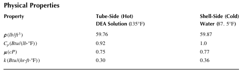
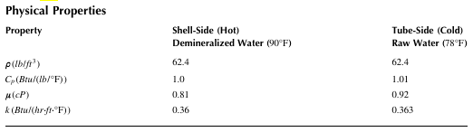
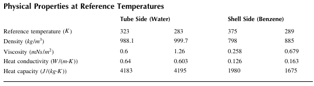

## 8 Heat Transfer

### Example 8.1 Heat Transfer in a One-Dimensional Slab
Figure 8.1 shows a one-dimensional slab with heat conduction and radiation. One surface of the slab is maintained at temperature T1, and the other surface at temperature T2 has radiative heat transfer with the surroundings that act as a black body at temperature Ta. The radiation from the slab surface can be represented by the Stefan-Boltzmann law: 
$$
\frac{q_x}{A}\left.\begin{matrix}
 \\
\end{matrix}\right| _{x=\Delta x} = σ(T_2^4-T_a^4)\left.\begin{matrix}
 \\
\end{matrix}\right| _{x=\Delta x}, (σ = 5.676 \times 10^{-8} W/(m^2 K^4))
$$
Calculate and plot the temperature profile within the slab. What is the corresponding value of T2? 
The thermal conductivity of the solid slab, k, is dependent upon temperature and is given by k = 30(1 + 0.002T). Assume that the convective heat transfer between the slab and the surroundings is negligible. 
Data: T1 = 290 K, Ta = 1273 K, Δx = 0.2 m

### Example 8.2 One-Dimensional Heat Conduction
A flat plate of infinite length is cooled using airflow over both sides of the plate. The initial 
uniform temperature of the plate is Ti = 340°C and the ambient temperature is Ta = 25 °C
The mid-plane temperature of the plate (T ) at time t is given by 
$$
T=T_a+(T_i-T_a)\frac{4 sin(\gamma)}{2 \gamma +sin(2 \gamma)} exp(- \frac{4 \gamma^2 \alpha t}{D^2})
$$
where 

D is the thickness of the plate(=0.05 m) 
α is the thermal diffusivity of the plate(=4.97 × 10 -7 m2/sec)
γ is the first positive root of the equation 
$$
\gamma tan(\gamma) - \frac{hD}{2k} = 0
$$
where 
k is the thermal conductivity of the plate(=1.18 W/(m K))
h is the convection heat transfer coefficient(=98.6 W/(m2 K))

Plot the mid-plane temperature of the plate (T ) as a function of t(0 < t < 15(min )). 

### Example 8.3 Heat Transfer by Radiation
A coating on a curved surface is cured by exposing it to an infrared heater. The system is located in a large room, and the heat transfer is assumed to be entirely due to radiation. The surface radiosity of the heater and the view factors can be determined by solving the following equations:
$q_1 = \frac{\epsilon_1 A_1}{1-\epsilon_1}(\sigma T_1^4 -J_1)=F_{12}A_1 (J_1 -J_2)+F_{13} A_1 (J_1 -\sigma T_3^4) $

$-q_2 = \frac{\epsilon_2 A_2}{1-\epsilon_2}(\sigma T_2^4 -J_2)=F_{12}A_1 (J_2 -J_1)+F_{23} A_2 (J_2 -\sigma T_3^4) $

$F_{12} = \frac{2}{\pi xy}(ln \sqrt{\frac{(1+x^2)+(1+y^2)}{1+x^2+y^2}} +x \sqrt{1+y^2} tan^{-1}(\frac{x}{\sqrt{1+y^2}}) +y \sqrt{1+x^2} tan^{-1}(\frac{y}{\sqrt{1+x^2}})-x tan^{-1}x -y tan^{-1}y) $

$F_{13} = 1-F_{12}, F_{23} =\frac{F_{13}A_1}{A_2}, x=W/H, y=L/H $

where 
ε1 and ε2 are the emissivities of the heater and the surface, respectively 
q1 is the heater power requirement 
q2 is the heat transfer rate to the surface 
A1 and A2 are the areas of the heater and the surface, respectively 
σ is the Stefan-Boltzmann constant 
J1 and J2 are the surface radiosities of the heater and the surface, respectively 
$F_{ij}$ is the view factor between surface i and surface j
T1 is the temperature of the heater 
T2 is the temperature of the surface
T3 is the wall temperature 
W is the width of the heater 
H is the distance between the heater and the surface 
L is the length of both the heater and the surface 
Using the following data, calculate q1. 
Data: A1 = 10 m2, A2 = 15 m2, W = H = 1 m, L = 10 m, T1 = 1000 K, T3 = 300 K, ε1 = 0.9, 
ε2 = 0.5, q2 = 77.1 kW,  σ =$5.67×10^{-8} W /(m^2∙K^4 )$

### Example 8.4 Heat Transfer by Conduction and Convection
A pin made of pure aluminum is used to conduct heat away from an electronic device. Generate the temperature profile of the pin as a function of time and calculate the steady-state temperature for each of the following cases:  
1. The pin is considered as a single lump (Figure 8.4(a)).  
2. The pin is assumed to consist of five equal lumps (Figure 8.4(b)). 

The ambient temperature Ta = 25℃, the convective heat transfer coefficient hc = 20 W/(m2∙℃), the length of the pin is L = 0.01 m, the diameter of the pin is D = 0.002 m, the circular area of the base of the pin through which the heat conduction take places is $A_k = 3.14 × 10^{−6}$ m2, and the surface area of the pin exposed to the air is $A_c = 6.28 × 10^{−5}$ m2. At t = 0, the pin temperature T = 25℃ and the base temperature Tb = 100℃. Thermal properties of pure aluminum are: density ρ = 2707 kg/ m3, thermal conductivity k = 220 W/(m∙℃), specific heat Cp = 896 J/(kg∙℃).  

### Example 8.5 Heat Transfer through a Multilayer Slab
Figure 8.9 shows a multilayer slab through which heat is transferred. The thickness of each layer of the slab is LA = 0.015 m, LB = 0.1 m, and LC = 0.075 m, and the thermal conductivity of each slab is kA = 0.0151, kB = 0.0433, and kC = 0.762 (W/(m∙K)). 
1. Calculate the heat flux through the slab if the interior surface is at T1 =255 K and the exterior surface is at T4 =298 K.  
2. It is proposed to reduce the heat loss by 50% by increasing the thickness of slab B, LB. What value of LB is required?  
3. A new slab is to be used instead of the slabB. The thermal conductivity of the new slab is given by k = $2.5e^{−1225/T}$ (T:K), and the thickness of the new slab is the same as that of the slab B. Calculate the heat flux through the new slab if the interior surface is at T1 = 255 K and the exterior surface is at T4 = 298 K, and plot the temperature profile within the slab. Assume that qx/A = −15 W/m2. 

### Example 8.6 Heat Transfer in a Wire
An insulated wire is carrying an electrical current. The wire surface is maintained at T1 = 15℃, and the electrical and thermal conductivities are given by k = 5 W/(m∙K) and $ke = 1.4×10^5 e^{0.0035T} Ω^{−1}m^{−1}$. 
The wire radius is R1 = 0.004 m, and the total current is maintained at It = 400 amps. Calculate and plot the temperature and heat flux within the wire.  

### Example 8.7 Heat Loss through Pipe Flanges
Consider the union formed by two aluminum flanges. Calculate the total heat loss flux q from a single flange when the average ambient temperature Ta = 60℉. Plot the heat transfer rate qr versus the radius r. The thermal conductivity of the aluminum pipe and the flange is 133 Btu/(hr∙ft∙℉),the thickness of the flange is 1 in., and R1 = 0.0833 ft and R2 = 0.25 ft. The fluid in the pipe is at T0 = 260℉ and the heat transfer coefficient to the surroundings is constant at h = 3 Btu/(hr∙ft2∙℉). 

### Example 8.8 Heat Transfer in a Cylindrical Laminar Flow
For the flow of a liquid in a cylinder with radius R, produce profiles of T as functions of L and r when R=0.03 m, Q=100 kJ/(sec∙m2), T0 =500 K, ρ=1000 kg/m3 , Cp=4.2 kJ/(kg∙K ), k =0.1 kJ/(sec∙m∙K ),and $v_{max}/k$ =5 . 

### Example 8.9 Heat Transfer in a Laminar Flow through a Cylinder
Consider the flow of a liquid in a cylinder with radius R L and length . For laminar flow, the velocity profile is given by 
$v_z = \frac{(P_0 - P_L)R^2}{4\mu L} \left\{ 1 - \left(\frac{r}{R}\right)^2 \right\} = v_{max} \left\{ 1 - \left(\frac{r}{R}\right)^2 \right\} $
where $v_{max} =(P_0 -P_L )R^2 /(4μL )$ . From the energy balance in cylindrical coordinates due to convection and conduction, we have
$v_z \frac{\partial T}{\partial z} = \frac{\alpha}{r} \frac{\partial}{\partial r} \left( r \frac{\partial T}{\partial r} \right) $
where α = k/(ρ Cp ) . Assume that the initial and boundary conditions are given as follows: 
$z = 0 : T(0, r) = T_0, \quad r = 0 : \frac{\partial T(z, 0)}{\partial r} = 0, \quad r = R : T(z, R) = T_b  $
Generate the temperature profile using the method of lines when R =0.05 , T0 =300 K, Tb =400 K, L=2 m, α=$10^{-4} m^2/sec$ ,and vmax=0.5 m/sec . Application of the difference formula for radian nodes 1 to n yields the following differential equations in the axial direction: 
$\begin{aligned}
\frac{dT}{dz} &= \frac{\alpha}{v_i} \left\{ \frac{T_{i+1} - 2T_i + T_{i-1}}{h^2} + \frac{1}{r_i} \left( \frac{T_{i+1} - T_{i-1}}{2h} \right) \right\} \quad (i = 2, \, 3, \, \cdots, \, n - 1) \\
\frac{dT}{dz} &= \frac{\alpha}{v_i} \left\{ \frac{T_b - 2T_i + T_{i-1}}{h^2} + \frac{1}{r_i} \left( \frac{T_b - T_{i-1}}{2h} \right) \right\} \quad (i = n) \\
\frac{dT}{dz} &= \frac{2\alpha}{v_i} \left( \frac{T_{i+1} - T_i}{h^2} \right) \quad (i = 1)
\end{aligned}  $
In this problem, let n=20.  

### Example 8.10 One-Dimensional Parabolic PDE for Heat Transfer 
A wall made of brick is 0.5 m thick, and the temperature of the wall is 100℃ at t = 0. The thermal diffusivity of the brick is α = $4.52×10^{-7}$ m/sec2. The temperature on the both sides of the wall is suddenly dropped to 18℃. Calculate and plot the temperature profile within the brick wall during 5 hr (18,000 sec) with the interval of 300 sec. Assume that the number of nodes in the x direction is 25.  

### Example 8.11 Two-Dimensional Elliptic Equations for Heat Transfer

The temperature profile in a two-dimensional thin metal plate can be described by the two-dimensional elliptic partial differential equation 

$$\frac{\partial^{2}T}{\partial x^{2}}+\frac{\partial^{2}T}{\partial y^{2}}=f$$

where f is assumed to be constant. The metal plate is made of an alloy that has a melting point of $800^{\circ}C$ and a thermal conductivity of 16 $W/(m\cdot K)$. The plate is subject to an electric current that creates a uniform heat source within the plate. The amount of heat generated is $Q^{\prime}=100~kW/m^{3}.$ All four edges of the plate are in contact with a fluid at $25^{\circ}C$ The set of Robbins boundary conditions is 

$$\frac{\partial T}{\partial x}|_{0,y}=5\{T(0,y)-25\}, \quad \frac{\partial T}{\partial x}|_{1,y}=5\{25-T(1,y)\},$$

$$\frac{\partial T}{\partial y}|_{x,0}=5(T(x,0)-25). [cite_start]\quad \frac{\partial T}{\partial y}|_{x,1}=5\{25-T(x,1)\}$$

Plot the temperature profiles within the plate. 

In order to solve the set of equations, all the values of the dependent variables have to be rearranged as a column vector and numbered. The finite difference approximation for this problem has the form 

$$-2\left(\frac{1}{\Delta x^{2}}+\frac{1}{\Delta y^{2}}\right)u_{n}+\left(\frac{1}{\Delta x^{2}}\right)u_{n+1}+\left(\frac{1}{\Delta x^{2}}\right)u_{n-1}+\left(\frac{1}{\Delta y^{2}}\right)u_{n+p+1}+\left(\frac{1}{\Delta y^{2}}\right)u_{n-p+1}=f$$

When the Laplace equation is being solved, $f=0$ For the Poisson equation, the value off is assumed constant throughout the plate. If the boundary condition is of the Dirichlet type, $u_{N}=(constant).$ However, if the boundary condition is of the Neumann or Robbins type, forward or backward difference is used to evaluate the 1st-order derivative at the boundaries. 

$x=0$: forward difference (N is a node on the line $x = 0$) 

$$\frac{\partial u}{\partial x}|_{x=0}=\frac{1}{2\Delta x}(-3u_{N}+4u_{N+1}-u_{N+2})$$

$x=L$: backward difference (N is a node on the line $x = L$) 

$$\frac{\partial u}{\partial x}|_{x=L}=\frac{1}{2\Delta x}(3u_{N}-4u_{N-1}+u_{N-2})$$

$y=0$: forward difference (N is a node on the line $y = 0$) 

$$\frac{\partial u}{\partial y}|_{y=0}=\frac{1}{2\Delta y}(-3u_{N}+4u_{N+p+1}-u_{N+2p+2})$$

$y=L$: backward difference (N is a node on the line $y = L$) 

$$\frac{\partial u}{\partial y}|_{y=L}=\frac{1}{2\Delta y}(3u_{N}-4u_{N-p-1}+u_{N-2p-2})$$

### Example 8.12 Number of Shells and Log-Mean Temperature Difference 

A hot fluid is cooled by cooling water in a countercurrent shell-and-tube heat exchanger. Determine the number of shells required, the correction factor F, and the updated log-mean temperature difference (LMTD).

Data: hot fluid inlet temperature $(T_{1})=250^{\circ}F$, hot fluid outlet temperature $(T_{2})=100^{\circ}F$, cooling water inlet temperature $(t_{1})=80^{\circ}F$, cooling water outlet temperature $(t_{2})=120^{\circ}F$.

### Example 8.13 Design of a Condenser

Consider a 1-4 shell-and-tube heat exchanger to cool 62,000 lb/hr of diethanolamine (DEA) solution (0.2 mass fractions DEA/0.8 water) from $150^{\circ}F$ to $120^{\circ}F$ by using water at $75^{\circ}F$ heated to $100^{\circ}F$ as shown in Figure 8.21. Assume that the tube-inside fouling resistance is given by Rfi = 0.004 ft² hr. °F/Btu and that the shell-side fouling resistance is negligible. Physical properties are given in Table below. Calculate the baffle spacing, shell-side and tube-side overall heat transfer coefficients, tube inside and outside heat transfer areas, and shell-side and tube-side pressure drops using the given data. As an initial guess for $U_{i}$, use $U_{i}=160~Btu/(ft^{2}\cdot hr\cdot^{\circ}F)$

Data: operating conditions: $\dot{m}_{h}=62,000~lb/hr$, $T_{1}=150^{\circ}F$, $T_{2}=120^{\circ}F$ $t_{1}=75^{\circ}F$, $t_{2}=100^{\circ}F,$ $u_{i}=5~ft/sec$. Shell and tube; $L=15ft$, $D_{o}=0.0625fi$, $D_{i}=0.04017~ft$, $D_{s}=1.4375ft$, $P_{t}=1/12~ft,$ $k_{w}=30~Btw(hr.ft.^{\circ}F)$, $R_{fi}=0.004~ft^{2}\cdot hr\cdot^{\circ}F/Btu$, $R_{f_{o}}=0$

### Example 8.14 Design of a Heater

Design a 1-2 shell-and-tube heat exchanger to be used to heat raw water at $75^{\circ}F$ to $80^{\circ}F$ using 150,000 lb/hr of demineralized water that enters the exchanger at $95^{\circ}F$ and exits at $85^{\circ}F$. Assume that the tube-side fouling resistance is $R_{fi}=0.001~hr.ft^{2}\cdot^{\circ}F/Btu$ and that the shell-side fouling resistance, $R_{fo}$, is negligible. The schematic diagram of the exchanger is shown in Figure 8.22, and physical properties are given in Table below. As an initial guess for $U_{i}$ use $U_{i}=400~Btu/(ft^{2}\cdot hr\cdot^{\circ}F)$.

Data: operating conditions: $\dot{m}_{h}=150,000~lb/hr$ $T_{1}=95^{\circ}F$ $T_{2}=85^{\circ}F$, $t_{1}=75^{\circ}F,$ $t_{2}=80^{\circ}F,$ $u_{i}=5~ft/sec.$ Shell and tube; $L=10ft,$ $D_{o}=0.0625~ft$, $D_{i}=0.05167~ft.$ $D_{s}=1.77083~ft$, $P_{t}=1/12~ft$ $k_{w}=30~Btw/h/ft/^{\circ}F$, $cl=0.02083$ ft $ft,R_{fi}=0.001~ft^{2}\cdot h\cdot^{\circ}F/Btu$, $R_{fo}=0$

### Example 8.15 Shell-and-Tube Countercurrent Heat Exchanger

Liquid benzene flowing at a rate of 4.8 kg/sec is cooled from 353 K in a four-pass shell-and-tube heat exchanger with cooling water flowing in the tubes. Inlet and outlet temperatures of cooling water are measured to be 298 and 303 K, respectively.

The heat exchanger geometry is as follows: $d_{o}=25.4~mm$, $d_{i}=19.86$ mm, $N_{T}=86$ (mounted on equilateral triangular pitch with a pitch ratio of 1.25), tube roughness = 0.025 mm, $L=2m$, $l_{s}=27~mm$, $D_{s}=305~mm$, $d_{otl}=294~mm$, $\delta_{sb}=$ 4.45 mm, $N_{ss}=0$ $l_{bc}=450~mm,$ $l_{in}$, $l_{out}=165~mm$, baffle cut for segmental $baffles=25\%$ Thermal conductivity of wall material is 45 $W/(m\cdot K)$. The fouling resistances for tube side and shell side are 0.00036 and 0.00018 m² K/W, respectively. The physical properties at reference temperatures are shown in Table below.

Determine the exit temperature of benzene, the heat duty, the flow rate of cooling water, and the pressure drops on the shell and tube sides.

### Example 8.16 Finned-Tube Heat Transfer Coefficient

A double-pipe finned-tube heat exchanger is to be used to cool $30^{\circ}$ API oil. Determine the tube-side and shell-side heat transfer coefficients and the overall heat transfer coefficient. The operating conditions and data are as follows:

* **Tube-side:** flow rate of cooling water $=26,740~lb/hr$, $T_{in}=85^{\circ}F$, $T_{out}=120^{\circ}F$ $F_{f}=0.002$, $K=0.366~Btu/(ft\cdot^{\circ}F\cdot hr)$ $\mu=0.72~cP$, $C_{p}=1~Btu/(lb\cdot^{\circ}F)$ 

* **Shell-side:** flow rate of oil $=18,000~lb/hr,$ $T_{in}=250^{\circ}F$, $T_{out}=150^{\circ}F,$ $F_{f}=0.002$, $K=0.074~Btu/(ft\cdot^{\circ}F\cdot hr)$, $\mu=2.45cP$ $C_{p}=0.518~Btu/(lb\cdot^{\circ}F)$ 

* **Heat exchanger geometry:** 

* **Shell:** 3 in. (3.068in. ID, 3.5in. OD) 

* **Tube:** 1.5 in. (1.61 in. ID, 1.9 in. OD) 

* **Number of fins:** 24, height 0.5 in., width 0.035 in. 

* **Tube material thermal conductivity:** $K=25~Btu/(ft\cdot^{\circ}F\cdot hr)$ 

