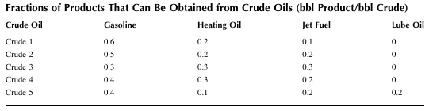
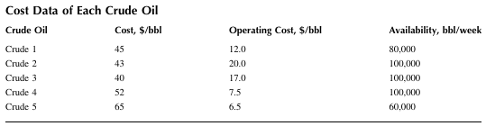
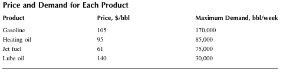
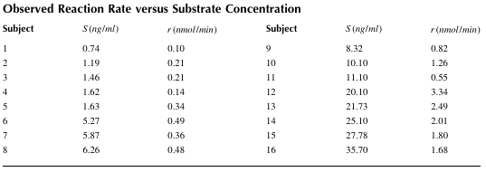

## 10 Optimization

### Example 10.1 Fibonacci Search 
Use the Fibonacci search method to find the minimum of $f(x)=2x^2 sin(1.5 x) -4x^2 +3x -1.$ 
The initial interval can be specified as [‒8,8]. Let the number of interval reduction be n = 20.  

### Example 10.2 Golden Section Method
Use the golden section method to find the minimum of $f(x)=2x^2 sin(1.5 x) -4x^2 +3x -1.$
The initial point can be specified as x1 = ‒5. Let the step size be h = 0.1 and the stopping criterion be $1 × 10^{-6}.$  

### Example 10.3 Brent’s Algorithm 
Use Brent’s search method to find the minimum of
$$
f(x)=exp(x)-3x+0.02/x-0.00004/x
$$
The initial point can be specified as x1 = 0.01. Let the step size be h = 0.2 and the stopping criterion be $1 × 10^{-6}.$   

### Example 10.4 Shubert-Piyavskii Algorithm
Use the Shubert-Piyavskii method to find the maximum of f(x) = -sin (1.2x) - sin(3.5x). The 
initial interval can be specified as [−3,8]. Let the Lipschitz constant be C = 8, the stopping criterion be $1 × 10^{-6}$, and the maximum number of function evaluations be 2000.   

### Example 10.5 Steepest Descent Method
Use the steepest descent method to find the minimum of the Rosenbrock’s function given by
$$
f(x)=100(x_2-x_1^2)^2+(1-x_1)^2
$$
The initial point can be specified as [-1.2, 1]. Use the initial step size of α0=5.
The stopping criterion and the maximum number of function evaluations can be set as $1 × 10^{-6}$ and 10,000, respectively.  

### Example 10.6 Newton’s Method
Use Newton’s method to find the minimum of the Rosenbrock’s function given by
$$
f(x)=100(x_2-x_1^2)^2+(1-x_1)^2
$$
The initial point can be specified as [-1.2, 1]. The stopping criterion and the maximum number of function evaluations can be set as $1 × 10^{-6}$ and 1000, respectively. 

### Example 10.7 Conjugate Gradient Method
Use the conjugate gradient method to find the minimum of the Rosenbrock’s function given by 
$$
f(x)=100(x_2-x_1^2)^2+(1-x_1)^2
$$
The initial point can be specified as [-1.2, 1]. Use the initial step size of α0=1.
The stopping criterion and the maximum number of function evaluations can be set as $1 × 10^{-6}$ and 10,000, respectively. 

### Example 10.8 Quasi-Newton Method
Wood’s function is given by
$f(x)=100(x_2-x_1^2)^2+(1-x_1)^2+90(x_4-x_3^2)^2+(1-x_3)^2+10.1[(x_2-1)^2+(x_4-1)^2]
+19.8(x_2-1)(x_4-1) $
Use the Davidon-Fletcher-Powell (DFP) method to find the minimum of Wood’s function. The 
initial point can be specified as [-3, -1, -3, -1]. Use an initial step size of α0=2.
The stopping criterion and the maximum number of function evaluations can be set as $1 × 10^{-6}$ and 1000, respectively.   

### Example 10.9 Two-Phase Simplex Method
Find the solution of the following LP using the two-phase method: 
Minimize $f(x)=2x_1 +x_2$
$-x_1+ x_2 < 1, 2x_1+ x_2 < 2,  x_1 > 0,  x_2 > 0$

### Example 10.10 Two-Phase Simplex Method 
In the platform support system shown in Figure 10.4, cable 1 can support 120 lb, cable 2 can 
support 160 lb, and cable 3 and 4 can support 100 lb each. A weight of × acting at a from the left support and b from the right support causes reactions of bx/(a+b) and ax/(a+b) respectively. 
Determine the maximum load that the system can support. 

### Example 10.11 Interior Point Method
Find the solution of the following LP using the interior point method: 
Minimize $f(x) = -2x_1-x_2-4x_3 $

### Example 10.12 Maximum Profit
Five crude oils of different grades are processed in a refinery to produce gasoline, heating oil, jet fuel, and lube oil. Determine the amount of each crude oil to be processed per week in order to achieve the maximum profit. What is the profit per week? Table 10.1 shows the fractions of products that can be obtained from the crude oils, and Table 10.2 shows cost data for each crude oil. Price and demand data for products are shown in Table 10.3.  

### Example 10.13 Rosen’s Gradient Projection Method
Find the solution of the following constrained minimization problem using Rosen’s gradient 
projection method: 
Minimize $f(x) = 0.02x_1^2 +1.2x_2^2 -80 $
Subject to $3 -x_1 < 0, 12 - 10x_1 + x_2 < 0, -40 < x_1, x_2 < 40 $
As a starting point, use $x^0$ =[4,5] . Note that this point satisfies all constraints. 

### Example 10.14 Zoutendijk’s Feasible Direction Method 
Find the solution of the following constrained minimization problem using Zoutendijk’s feasible direction method: 
Minimize $f(x) = -(1.2x_1 +3x_2) $
$f(x) = (1.2x_1 + 3x_2 ) $
Subject to $g(x)= x_1^2+6x_2^2 -1 < 0, 0 < x_1, x_2 < 10 $
As a starting point, use $x^0$ =[1,0]  . There are no active constraints (nc=0). Note that this point satisfies all constraints.  

### Example 10.15 Generalized Reduced Gradient Method
Find the solution of the following constrained minimization problem using the generalized 
reduced gradient method: 
Minimize $f(x)= x_1^2+ x_2^2 +2.3x_3^2 -1.2x_4^2 -4x_1 -6x_2 -20x_3 +6x_4 +100  $
Subject to 
$h_1(x)= x_1^2+ x_2^2 +x_3^2 + x_4^2 +x_1 - x_2 +x_3 - x_4 <7 $
$h_2(x)= x_1^2+ 2x_2^2 +x_3^2 + 2x_4^2 -x_1 - x_4 <11 $
$h_3(x)= 2x_1^2+ x_2^2 +x_3^2 +2x_1 - x_2 - x_4 <6, -100 < x_1, x_2, x_3, x_4 < 100 $
The inequality constraints can be converted to equalities by introducing slack variables as follows: 
$g_1(x)= x_1^2 + x_2^2 +x_3^2 + x_4^2 +x_1 - x_2 +x_3 - x_4 +x_5 -7 =0 $
$g_2(x)= x_1^2 + 2x_2^2 +x_3^2 + 2x_4^2 -x_1 - x_4 +x_6 -11 =0 $
$g_3(x)= 2x_1^2 + x_2^2 +x_3^2 +2x_1 - x_2 - x_4 +x_7 -6 =0 $

As a starting point, we can use $x^0$ =[00007116]. 0 Note that this point satisfies all equality constraints. Set kmax = 1000 and crit = $1 × 10^{-4}$.  

### Example 10.16 Sequential Quadratic Programming Method
Find the solution of the following constrained minimization problem using the sequential 
quadratic programming method: 
Minimize $f(x) = 2x_1 +x_2^2 $
Subject to $h(x)= x_1^2 +x_2^2 =8, 0 < x_1 < 4, 0 < x_2 < 5 $

As a starting point, use $x^0 =[2,3]^T $ . The initial values of Lagrangian multipliers can be set as 1 and 3. Set crit = $1 × 10^{-6}$.  

### Example 10.17 Cyclic Coordinate Search Method
Find the minimum of the Powell’s function using the cyclic coordinate search method: 
$f(x)= (x_1 +10x_2)^2 +5(x_3 -x_4)^2 +(x_2 -2x_3)^4 +10(x_1 -x_4)^4 $

As a starting point, use $x^0 =[-3, -1, 0, 1] $ and crit = $1 × 10^{-4}$.  

### Example 10.18 Hooke-Jeeves Pattern Search Method
Find the minimum of the Rosenbrock’s function f( x) using the Hooke-Jeeves pattern search 
method: 
$f(x)= 100(x_1^2 -x_2)^2 +(1 -x_1)^2  $

Use $x^0 =[-1, 1] $ and crit = $1 × 10^{-6}$.  

### Example 10.19 Rosenbrock’s Method
Find the minimum of 
$f(x)= x_1^2 +2x_2^2 +2x_1x_2  $

using Rosenbrock’s method. Use $x^0$=[0.5,1] and crit = $1 × 10^{-6}$.  

### Example 10.20 Nelder-Mead’s Simplex Method
Find the minimum of the Powell function using Nelder-Merad’s simplex method: 
$f(x)= (x_1 +10x_2)^2 +5(x_3 -x_4)^2 +5(x_2 -2x_3)^4 +10(x_1 -x_4)^4 $

As a starting point, use $x^0$ =[ -3, -1, 0, 1] and crit = $1 × 10^{-6}$. 

### Example 10.21 Simulated Annealing Method 
Find the minimum of the corrugated spring function f( x)
using the simulated annealing method: 
$$
f(x)=-cos(KR) +0.1R^2, R=\sqrt{(x_1-c)^2+(x_2-c)^2 }, -10 < x_1, x2 < 10
$$
Set the initial temperature as T = 100, the temperature reduction factor rp = 0.8, the step reduction parameter rs = 0.9, and crit = $1 × 10^{-8}$

### Example 10.22 Genetic Algorithm 
Find the minimum of the corrugated spring function f( x)
using the genetic algorithm:
$$
f(x)=-cos(KR) +0.1R^2, R=\sqrt{(x_1-c)^2+(x_2-c)^2 }, -10 < x_1, x2 < 10
$$
Set nb = 8, ps = 50, ng = 60 and mp = 0.05. 

### Example 10.23 Zero-One Programming Method
Find the solution of the following minimization problem using the zero-one programming 
method: 
Minimize $f(x) = 4x_1 + 3x_2 $
Subject to $2x_1 -5x_2 <10, 3x_1 + 2x_2 <9, 0 < x_1,x_2 (x_i =0 or 1)$

### Example 10.24 Branch-and-Bound Algorithm
Find the solution of the following minimization problem using the branch-and-bound algorithm: 
Minimize $f(x) = 12x_1 + 10x_2 +6x_3 +4x_4 $
Subject to $x_1 +3x_2 +2x_3 +4x_4 <8, x_1 + x_2 +x_3 = 2, x_3 +x_4 = 1 (x_i =0 or 1) $

### Example 10.25 Branch-and-Bound Algorithm
Find the solution of the following maximization problem using the branch-and-bound algorithm: 
Maximize $f(x) = 5x_1 + 3x_2 +x_3 +3x_4 + 5x_5 +2x_6 +5x_7 +5x_8 +2x_9 $
Subject to $x_1 +x_4 +x_6 <1, x_2 + x_7 < 1, x_4 +x_9 < 1, x_1 +x_2 +x_3 = 1, x_4 +x_5 = 1, x_8 +x_9 = 1 (x_i = 0 or 1) $

### Example 10.26 Unconstrained Optimization by Built-In Functions
(1) Find the minimum of $f(x) = 2 x^2sin(x ) + e^{-x} $ using the built-in functions fminsearch and fminunc. 
(2) Minimize $f(x) = 2 x^2sin(x ) + e^{-x} $ using the built-in function fminbnd in the interval 
-4 < x < 0. 
(3) Minimize $f(x) = 2 x^2sin(x ) + e^{-x} $ using the built-in function lsqnonlin in the interval -4 < x < 0. Use x0 = -1 as a starting point. Check the result using the function fminbnd.  

### Example 10.27 Parameters of the Michaelis-Menten Model
The enzyme reaction E + S -> E + P can be described by the Michaelis-Menten kinetics
$$
r_m = \frac{r_{max}S}{k_m+S}
$$
where 
rm is the reaction rate 
rmax is the maximum reaction rate 
km is a constant 
S is the substrate concentration 

Table below shows experimental data for S and r. The parameters rmax and km in the reaction model can be found from the optimization of the squared residual given by 
$$
J=\sum_{k=1}^{n}(r-r_m)^2=\sum_{k=1}^{n}(r-\frac{r_{max}S}{k_m+S})^2
$$
Use the built-in function fminsearch or fminunc to find the optimal value of rmax and km. Plot reaction rates calculated by the model equation using the optimal parameters.  

### Example 10.28 Optimal Reflux Ratio in a Binary Column
We consider determination of the optimal reflux ratio (L/D) for the operation of a binary distillation column. The rule of thumb about the minimum reflux ratio is to operate 1.2 times the minimum value given by Fenske equation. The minimum reflux ratio (L/D)min by the Fenske 
equation is as follows: 
$$
(\frac{L}{D})_{min}=\frac{1}{\alpha -1}(\frac{x_D}{x_F}-\alpha (\frac{1-x_D}{1-x_F}))
$$
The objective function consists of the cost of the column (C_col )and the energy cost( C_eng) in the reboiler: 
$$
J(L/D)=1/3C_{col}+C_{eng}
$$
The column cost is calculated as the steel cost: 
$$
C_{col}=(A+\pi N(d/2)^2)w\rho _sC_{st}
$$
where 
A(m2 ) is the area 
N is the number of trays 
d(m ) is the column diameter 
w(m ) is the width of the steel 
ρs (kg /m3 ) is the steel density 
Cst($) is the steel cost 

A and w are given by 
$$
A=4\pi (d/2)^2+\pi dh, w=\frac{rP}{\xi S-0.6P}+0.0032
$$
where 
h(m ) is the height 
P (psi ) is the operating pressure 
S (psi ) is the tensor stress for the material 
r(m ) is the column radius 
ξ is the welding efficiency 

h is given by 
$$
h=0.6(\frac{N-1}{\eta }+1)+2
$$
where is the efficiency of the theoretical trays. The column diameter d is determined as follows: 
$$
d=\sqrt{\frac{4V\times 22.4\times 760\times (T+273.15)}{273\pi PK\sqrt{(\rho _L-\rho _G)/\rho _L}}}
$$
The McCabe-Thiele method can be used to determine the number of theoretical trays N. We 
assume that the equilibrium composition is given by
$$
y^*=\frac{\alpha x^*}{1+(\alpha -1)x^*}
$$
The operating lines for the rectifying and stripping sections can be represented as
$$
y_m=(L/V)x_{m-1}+(D/V)x_D, y_{n+1}=(L'/V')x_n+(B/V')x_B
$$
V can be obtained from the following equation: 
$$
V=F(1+L/D)(\frac{x_F-x_B}{x_D-x_B})
$$
The energy cost Ceng in the reboiler is given by 
$$
Q=\lambda F(1+L/D)(\frac{x_F-x_B}{x_D-x_B}), C_{eng}=\frac{Q}{\lambda _s}C_{ss}
$$
where Css is the steam cost. Find the optimal reflux ratio using the built-in function fminsearch. Use the given data. 
ξ = 0.8, η = 0.75, S = 12000 psi, ρG = 2 kg/m3 , ρL=850 kg/m3 , ρS=8000 kg/m3 ,
K = 0.05 m/sec , λ=800 kJ/kmol , λS=1800 kJ/kg , Css=$0.05/kg , Cst=$10/kg ,
F=100 kmol/sec, T=70 °C, P=760 mmHg, xB=0.05, xD=0.85, xF=0.4, α=2.3

### Example 10.29 Constrained Optimization by Built-In Functions 
(1) Solve the constrained linear least-squares problem given by 
Minimize $\frac{1}{2}\left\| Cx-d\right\|^2 $
Subject to Ax < b
where 
$A=\begin{vmatrix}
-2 & 1 \\
3 & 5 \\
\end{vmatrix},
b=\begin{vmatrix}
6 \\
8 \\
\end{vmatrix},
C=\begin{vmatrix}
2 & 0 \\
0 & 3 \\
\end{vmatrix},
d=\begin{vmatrix}
4 \\
4 \\
\end{vmatrix}  $

(2) Minimize 
$f(x)=(x_1-1/2)^2(x_1+1)^2+2(x_2+1)^2(x_2-1)^2 $
Subject to $2x_1+4x_2 < 7, -3x_1+x_2 < 3 $
Set x0 =[00] . 
(3) Find a minimax solution of 
$$
f(x)=\frac{1}{(x-0.3)^2+0.01}+\frac{1}{(x-0.9)^2+0.04}-5
$$
Use x0 =1. 
(4) Minimize 
$f(x)=-4x_1+x_1^2-2x_1x_2+2x_2^2 $
Subject to $2x_1+x_2 < 6, x_1-4x_2 < 0, x_1 > 0, x_2 > 0 $

### Example 10.30 Linear Programming Problem by a Built-In Function 
Minimize 
$f(x)=-50x_1-98x_2-25x_3-43x_4 $
Subject to $6x_1+12x_2 +3x_3 +8x_4 < 1150, 4x_1 +30x_2 +2x_3 +x_4 < 750, x_i > 0 $

### Example 10.31 Mixed-Integer Programming Problem by a Built-In Function
Minimize 
$f(x)=-2x_1-3x_2 $(x_1, x_2 are integer)    
Subject to $4x_1+10x_2 < 45, 4x_1 +4x_2 < 23, x_i > 0 $

