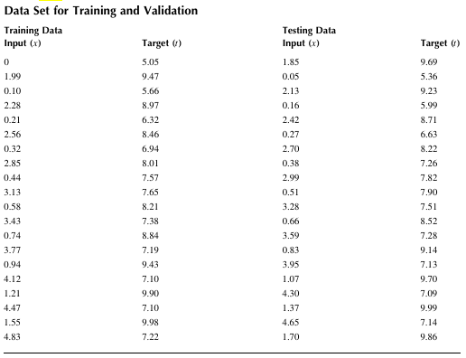
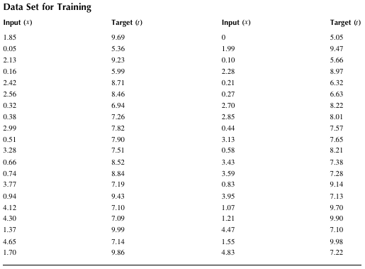
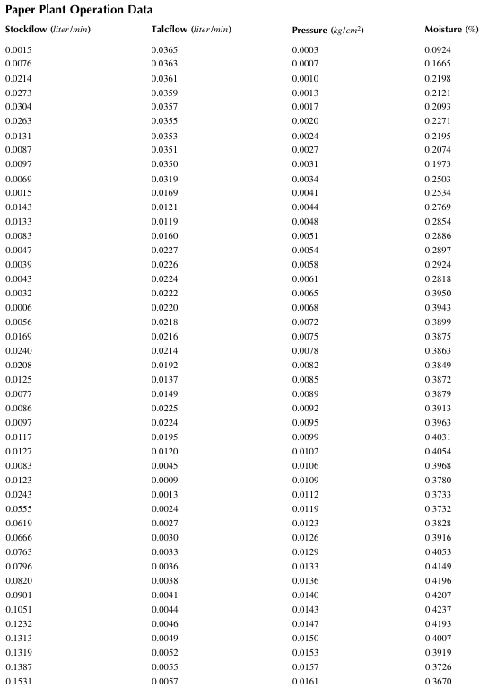
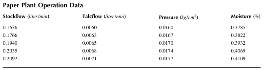
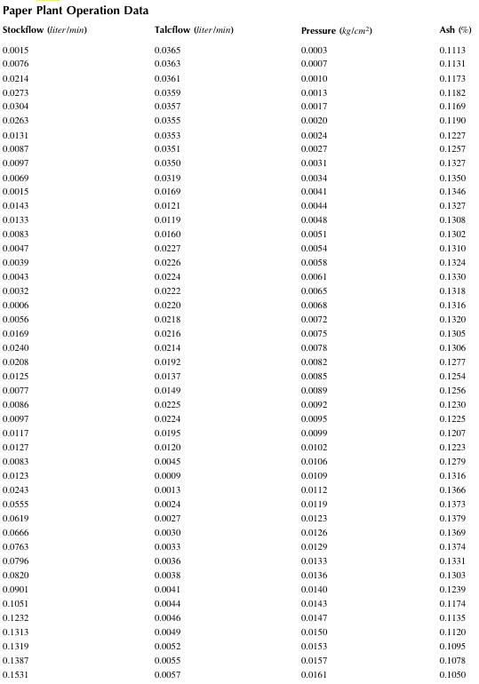
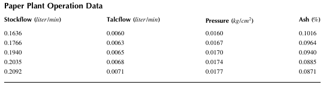

## 11 Computational Intelligence

### Example 11.1  Plots of Membership Functions 
Let y1, y2, y3, and y4 be fuzzy sets defined as 
y1=trimf(x,[3 6 8]); y2 = sigmf(x,[2 4]); y3 = gaussmf(x,[2 5]); 
y4 = smf(x,[1 8]); 
Plot these fuzzy sets for 0 < x < 10

### Example 11.2  Fuzzy Arithmetic Operations 
Suppose that fuzzy sets A and B are given by A = trapmf(x,[-10 -2 1 3]) and B = gaussmf(x,[2 
5]) in the range of -20 < x < 20 .
Evaluate the sum, difference, and product of A and B and plot the results. 

### Example 11.3  Comparison of Defuzzification Methods
The fuzzy sets A and B are defined by triangular and trapezoidal membership functions as A = 
trimf(x,[-5 -4 -2]) and B = trapmf(x,[-5 -3 2 5])in the range of -5 < C < 5 .
The fuzzy set C is given by 
C = max(0.7A , 0.5B )
Perform defuzzification of C using centroid, bisector, and mom methods.

### Example 11.4  Creation of an FIS Object 
Use the built-in function mamfis to create a Mamdani FIS object with three inputs and one output.

### Example 11.5  Creation of a Multilayer Network
Create a network with four hidden layers. The numbers of nodes of the layers are 4, 7, 8, and 6 
for the first, second, third, and fourth hidden layer, respectively. 

### Example 11.6  Training and Validation 
Create a feed-forward network with one hidden layer containing three nodes using the Levenberg- Marquardt algorithm (trainlm). Train and test the network using the data given in Table below. 

### Example 11.7  Regression Fit
Create a feed-forward network with one hidden layer containing 10 nodes using the Levenberg- Marquardt algorithm (trainlm). Train the network using the training data given in Table below, and calculate and plot the regression between its targets and outputs. Use the built-in function plotfit to plot the output function of the network. 

### Example 11.8  Estimation of Moisture Content 
Table below shows operation data acquired during the operation of a paper manufacturing plant. 
The input variables are Stockflow (stock flow rate, liter min), Talcflow (talc flow rate, liter/ min) and Pressure (kg /cm2), and the output variable is Moisture (moisture content, %). Create a function fitting neural network, train it, and plot test data and moisture contents estimated by the network. 
The network should have one hidden layer with eight neurons. Divide the data so that 60% is used for training, 20% is used for validation, and 20% is used for testing.

### Example 11.9  Estimation of Ash Content 
Consider the paper plant operation data shown in Table 11.7. Construct the SVM regression model 
and predict the Ash content by the model. 75% of the whole data set should be used in training and the remaining 25% in testing. Produce the plot representing the estimation results with data points. 

### Example 11.10  Regression of Ash Content
Consider the paper plant operation data shown in Table 11.7. Construct the SVM regression model by using the function fitrlinear and predict the ash content by the model. 75% of the whole data set should be used in training and the remaining 25% in testing. Produce the plot representing the estimation results with data points.

### Example 11.11  Regression of Output Values 
The input data set is defined as a 100 × 50 sparse matrix 
X = [x1 ,x2 , ,x50 ]. Assume that 10% 

of all the elements of X are nonzero. Suppose that the output Y is defined by 
Y = 1.2 * x20 + 0.5*sin(x40 ) + ε
where ε is a vector of random normalized error with mean 0 and standard deviation 0.3. We can create a normal distributed sparse random matrix by using the built-in function sprandn. Create the SVM regression model by using the function ftirlinear. 30% of the data set is to be used in validation. 

